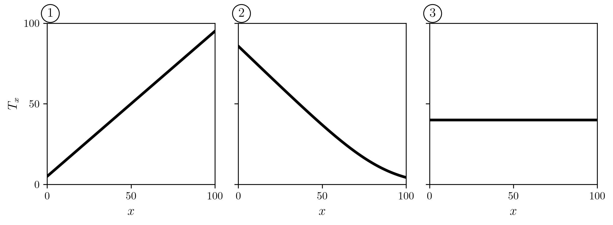
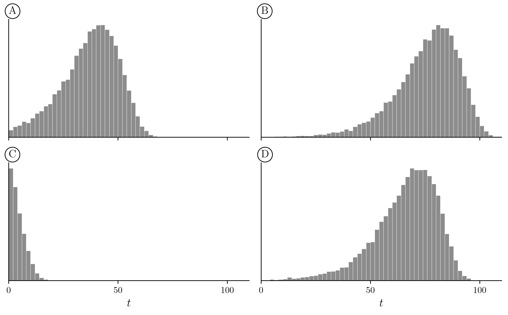
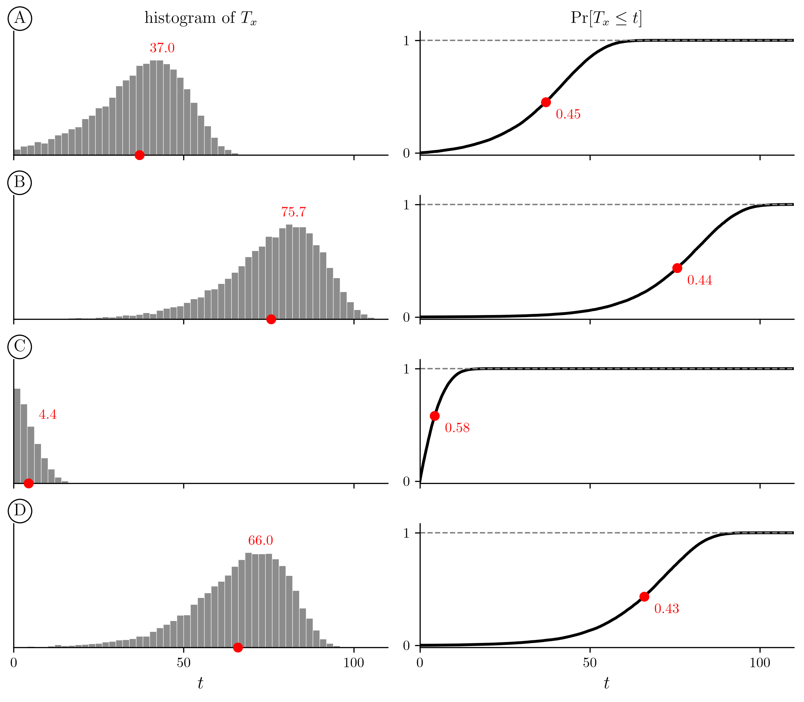
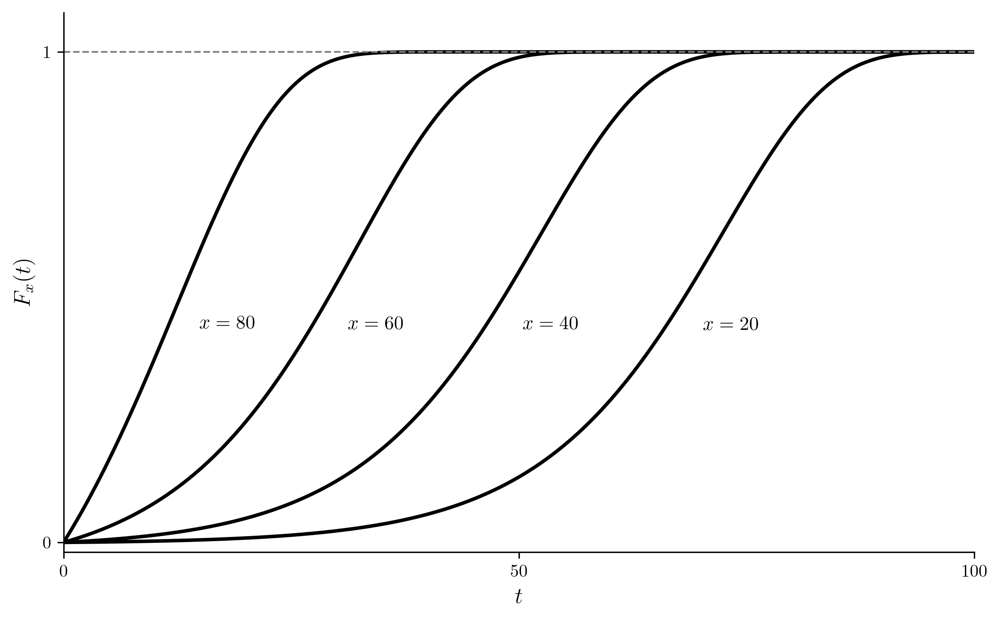
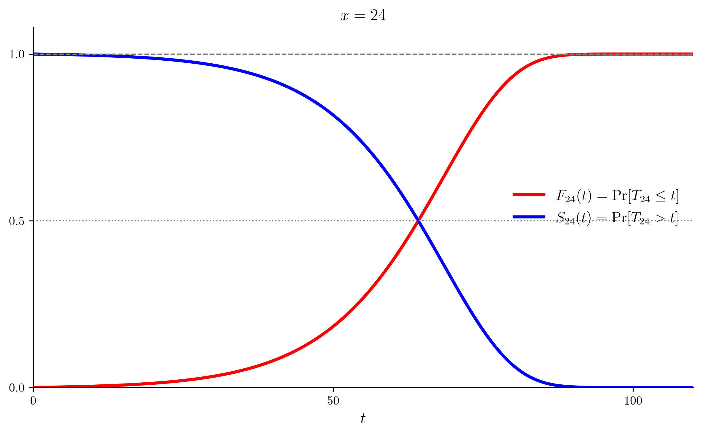

> 이 노트는 Dickson, Hardy, and Waters (2020), *Actuarial Mathematics for Life Contingent Risks*, 3rd ed., Chapter 2 — Survival models 를 따라 구성했다.

# 1. 강의영상

# 2. 기호 $(x)$

`-` $(x)$ 는 지금 나이가 $x$ 인 사람 한 명을 가리키는 기호이다.  

  - 여기서 $x \ge 0$ 이다.
  - $(x)$ 를 「연령 $x$ 인 생명」이라고 읽으면 된다..

`# 예제1` 이은지 34세, 미미 30세, 이영지 23세, 안유진 23세이다. 다음 중 옳지 않은 것은?

1. 이은지는 $(34)$ 로 나타낼 수 있다.
2. 미미는 $(30)$ 으로 나타낼 수 있다.
3. 이영지는 $(23)$ 으로 나타낼 수 있다.
4. 안유진은 $(24)$ 로 나타낼 수 있다.

`(풀이)` 답은 4. $(x)$ 의 $x$ 는 지금 나이다. 안유진은 지금 23세이므로 $(23)$ 이다. 이영지와 나이가 같으므로 두 사람 다 $(23)$ 으로 쓴다.

`# 예제2` 미미는 30세이다. $(30)$ 은 무엇을 뜻하는가?

1. 미미
2. 30세인 어떤 한 사람

`(풀이)` 답은 2. $(x)$ 의 $x$ 는 나이이지 사람 이름이 아니다. 미미는 $(30)$ 의 한 예일 뿐이다.

`-` $(x)$ 는 지금 살아 있는 사람이다. 「지금 나이가 $x$ 」라는 말에 이미 살아 있다는 뜻이 들어 있다. 죽은 사람은 나이가 더 늘지 않기 때문이다. 

# 3. 장래생존기간 $T_x$

`-` $(x)$ 는 $x$ 보다 큰 어느 나이에서든 죽을 수 있다. $(x)$ 가 앞으로 더 사는 햇수를 $T_x$ 라 쓰고, 이를 $(x)$ 의 장래생존기간(future lifetime)이라 부른다. $T_x$ 는 미리 알 수 없는 양이므로 연속확률변수로 모형화한다. 그러면 사망시연령은 $x + T_x$ 가 되고, 이것도 확률변수다. 

  - $x + T_x$ 에서 $x$ 는 정해진 수이고 $T_x$ 만 확률변수다. 지금 나이는 알고, 앞으로 살 햇수는 모른다.
  - 느낌으로는 $x$ 와 $T_x$ 가 서로 깎아먹는 사이다. $x$ 가 커질수록 $T_x$ 는 작아지는 쪽이다.

`# 가짜예제` $T_1$ 과 $T_{100}$ 중 어느 쪽의 값이 더 큰 가?

1. $T_1$
2. $T_{100}$

`(풀이)` 답은 1. 1세 아이는 보통 수십 년을 더 살고, 100세 노인은 몇 년 남지 않았다. 다만 둘 다 확률변수라서 「값」을 바로 비교할 수는 없다. 그래서 이 문제는 잘못낸 문제다. 제대로 비교하려면 분포끼리 비교해야 하고, 그 얘기는 뒤에서 한다.

`# 가짜예제` 가로축을 $x$, 세로축을 $T_x$ 로 놓고 그린다면 어느 그림이 어울리는가?

{width=80% fig-align="center"}

1. 그림 1
2. 그림 2
3. 그림 3

`(풀이)` 답은 2. $x$ 가 커질수록 $T_x$ 는 작아지는 쪽이다. 다만 $T_x$ 는 확률변수라서 $x$ 하나에 값이 하나로 정해지지 않으므로 이런 그래프는 엄밀히는 그릴 수 없다. 그래서 이 문제도 잘못 낸 문제다. 제대로 그리려면 $x$ 마다 $T_x$ 의 평균을 찍어야 하고, 그 얘기는 뒤에서 한다.

`# 가짜예제` 네 히스토그램은 $x = 10, 20, 50, 100$ 인 $T_x$ 를 각각 많이 뽑아 그린 것이다. $x = 100$ 인 것은 어느 것인가?

{width=75% fig-align="center"}

1. A
2. B
3. C
4. D

`(풀이)` 답은 3이지 않을까? 100세는 앞으로 살 햇수가 몇 년 안 되므로 $T_{100}$ 은 0 근처에 몰린다. 

`# 가짜예제` 네 줄 A, B, C, D 는 서로 다른 나이 $x$ 의 $T_x$ 를 각각 많이 뽑아 그린 것이다. 왼쪽은 $T_x$ 의 히스토그램(뽑은 값이 $t$ 근처에 떨어진 개수), 오른쪽은 $\Pr[T_x \le t]$ 의 그래프다. 빨간 점은 $T_x$ 의 평균이다. 나이 $x$ 가 적은 것부터 순서대로 나열하면?

{width=75% fig-align="center"}

1. B, D, A, C
2. C, A, D, B
3. A, B, C, D
4. B, A, D, C

`(풀이)` 답은 1이 아닐까? 

# 4. 분포함수 $F_x$ 와 생존함수 $S_x$

`-` $F_x$ 를 $T_x$ 의 분포함수라 하자. 즉 $F_x(t) = \Pr[T_x \le t]$ 이다. 우리는 $F_x$ 를 연령 $x$ 로부터의 생애분포(lifetime distribution)라 부른다.

- $t$ 가 커질수록 $F_x(t)$ 는 1 에 가까워진다. $(x)$ 가 언젠가는 죽는다는 뜻이다.
- $F_x$ 는 죽음의 느낌을 가진 함수이다.
  
`# 예제3` 아래 그림은 $x = 20, 40, 60, 80$ 네 나이에 대한 $F_x(t)$ 를 $t$ 에 대해 그린 것이다. 옳지 않은 것은?

{width=75% fig-align="center"}

1. $x$ 를 고정하면, $t$ 가 커질수록 $F_x(t)$ 는 커진다.
2. $x$ 를 고정하면, $t$ 가 작아질수록 $F_x(t)$ 는 작아진다.
3. $t$ 를 고정하면, $x$ 가 커질수록 $F_x(t)$ 는 커진다.
4. $t$ 를 고정하면, $x$ 가 작아질수록 $F_x(t)$ 는 작아진다.
5. $x$ 가 커질수록, 그리고 $t$ 가 커질수록 $F_x(t)$ 는 커진다.
6. $t$ 를 고정하면, $x$ 가 작아질수록 $F_x(t)$ 는 커진다.

`(풀이)` 답은 6. 

`-` $F_x(t)$ 는 $t$ 가 커질수록 확실하게 커진다. $x$ 는 살짝 애매하긴 한데, 대부분 $x$가 커질수록 $F_x(t)$ 도 커진다. 

  - $x$ 는 지금 나이이고, $t$ 는 지금부터 흐르는 시간이니깐.. 통상적으로는 $x$가 커질수록 그리고 $t$가 커질수록 $F_x(t)$는 커짐.  
  - 그런데 사실 $x$ 쪽은 아닐 수도 있다. 나이가 들수록 죽을 위험이 커진다는 것은 성인의 이야기다. 갓난아기는 다섯 살 아이보다 한 해 안에 죽을 확률이 클 수도 있다. 

`-`  생존함수(survival function)를 $S_x(t) = 1 - F_x(t) = \Pr[T_x > t]$ 와 같이 정의한다. (많은 생명보험 문제에서 우리는 사망보다 생존의 확률에 관심이 있다.)

`-` 아래 그림은 $x = 24$ 에 대해 $F_{24}(t)$ 와 $S_{24}(t)$ 를 같이 그린 것이다. 빨간 선이 $F_{24}(t)$, 파란 선이 $S_{24}(t)$ 다. 둘을 더하면 어느 $t$ 에서나 1 이다.

{width=75% fig-align="center"}

`-` 빨간 선과 파란 선이 만나는 점에서는 $F_{24}(t) = S_{24}(t)$ 이고 둘의 합이 1 이므로 각각 0.5 다. 이 $t$ 는 $T_{24}$ 의 중앙값이다. 위 그림의 모형에서는 $t \approx 64$, 나이로는 88 세쯤이다.

`# 예제4` 위 그림에서 $F_{24}(t)$ 와 $S_{24}(t)$ 가 $t \approx 64$ 에서 만났다. 이 사실의 해석으로 옳은 것은?

1. $t \approx 64$, 나이로는 $x + t \approx 88$ 이 되면 생존할 확률이 0.5 다. 이 시점부터는 죽느냐 사느냐가 반반이므로, 매일매일 동전을 던지는 심정으로 사는 것이다.
2. 「24세인 사람이 앞으로 64년을 넘겨 살까」라는 물음 하나의 답이 공정한 동전 한 번과 같다.

`(풀이)` 답은 2. 24세인 사람이 「앞으로 64년을 넘길까」라는 물음 하나에 대한 확률이 0.5 인 것이지, 하루하루가 0.5 인 것이 아니다.

# 5. $T_0$ 과 $T_x$ 를 잇는 관계

`-`  그런데 가만히 생각해보면 아래식이 성립함을 직관적으로 알 수 있다. 

$$
\Pr[T_x \le t] = \Pr[T_0 \le x + t \mid T_0 > x]
$$
(왜?) -- 딱 보면.. 

- 좌변뜻 = 지금 $x$ 살인 사람이 앞으로 $t$ 년 안에 죽을 확률.
- 우변뜻 = 갓 태어난 사람이 $x$ 살까지는 살았다고 할 때, 그 사람이 $x + t$ 살 전에 죽을 확률.

둘 다 「$x$ 살까지 살아 있는 사람이 앞으로 $t$ 년 안에 죽는다」는 같은 말이다. 보는 시점만 다르다.

`-`  이제 $\Pr[T_x \le t] = \Pr[T_0 \le x + t \mid T_0 > x]$ 를 재료삼아 수학기계를 적당히 샥샥 활용하면 아래를 얻어낼 수 있다. 

$$S_0(x + t) = S_0(x)\, S_x(t)$$

(왜?) 

$$
\begin{aligned}
& F_x(t) &&= \Pr[T_x \le t] \\
& &&= \Pr[T_0 \le x + t \mid T_0 > x] \\
& &&= \frac{\Pr[x < T_0 \le x + t]}{\Pr[T_0 > x]} \\
& &&= \frac{F_0(x + t) - F_0(x)}{S_0(x)} \\[6pt]
\Leftrightarrow\quad & S_x(t) &&= 1 - F_x(t) \\
& &&= \frac{S_0(x) - F_0(x + t) + F_0(x)}{S_0(x)} \\
& &&= \frac{1 - F_0(x + t)}{S_0(x)} \\
& &&= \frac{S_0(x + t)}{S_0(x)} \\[6pt]
\Leftrightarrow\quad & S_0(x + t) &&= S_0(x)\, S_x(t).
\end{aligned}
$$

`-` 이는 출생부터 연령 $x + t$ 까지 생존할 확률을 다음 둘의 곱으로 해석할 수 있음을 보인다.

(1) 출생부터 연령 $x$ 까지 생존할 확률, 그리고
(2) 연령 $x$ 까지 생존했다는 조건 아래, 연령 $x + t$ 까지 더 생존할 확률.

`-` 여기서 한번 더 생각하면 아래의 수식을 금방 얻을 수 있다. 

$$
S_x(t + u) = S_x(t)\, S_{x+t}(u)
$$
(왜?) -- 직관적으로

- 좌변 = 지금 $x$ 살인 사람이 앞으로 $t + u$ 년을 넘겨 살 확률.
- 우변 = (지금 $x$ 살인 사람이 앞으로 $t$ 년을 넘겨 살 확률) $\times$ ($x + t$ 살까지 살았다고 할 때, 그 사람이 다시 $u$ 년을 넘겨 살 확률).

$t + u$ 년을 넘기려면 먼저 $t$ 년을 넘겨야 하고, 넘긴 다음에 $u$ 년을 더 넘겨야 한다. 두 관문을 차례로 통과할 확률이라 곱이 된다. 바로 위의 $S_0(x + t) = S_0(x)\, S_x(t)$ 에서 출발점을 0 살에서 $x$ 살로 옮긴 것이다.

(왜??) -- 샤샤삭

$$
\begin{aligned}
& S_0(x + t) &&= S_0(x)\, S_x(t) \\
\Leftrightarrow\quad & S_x(t) &&= \frac{S_0(x + t)}{S_0(x)} \\
\Leftrightarrow\quad & S_x(t + u) &&= \frac{S_0(x + t + u)}{S_0(x)} \\
& &&= \frac{S_0(x + t)}{S_0(x)} \cdot \frac{S_0(x + t + u)}{S_0(x + t)} \\
& &&= S_x(t)\, S_{x+t}(u)
\end{aligned}
$$

첫 줄은 $S_x(t) = S_0(x + t) / S_0(x)$ 의 $t$ 자리에 $t + u$ 를 넣은 것이다. 둘째 줄은 $S_0(x + t)$ 로 나누고 다시 곱한 것뿐이다. 셋째 줄은 같은 식을 $x$ 에서 한 번, $x + t$ 에서 한 번 쓴 것이다.

`-` 절단은 두 번이 아니어도 된다. 몇 번을 자르든 같은 꼴로 곱해진다.

$$
S_x(t_1 + t_2 + \cdots + t_n)
= S_x(t_1)\, S_{x+t_1}(t_2)\, S_{x+t_1+t_2}(t_3) \cdots S_{x+t_1+\cdots+t_{n-1}}(t_n)
$$

(왜?) -- 직관적으로

- 「거기까지 살아남았다」는 조건을 한 칸씩 옮겨 가며 곱하는 것이다. 각 조각은 그 나이에 서 있는 사람의 확률이다.
- 두 조각 식을 $n - 1$ 번 되풀이한 것이다. 관문이 둘이든 $n$ 개든 차례로 통과할 확률은 곱이다.

(왜??) -- 샤샤삭

$$
\begin{aligned}
& S_x(t_1)\, S_{x+t_1}(t_2) \cdots S_{x+t_1+\cdots+t_{n-1}}(t_n) \\
&= \frac{S_0(x+t_1)}{S_0(x)} \cdot \frac{S_0(x+t_1+t_2)}{S_0(x+t_1)} \cdots \frac{S_0(x+t_1+\cdots+t_n)}{S_0(x+t_1+\cdots+t_{n-1})} \\
&= \frac{S_0(x+t_1+\cdots+t_n)}{S_0(x)} \\
&= S_x(t_1+\cdots+t_n)
\end{aligned}
$$

각 조각을 $S_0$ 의 비로 쓰면 앞 조각의 분자가 뒤 조각의 분모와 같아서 차례로 지워진다.
