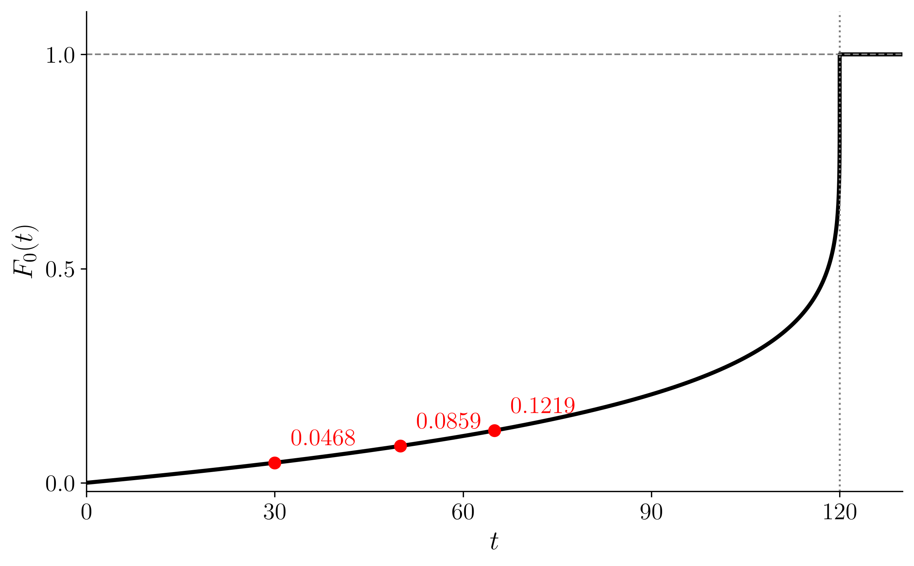

`-` 직관: 만약에 $S_0(t)$를 알면? 임의의 $x,t'$ 에 대하여 $S_{x}(t')$의 값을 항상 알 수 있다. 

`# 예제3` 아래의 $F_0$ 에 대하여 

$$
F_0(t) = \begin{cases} 1 - (1 - t/120)^{1/6} & 0 \le t < 120 \\ 1 & t \ge 120 \end{cases}
$$

{width=75% fig-align="center"}

  - 거의 전 구간이 낮게 깔려 있다가 $t = 120$ 에서 1 로 곧추선다. 빨간 점은 아래 (a)(b)(c) 에 쓰이는 $F_0(30)$, $F_0(50)$, $F_0(65)$ 다.
  - 사람의 사망을 닮은 모양은 아니다. 이 $F_0$ 는 손으로 계산이 되도록 고른 것이고, 실제 모형은 사망력에서 다시 본다.

다음 확률을 구하여라.

`(a)` 갓 태어난 생명이 연령 30을 넘어 생존할 확률

`(풀이)`

구하는 확률은 $S_0(30)$ 이다.

$$
S_0(30) = 1 - F_0(30) = (1 - 30/120)^{1/6} = 0.9532
$$

`(b)` 연령 30인 생명이 연령 50 이전에 사망할 확률

`(풀이)`

30세인 생명이 앞으로 20년 안에 사망할 확률이므로 $F_{30}(20)$ 이고, (2.2)를 쓴다.

$$
F_{30}(20) = \frac{F_0(50) - F_0(30)}{1 - F_0(30)} = 0.0410
$$

`(c)` 연령 40인 생명이 연령 65를 넘어 생존할 확률

`(풀이)`

40세인 생명이 앞으로 25년을 넘겨 생존할 확률이므로 $S_{40}(25)$ 이고, (2.3)을 쓴다.

$$
S_{40}(25) = \frac{S_0(65)}{S_0(40)} = 0.9395
$$

`#`

# 3. 생존함수의 조건?

`-` 생애분포에 대한 임의의 생존함수가 유효하려면 다음 조건을 만족해야 한다.

- 조건 1  $S_x(0) = 1$; 즉, 현재 연령 $x$ 인 생명이 0년 생존할 확률은 1이다.
- 조건 2  $\lim_{t \to \infty} S_x(t) = 0$; 즉, 모든 생명은 결국 사망한다.
- 조건 3  생존함수는 $t$ 의 비증가함수여야 한다; 즉, $(x)$ 가 이를테면 10년보다 10.5년을 생존하는 것이 더 있을 법할 수는 없는데, 10.5년을 생존하려면 $(x)$ 가 먼저 10년을 생존해야 하기 때문이다.

`-` 이 책에서 쓰는 모든 분포에 대해 우리는 세 가지 추가 가정을 한다:

- 가정 1  $S_x(t)$ 는 모든 $t > 0$ 에 대해 미분가능하다.
- 가정 2  $\lim_{t \to \infty} t\, S_x(t) = 0$.
- 가정 3  $\lim_{t \to \infty} t^2 S_x(t) = 0$.

