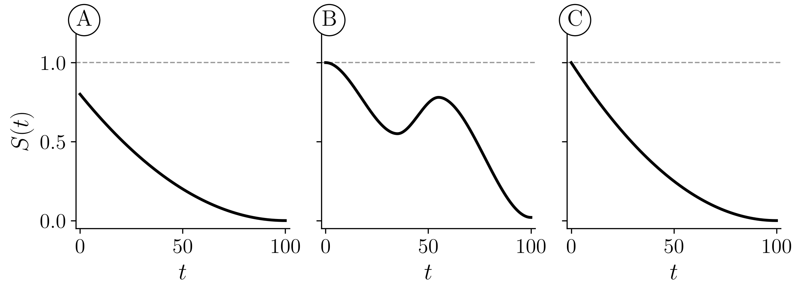
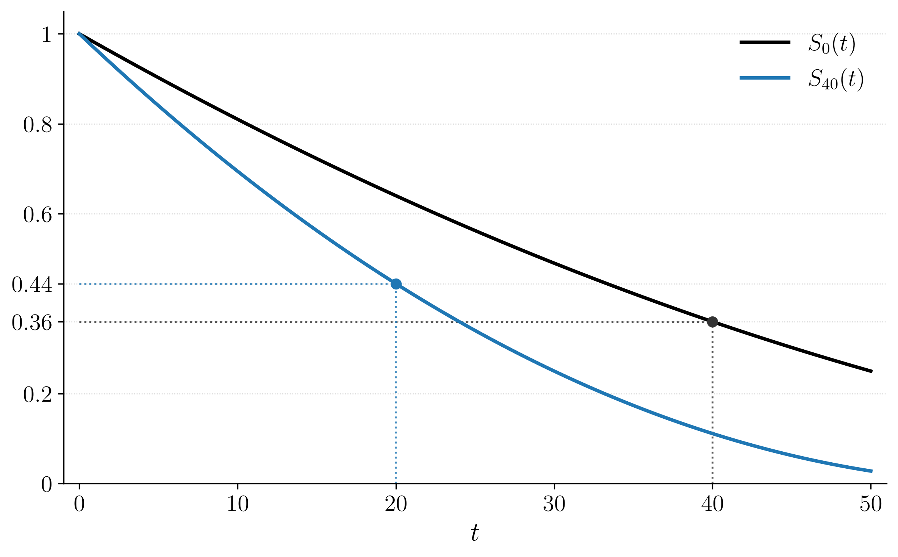

`# 문제1` 아래의 수식에서 조건 $T_0 > x$ 를 빼고 $\Pr[T_0 \le x + t]$ 로만 쓰면 무엇이 달라지는가?

$$
\Pr[T_x \le t] = \Pr[T_0 \le x + t \mid T_0 > x]
$$

1. 아무것도 달라지지 않는다
2. $x$ 살이 되기 전에 죽은 사람까지 함께 세게 된다
3. $x$ 살이 되기 전에 죽은 사람이 빠진다

`# 문제2` 조건부확률의 정의는 $\Pr[A \mid B] = \dfrac{\Pr[A \cap B]}{\Pr[B]}$ 이다. 이것을 써서 $\Pr[T_0 > x + t \mid T_0 > x]$ 를 $S_0$ 으로 나타내라 (단 $S_0(x) > 0$)

`# 문제3` 갓 태어난 사람이 아니라 **30세인 사람**의 생존함수가 아래와 같다.

$$
S_{30}(t) = \begin{cases} 1 - t/70 & 0 \le t < 70 \\ 0 & t \ge 70 \end{cases}
$$

`(a)` 30세인 사람이 50세를 넘겨 살 확률

`(b)` 20세인 사람이 50세를 넘겨 살 확률

`(c)` 30세인 사람이 70세 전에 죽을 확률

`# 문제4` $S_0$ 을 모든 $t$ 에서 안다고 하자. 

`(a)` 갓 태어난 사람이 70세를 넘겨 살 확률을 $S_0(t)$로 표현하라. 

`(풀이)` $S_0(70)$

`(b)` 25세인 사람이 앞으로 15년을 넘겨 살 확률을 $S_0(t)$로 표현하라. 

`(c)` 25세인 사람이 40세 전에 죽을 확률을 $S_0(t)$로 표현하라. 

`(d)` 25세인 사람이 40세와 70세 사이에 죽을 확률을 $S_0(t)$로 표현하라. 

`(e)` 40세인 사람이 70세를 넘겨 살 확률을 구하고, 그것을 (b) 의 답과 곱하면 무엇이 되는지 써라.

`# 문제5` 갓 태어난 사람의 생존함수 $S_0$ 이 아래 표와 같다.

| $t$ | 25 | 50 | 75 |
|---|---|---|---|
| $S_0(t)$ | 0.80 | 0.50 | 0.20 |

다음에 답하여라.

`(a)` 갓 태어난 사람이 50세를 넘겨 살 확률을 구하라.

`(b)` 25세인 사람이 50세를 넘겨 살 확률을 구하라. 

`(c)` (a)와 (b)의 결과를 비교하면, 갓 태어난 사람이 50세를 넘겨 살 확률보다 25세인 사람이 50세를 넘겨 살 확률이 더 크게 나옴을 알 수 있다. 왜 그러한 결과가 나오는지 해석하라. 

`# 문제6` 생존함수 $S_0$ 이 아래와 같다.

$$
S_0(t) = \begin{cases} 1 - t/100 & 0 \le t < 100 \\ 0 & t \ge 100 \end{cases}
$$

`(a)` 60세인 사람이 80세를 넘겨살 확률을 구하라.

`(b)` 40세인 사람이 60세를 넘겨 살 확률을 구하라.

`(c)` (a)와 (b)의 값 중 무엇이 더 큰가? 왜 그렇다고 생각하는가?

`# 문제7` 분포함수 $F_0$ 이 아래와 같다.

$$
F_0(t) = \begin{cases} 1 - (1 - t/100)^2 & 0 \le t < 100 \\ 1 & t \ge 100 \end{cases}
$$
(계산기를 사용하세요)

`(a)` 20세인 사람이 50세를 넘겨 살 확률

`(b)` 50세인 사람이 75세 전에 죽을 확률

`(c)` 20세인 사람이 50세와 75세 사이에 죽을 확률

`# 문제8` 

아래를 안다고 가정할떄, 
$$
S_x(t) = \frac{S_0(x + t)}{S_0(x)} \quad (S_0(x) > 0)
$$

다음을 보여라. 

$$
F_x(t) = \frac{F_0(x + t) - F_0(x)}{1 - F_0(x)}
$$

`# 문제9` 어떤 학생이 이렇게 주장했다.

> 「$x$ 살인 사람이 $t + u$ 년을 넘기려면 $t$ 년을 넘기고 또 $u$ 년을 넘겨야 한다. 두 일이 서로 독립이므로
> $$S_x(t + u) = S_x(t)\, S_x(u)$$
> 이다.」

`(a)` 아래의 생존함수에 $x = 0$, $t = u = 25$ 을 대입하고 위 주장이 틀렸음을 보여라. 

$$
S_0(t) = \begin{cases} 1 - t/100 & 0 \le t < 100 \\ 0 & t \ge 100 \end{cases}
$$

`(b)` 학생의 논증에서 **어느 낱말이 잘못이었는지** 한 줄로 써라.

`# 문제10` 다음 주장을 고려하자. 

> 「갓 태어난 사람이 앞으로 $t$ 년을 넘길 확률은, 이미 $x$ 살까지 산 사람이 앞으로 $t$ 년을 넘길 확률보다 **언제나 크거나 같다.** 즉 모든 모형에서 $S_0(t) \ge S_x(t)$ 다.」

이 주장은 아래의 생존분석표에서 참일까? 

| $a$ | 1 | 5 | 6 |
|---|---|---|---|
| $S_0(a)$ | 0.900 | 0.880 | 0.879 |

`(a)` $S_0(1)$ 과 $S_5(1)$ 을 구하여라.

`(b)` (a) 의 두 값을 견주어 위 주장을 판정하여라.

`# 문제11` 아래 세 곡선 A, B, C 는 각각 어떤 함수의 그래프다(가로축은 $t$). 이 중 생존함수가 될 수 있는 가능성을 가진 그림을 고르고 이유를 설명하라.

{width=75% fig-align="center"}

`# 문제12` 아래 그림은 같은 $S_0$ 에서 나온 검정 $S_0(t)$ 와 파랑 $S_{40}(t)$ 를 함께 그린 것이다.

{width=75% fig-align="center"}

$S_0(60)$ 을 구하라. 
