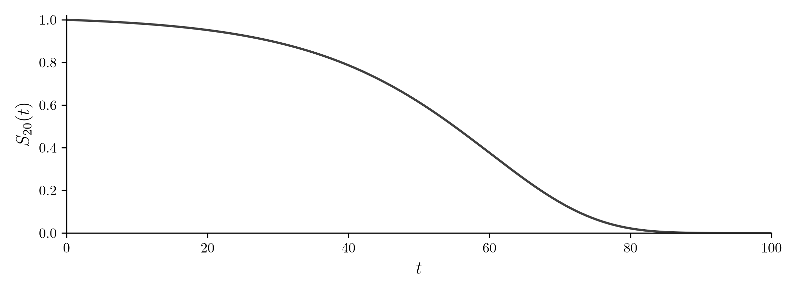
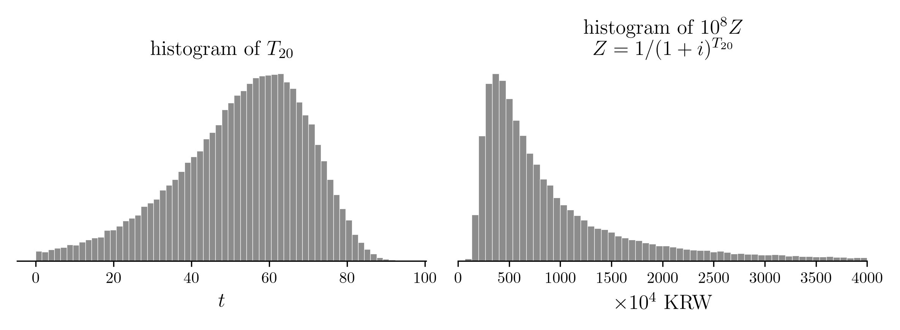
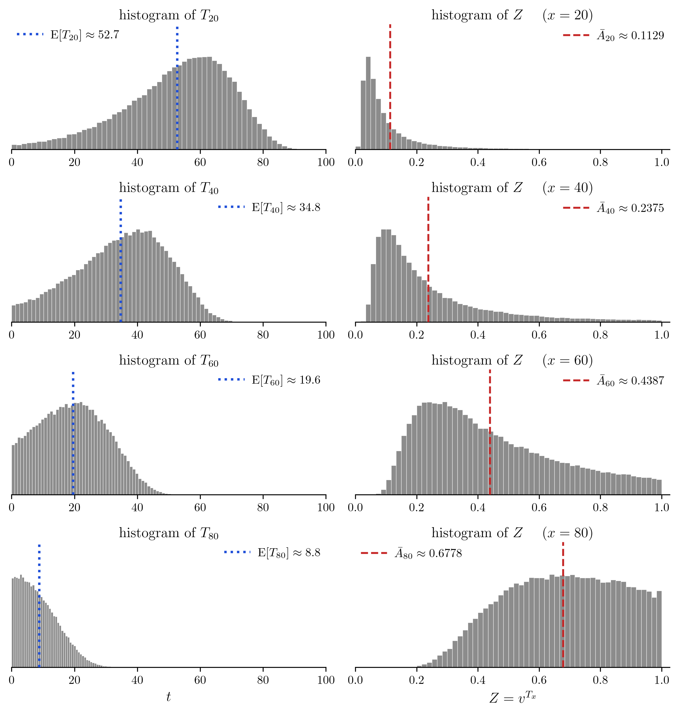
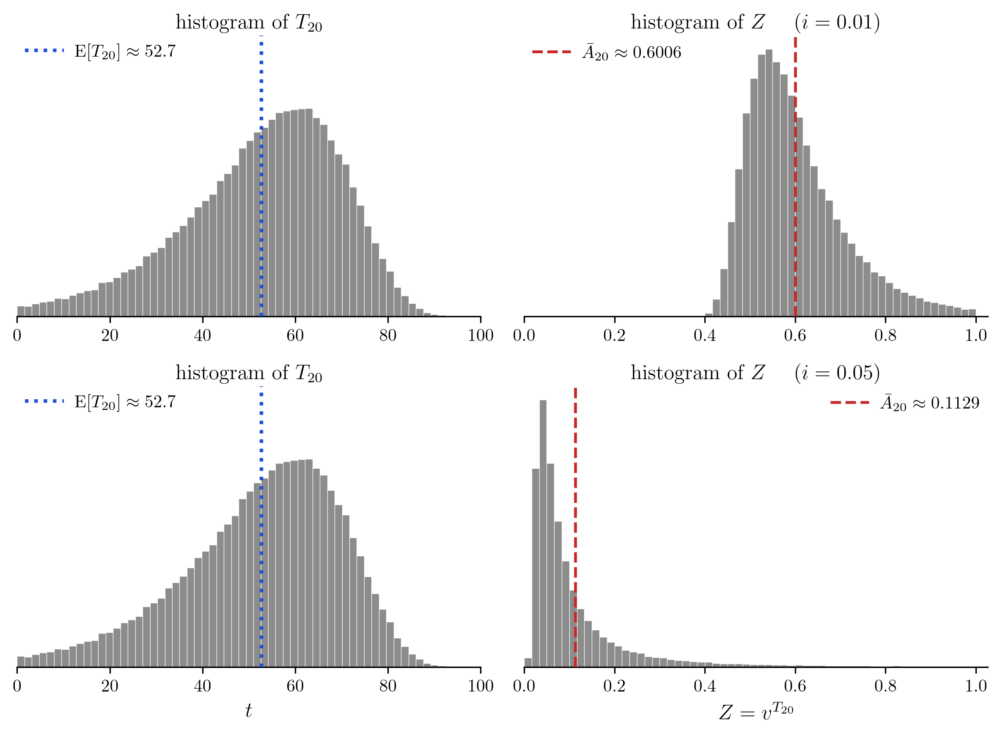

# 1. 강의영상



# 2. 보험료를 얼마로 받아야 하나

`-` 지금 나이가 $x$ 인 사람이 든든종신보험에 든다고 하자. 죽으면 1억이 나온다. 이 사람이 내야 할 돈을 보험료라 한다. 보험료를 얼마로 정해야 할까?

`# 예제1` $(x)$ 가 지금 숨넘어가기 직전이다. $(x)$ 는 든든종신보험에 가입하고 싶다. 보험회사는 얼마에 가입시켜줘야하는가? 

`(풀이)` 1억. 지금 나가는 돈이라 그대로 1억이다.

`# 예제2` $(x)$ 가 딱 1년 뒤에 죽는 것이 확실하다. 보험회사는 얼마에 가입시켜줘야 하는가?

`(풀이)` 1년 뒤에 1억을 내주면 된다. 그러니 1억보다 적게 받아도 된다. 받은 돈이 1년 동안 이자를 벌기 때문이다. 연이자율이 $i$ 라면 받은 돈은 1년 뒤에 $(1+i)$ 배가 되므로, 그것이 1억이 되게 하려면 1억을 $(1+i)$ 로 나눈 만큼만 받으면 된다.

$$\frac{10^8}{1+i}$$

`# 예제3` $(x)$ 가 딱 $n$ 년 뒤에 죽는 것이 확실하다면? 보험회사는 얼마에 가입시켜줘야 하는가?

`(풀이)` 이번에는 이자가 $n$ 번 붙는다. 받은 돈은 $n$ 년 뒤에 $(1+i)^n$ 배가 되므로

$$\frac{10^8}{(1+i)^n}$$

  - $n$ 이 커질수록 보험료가 싸진다. 늦게 죽을수록 보험회사가 이자를 벌 시간이 길다.

`-` 위의 수식을 일반화하면 아래와 같다. 

$$\frac{\text{보험금}}{(1+\text{이자율})^{\text{남은 수명}}}$$

`# 예제4` 그런데 $(x)$ 가 언제 죽을지는 아무도 모른다. 이자율을 $i$ 라 하고 $T_x$ 년 뒤에 죽는다고 하면? 보험회사는 얼마에 가입시켜줘야 하는가?

`(풀이)` 위 식에서 보험금은 $10^8$, 이자율은 $i$, 남은 수명은 $T_x$ 이다. 그러므로 아래와 같이 쓰면 된다.

$$\frac{10^8}{(1+i)^{T_x}}$$

`-` 예제4 의 풀이는 수학적인 풀이이다. 사실 $T_x$ 는 정해지지 않은 값이므로 보험료를 $\frac{10^8}{(1+i)^{T_x}}$ 로 잡을 수는 없다. 가장 확실한 것은 미래로 날아가서 언제 죽을지 관측하고 (즉 $T_x$ 를 확정하고) 다시 과거로 돌아와 보험료를 책정하는 것인데, 이것은 불가능하니 적당히 손해보지 않는 선에서 정해야 할 것 같다.

`-` 다행스럽게도 보험회사는 오랜 시간 축적된 자료로 $T_x$ 의 분포를 알고 있다.

  - $F_x$ 를 안다는 말이고, $S_x$ 를 안다는 말이기도 하다.

`-` 이러면 해결책이 쉬울 것 같다. $T_x$의 평균을 계산하고 아래식의 "남은 수명" 자리에 대입하면 되지 않을까?

$$\frac{10^8}{(1+i)^{\text{남은 수명}}}$$

`# 예제5` 정말 그런지 네 사람으로 확인해 보자. $(x)$ 인 사람 넷 A, B, C, D 가 있고 남은 수명이 각각 2년, 45년, 60년, 75년이라 하자. 보험회사는 사실 타임머신이 있어서 미래로 날아가 이것을 관측한 뒤 다시 돌아왔다고 하자. $i = 0.05$ 이다. 네 사람에게 받아야 할 보험료는 얼마인가? (네 사람 모두 같은 금액을 받아야 한다.)

`(틀린풀이)` 남은 수명의 평균을 먼저 낸다. $\frac{2 + 45 + 60 + 75}{4} = 45.5$ 년이므로

$$\frac{10^8}{(1+i)^{45.5}} \approx 1{,}086 \ \text{만원}$$

그러므로 1,086만원씩 받으면 될 것 같다. 진짜 그런가?

이 보험회사가 네 사람에게 1,086만원씩, 모두 4,344만원을 받았다고 하자. 남은 돈에는 이자가 붙고, 누군가 죽으면 1억을 내준다. 따라가 보자.

| 시각 | 이자 불린 잔고 | 지급 | 남은 잔고 |
|---|---:|---:|---:|
| 0년 | | | 4,344만원 |
| 2년 | 4,790만원 | 1억 | $-5{,}210$만원 |
| 45년 | $-42{,}461$만원 | 1억 | $-52{,}461$만원 |
| 60년 | $-109{,}062$만원 | 1억 | $-119{,}062$만원 |
| 75년 | $-247{,}521$만원 | 1억 | $-257{,}521$만원 |

첫 사람이 죽는 2년째에 이미 잔고가 음수다. 그 뒤로는 빚에 이자가 붙어 눈덩이가 된다. 회사는 망한다. 뭔가 이상하다. 사실 우리가 계산한 시나리오는 "네 사람이 모두 45.5년 함꼐 죽는다" 이다. 

| 시각    | 이자 불린 잔고 | 지급  | 남은 잔고   |
| ----- | -------: | --: | ------: |
| 0년    |          |     | 4,344만원 |
| 45.5년 | 4억       | 4억  | 0       |

4억은 $4 \times \dfrac{10^8}{(1+i)^{45.5}} \times (1+i)^{45.5} = 4 \times 10^8$ 이로 계산한다. 4,344만원이 45.5년 동안 불어 4억이 되고, 네 사람에게 1억씩 내주면 잔고가 0이 되는 걸 상상했던 것이다. 

`(풀이)`

그러면 얼마를 받아야 하는가? 타임머신 덕에 우리는 네 사람이 언제 죽는지 알고 있다.

| | A | B | C | D |
|---|---|---|---|---|
| 남은 수명 | 2년 | 45년 | 60년 | 75년 |

만약에 A 한 사람만 있었다면 우리는 아래의 금액을 불렀을 것이다.

$$\frac{10^8}{(1+i)^{2}} = \frac{10^8}{1.05^{2}} \approx 9{,}070 \ \text{만원}$$

같은 논리로 B, C, D 한 사람씩만 있었다면 각각 아래의 금액을 불렀을 것이다.

$$\frac{10^8}{1.05^{45}} \approx 1{,}113 \ \text{만원}, \qquad \frac{10^8}{1.05^{60}} \approx 535 \ \text{만원}, \qquad \frac{10^8}{1.05^{75}} \approx 258 \ \text{만원}$$

정리하면 아래와 같다.

| | A | B | C | D |
|---|---|---|---|---|
| 남은 수명 | 2년 | 45년 | 60년 | 75년 |
| 보험료 | 9,070만원 | 1,113만원 | 535만원 | 258만원 |

이것의 평균을 내보자.

$$\frac{9{,}070 + 1{,}113 + 535 + 258}{4} \approx 2{,}744 \ \text{만원}$$

그러면 2,744만원씩 받으면 어떻게 되는지 같은 표로 따라가 보자.

| 시각 | 이자 불린 잔고 | 지급 | 남은 잔고 |
|---|---:|---:|---:|
| 0년 | | | 10,976만원 |
| 2년 | 12,101만원 | 1억 | 2,101만원 |
| 45년 | 17,124만원 | 1억 | 7,124만원 |
| 60년 | 14,810만원 | 1억 | 4,810만원 |
| 75년 | 10,000만원 | 1억 | 0 |

마지막에 잔고가 0 이 된다. 더도 덜도 아니게 딱 맞는다.

  - 표의 금액은 만원 단위로 반올림한 것이다. 실제 보험료는 2,744.03만원이고, 그 값으로 계산하면 마지막 잔고가 정확히 0 이다.

`#`

`-` (네 사람 말고) 좀 더 많은 사람으로 보자. $x = 20$ 이라 하고 남은 수명 $T_{20}$ 의 생존함수가 아래와 같다고 하자.

$$S_{20}(t) = \exp\left\{-\frac{B}{\log c}\,c^{20}\left(c^t - 1\right)\right\}, \qquad B = 0.0003,\ c = 1.07$$

{width=75% fig-align="center"}

  - 20세인 사람이 $t$ 년을 더 살 확률이다. 50년을 더 살 확률이 약 $0.61$ 이고, 80년을 더 살 확률은 약 $0.02$ 다.

`-` $i = 0.05$ 라 하자. $T_{20}$ 과 $\dfrac{10^8}{(1+i)^{T_{20}}}$ 의 히스토그램을 그리면 아래와 같다.

{width=75% fig-align="center"}

  - $T_{20}$ 을 10만 번 뽑아 왼쪽에 그렸고, 그 각각에 대해 보험료를 계산해 오른쪽에 그렸다.
  - 오른쪽 그림은 4,000만원에서 잘라 그렸다. $10^8 Z$ 는 1억까지 갈 수 있는데, 4,000만원을 넘는 경우가 약 $4.3\%$ 다. 일찍 죽을수록 오른쪽으로 간다.

`-` 강의노트의 메시지는 아래의 수식이다.

$$\mathrm{E}\left[\frac{10^8}{(1+i)^{T_{20}}}\right] \ne \frac{10^8}{(1+i)^{\mathrm{E}[T_{20}]}}$$

`-` 같은 그림에 좌변과 우변을 세로선으로 그려 보면 아래와 같다. 10만 개로 구한 값이라 참값 자체는 아니고 그에 가까운 값이다.

{width=75% fig-align="center"}

`-` 점선이 파선보다 왼쪽에 있다. 즉 수명의 평균을 먼저 취하면 실제로 받아야 할 것보다 한 사람당 $1{,}129 - 764 = 364$ 만원이 모자란다. 보험회사는 망한다.

`-` 그러면 아래의 값을 보험료로 받으면 절대로 안 망하는가? (쌓인 돈이 한 번이라도 음수가 되지 않는가?)

$$\mathrm{E}\left[\frac{S}{(1+i)^{T_x}}\right]$$

  - $S$ 는 보험금이고 $T_x$ 는 $(x)$ 의 남은 수명이다. 지금까지 보고 있던 예에서는 $x = 20$ 이고 $S = 10^8$ 이었다.

이 값은 보험회사의 손익분기점이다. 이 값을 보험료로 받으면 회사의 손익이 평균적으로 0 이 된다. 그러나 「손익이 평균적으로 0 이다」와 「망하지 않는다」는 느낌이 다르다. 예를 들어 보자.

`# 예제6` 한 보험회사가 가입자를 «한 명» 받으려 한다. 죽으면 그 해 말에 100만원을 주는 보험이고, 이자율은 $i = 0.05$ 이며 보험료는 지금 받는다. 후보가 둘이다.

  - 이 예제에서만 보험금이 «그 해 말»에 나간다. 이야기를 표로 그리기 쉽게 하려는 것이고, 앞뒤의 본 줄기에서는 «죽는 순간» 나간다.

  - A 는 2년째에 죽는 것이 확실하다.
  - B 는 1년째에 죽을 확률이 $0.488$ 이고, 그렇지 않으면 3년째에 죽는다.

A 를 받을 때와 B 를 받을 때의 손익분기점을 각각 구하라.

`(풀이)` 둘 다 약 $90.70$ 만원이다.

  - A 는 2년 뒤에 확실히 100만원이 나가므로 $\dfrac{100}{(1+i)^2} \approx 90.70$ 만원이다.
  - B 는 $0.488 \times \dfrac{100}{1+i} + 0.512 \times \dfrac{100}{(1+i)^3} \approx 90.70$ 만원이다.

`# 예제7` 예제6 에서 A 를 받았을 때와 B 를 받았을 때, 쌓인 돈이 한 번이라도 음수가 될 확률은 각각 얼마인가?

`(풀이)` A 를 받으면 $0$ 이고, B 를 받으면 $0.488$ 이다. 

# 3. 기호 정리

`-` 새롭게 소개할 기호는 다섯이다.

| 기호 | 이름 | 뜻 |
|---|---|---|
| $i$ | 연이자율 | 지금 1원을 넣으면 1년 뒤에 $1+i$ 원이 된다 |
| $v$ | 할인계수 | $v = \dfrac{1}{1+i}$. 1년 뒤의 1원이 지금 얼마인가 |
| $S$ | 보험금 | 죽으면 받기로 한 금액. 생존함수 $S_x(t)$ 와 달리 아래첨자도 괄호도 없다 |
| $Z$ | 현가 확률변수 | $Z = v^{T_x}$. 죽는 순간 1원을 받는 약속의 지금 값 |
| $\bar{A}_x$ | 현가의 기댓값 | $\bar{A}_x = \mathrm{E}[Z]$. 죽는 순간 1원을 받는 약속의 손익분기점 |

`-` 「보험금」과 「보험료」는 방향이 반대다.

  - 보험금은 회사가 «내주는» 돈이다. 이 장에서 $S$ 로 쓴다.
  - 보험료는 가입자가 «내는» 돈이다. 우리가 지금 구하려는 것이 이것이다.
  - 그러니 $S$ 는 주어지는 값이고, 보험료는 구하는 값이다.

`-` 아래의 수식을 관찰하자.

$$\text{보험료} = \frac{\text{보험금}}{(1+\text{이자율})^{\text{남은 수명}}}$$

이는 아래와 같이 쓸 수 있다.

$$\text{보험료} = \text{보험금} \times \left(\frac{1}{1+\text{이자율}}\right)^{\text{남은 수명}} = S\times v^{T_x} = S \times Z$$

`-` 아까 살펴보았던 아래의 히스토그램을 다시 한번 보자. 

{width=75% fig-align="center"}

- 오른쪽의 가로축이 $SZ$ 다. 막대 하나하나가 한 사람에게 나갈 돈의 지금 값이다. 
- 빨간 파선이 $\mathrm{E}[SZ] = S\bar{A}_{20}$ 이다. 앞에서 손익분기점이라 부른 것이 이것이다.
- 보험금은 $S = 10^8$ 이다. $Z$ 대신 $SZ$ 를 그렸으므로 가로축 눈금이 $S$ 배가 되었을 뿐, 모양은 $Z$ 그대로다.

`-` 나이 $x$ 에 따라 $Z$ 의 분포가 어떻게 달라지는지 보자.

{width=75% fig-align="center"}

- 왼쪽 열이 $T_x$ 이고 오른쪽 열이 그 사람들의 $Z$ 다. 
- 나이가 많을수록 왼쪽은 0 쪽으로 몰리고 오른쪽은 1 쪽으로 간다. 

`# 예제8` 같은 보험금이라면 나이가 어린 사람과 많은 사람 중 누가 보험료를 더 내는 것이 타당한가? 까닭을 한 줄로 말하라.

`(풀이)` 나이가 많은 사람이다. 보험금이 빨리 나갈 것이라 회사가 그 돈을 굴릴 시간이 짧기 때문이다.

`-` 이자율이 달라지면 위 히스토그램이 어떻게 바뀌는지 보자.

{width=75% fig-align="center"}

- 왼쪽 두 그림은 똑같다. 사람이 언제 죽느냐는 이자율과 상관이 없기 때문이다.
- 오른쪽 둘은 그 같은 사람들에 이자율만 달리 먹인 것이다.  이자율을 $1\%$ 에서 $5\%$ 로 올리니 $\bar{A}_{20}$ 이 $0.6006$ 에서 $0.1129$ 로 줄어든다.

`# 예제9` 금리가 높을 때와 낮을 때 중, 보험에 드는 쪽이 유리한 때는 언제인가? 까닭을 한 줄로 말하라.

`(풀이)` 금리가 높을 때다. 회사가 받은 돈을 굴려 벌 수 있는 것이 많아 그만큼 덜 받아도 되기 때문이다.
