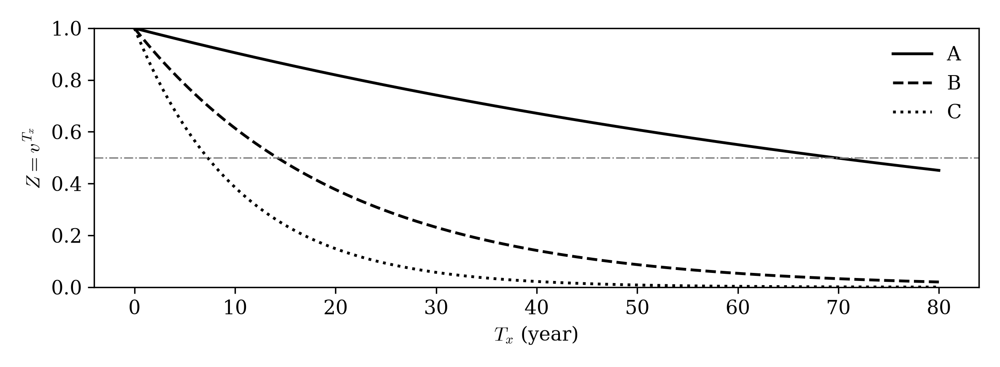
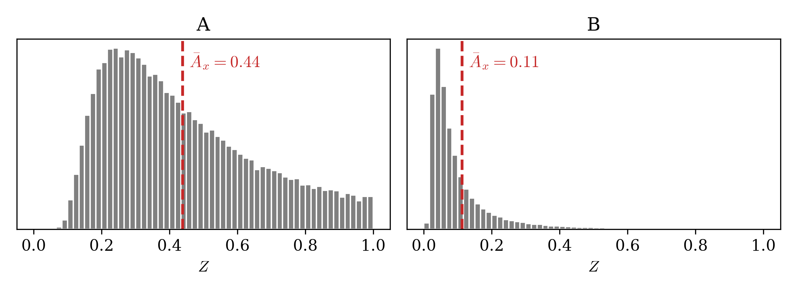
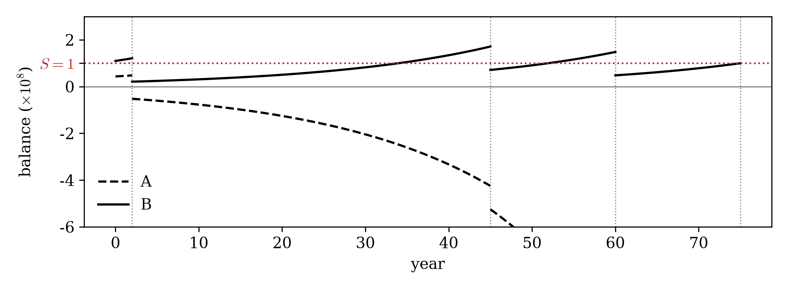
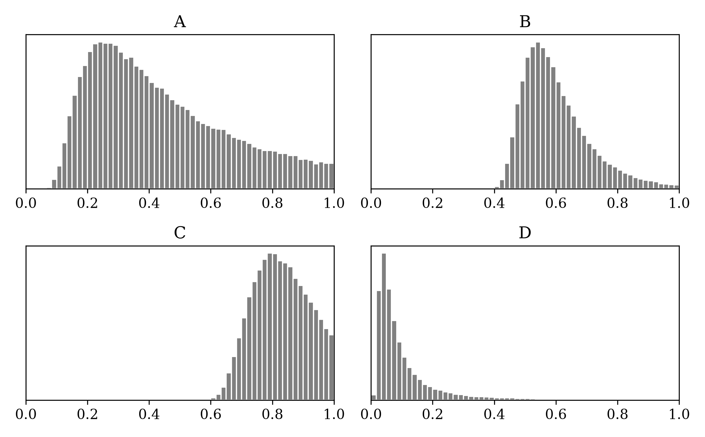

<!-- 강의영상 링크 자리.  한 줄 -->

### 문제1

다음 중 옳지 않은 것은?

1. $Z = v^{T_x}$ 는 죽는 순간 받을 1원의 지금 값이고, $T_x$ 가 확률변수라 $Z$ 도 확률변수다.
2. $\bar A_x = \mathrm{E}[Z]$ 를 보험료로 받으면 회사의 손익이 평균적으로 0 이다.
3. 보험금 $S$ 는 회사가 «내주는» 돈이고 보험료는 가입자가 «내는» 돈이다.
4. $\bar A_x$ 를 보험료로 받으면 회사는 망하지 않는다.

### 문제2

$i = 0.05$ 다. $(x)$ 의 남은 수명 $T_x$ 가 확률 0.2 로 2년, 0.5 로 10년, 0.3 으로 30년이다.

`(a)` $\mathrm{E}[Z]$ 를 구하라.

`(b)` $\mathrm{E}[T_x]$ 를 먼저 구하고 $v^{\mathrm{E}[T_x]}$ 를 구하라.

`(c)` (a) 와 (b) 중 어느 쪽이 큰가. 보험회사가 (a)를 보험료로 받아야 하는가? 아니면 (b)를 보험료로 받아야 하는가?

### 문제3

$\bar A_{20}$ 을 세 이자율에서 계산하니 아래와 같았다. 이자율은 $1\%$, $5\%$, $10\%$ 중 하나씩이다. 각 값에 이자율을 짝지어라.

| | $\bar A_{20}$ | 이자율 |
|---|---|---|
| (a) | 0.0310 | |
| (b) | 0.1129 | |
| (c) | 0.6006 | |

### 문제4

아래는 $Z = v^{T_x}$ 를 $T_x$ 에 대해 그린 것이다. 이자율은 $1\%$, $5\%$, $10\%$ 중 하나씩이다. 회색 점선은 $Z = 0.5$ 다.

{width=75% fig-align="center"}

`(a)` $i = 5\%$ 인 곡선은 어느 것인가.

`(b)` 그 곡선이 $Z = 0.5$ 와 만나는 $T_x$ 를 그림에서 대략적으로 읽어라.

`(c)` $i = 5\%$ 에서 어떤 사람에게 보험료로 0.5 를 받았다. 회사가 이 사람에게서 손해를 보는 것은 $T_x$ 가 (b)의 답보다 작을때인가? 클때인가?

### 문제5

아래는 같은 이자율 $5\%$ 에서 두 나이의 $Z$ 를 각각 10만 번 뽑아 그린 히스토그램이다. 한쪽은 20세, 한쪽은 60세다. 빨간 파선은 $\bar A_x$ 이고, A 에서는 $0.44$, B 에서는 $0.11$ 이다.

{width=75% fig-align="center"}

`(a)` 60세는 어느 쪽이라고 생각하는가. 까닭을 한 줄로 써라.

`(b)` 보험회사는 $S\bar A_x$ 만을 보험료로 받는다고 가정하자. 60세인 사람은 20세인 사람보다 몇 배나 더 비싸게 주고 보험에 가입해야 할까?

### 문제6

이투데이 2023년 1월 4일 기사 [「고금리 지속에 종신보험료 낮아진다…새해 예정이율 일제히 상향」](https://www.etoday.co.kr/news/view/2209444) 의 한 대목이다.

> 고금리 효과로 소비자들은 보험료 할인 혜택을 보게 됐다. 다수의 생명보험사들은 올해 들어 주력 상품들의 예정이율을 상향 조정해 보험료를 내렸다.

기사에 따르면 예정이율이란 「보험사가 보험금을 지급하기 위해 적용하는 이율」이다. (우리 강의노트의 기호로는 $i$ 다.) 이 기사가 왜 말이 되는지 설명하라. 

### 문제7

$i = 0.05$, 보험금 $S = 1$억이다.

`(a)` $v$ 의 값을 구하라.

`(b)` 10년 뒤에 죽는 사람의 $Z$ 를 구하라.

`(c)` 그 사람의 $SZ$ 를 만원 단위로 구하라.

`(d)` $\bar A_x = 0.3$ 인 사람에게 받아야 할 보험료 $S\bar A_x$ 를 만원 단위로 구하라.

`(e)` $Z = 0.99$ 인 사람은 가입 뒤 대략 몇 년 만에 죽은 것인가.

### 문제8

$i = 0.05$ 다. 갑은 남은 수명이 «확실히» 10년이다. 을은 확률 0.5 로 2년, 0.5 로 18년이다. 죽는 순간 1억을 준다.

`(a)` 두 사람의 $\mathrm{E}[T_x]$ 를 구하라.

`(b)` 두 사람의 $v^{\mathrm{E}[T_x]}$ 를 구하라.

`(c)` 두 사람의 $\mathrm{E}[Z]$ 를 구하라.

`(d)` 보험회사가 $10^8 \times \mathrm{E}[Z]$ 를 보험료로 받는다고 하자. 두 사람 중 누가 더 많은 돈을 내야 할까? 이유를 써라.

### 문제9

남은 수명이 확률 0.5 로 $a$ 년, 0.5 로 $b$ 년일 때($a < b$), $\mathrm{E}[Z] > v^{\mathrm{E}[T_x]}$ 임을 $v^t$ 의 그래프 모양(문제4 의 그림)으로 설명하라.

### 문제10

03wk-2 예제5 의 네 사람(남은 수명 2·45·60·75년, 보험금 1억, $i = 0.05$)에게 같은 보험료를 받고 잔고를 따라간 그림이다. 한 선은 「수명 평균 45.5년을 넣어 만든 보험료 1,086만원」, 다른 선은 「$\mathrm{E}[Z]$ 로 만든 보험료 2,744만원」을 받은 것이다. 점선 세로줄은 사망 시각이다.

{width=75% fig-align="center"}

`(a)` $\mathrm{E}[Z]$ 로 만든 보험료를 받은 쪽은 A, B 중 어느 것인가.

`(b)` 다른 쪽은 언제 처음 잔고가 음수가 되는가. 그 뒤로 왜 점점 더 가파르게 내려가는가.

`(c)` $\mathrm{E}[Z]$ 로 만든 보험료를 받은 쪽은 75년째에 마지막 사람에게 1억을 내준 뒤 잔고가 얼마인가.

### 문제11

$i = 0.05$ 다. $(x)$ 의 남은 수명이 확률 0.5 로 2년, 0.5 로 30년이다. 죽는 순간 1억을 준다.

`(a)` $10^8 \times \mathrm{E}[Z]$ 를 보험료로 받으면 이 한 사람에게서 회사의 잔고가 음수가 될(망할) 확률은 얼마인가.

`(b)` 그 확률을 0 으로 만들려면 보험료를 최소 얼마로 받아야 하는가.

`(c)` (b) 의 보험료를 받으면 이 사람이 30년 뒤에 죽었을 때 회사는 얼마를 남기는가. (30년 뒤 시점의 금액으로.)

### 문제12

어떤 사람에게 보험료로 0.5 (보험금 1원 기준) 를 받았다. 회사가 손해 보는 사건은 $T_x < u$ 이고 $u$ 는 이자율에 따라 다르다.

`(a)` $v^u = 0.5$ 에서 $u$ 를 이자율 $1\%$, $5\%$, $10\%$ 에 대해 각각 구하라. (계산기)

`(b)` 이자율이 높을수록 회사가 손해 보는 $T_x$ 의 범위는 넓어지는가 좁아지는가.

`(c)` (b) 에서는 이자율이 높을수록 회사가 손해 보는 범위가 넓어졌는데, 문제6 의 기사는 금리가 오르자 보험료를 «내렸다»고 한다. 둘이 모순이 아닌 까닭을 한 줄로 써라.

### 문제13

아래 네 히스토그램은 나이 20세·60세와 이자율 $1\%$·$5\%$ 의 네 조합에서 $Z$ 를 10만 번 뽑아 그린 것이다.

{width=75% fig-align="center"}

각 그림이 어느 조합인지 아래의 표를 채워라.

| 그림 | 나이 | 이자율 |
|---|---|---|
| A | | |
| B | | |
| C | | |
| D | | |

