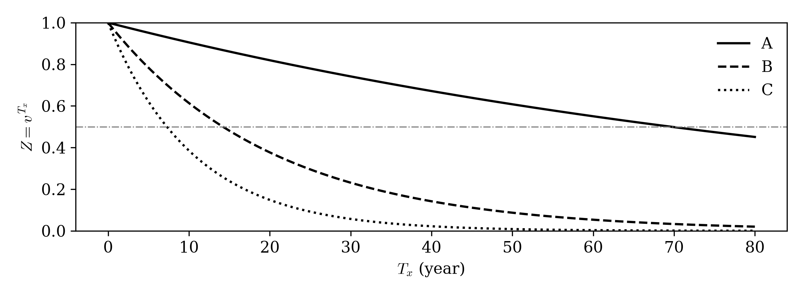
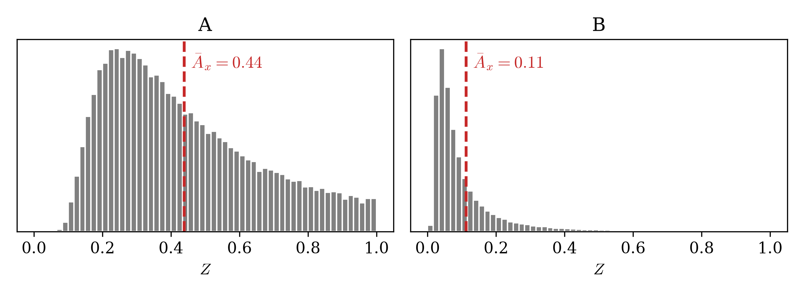
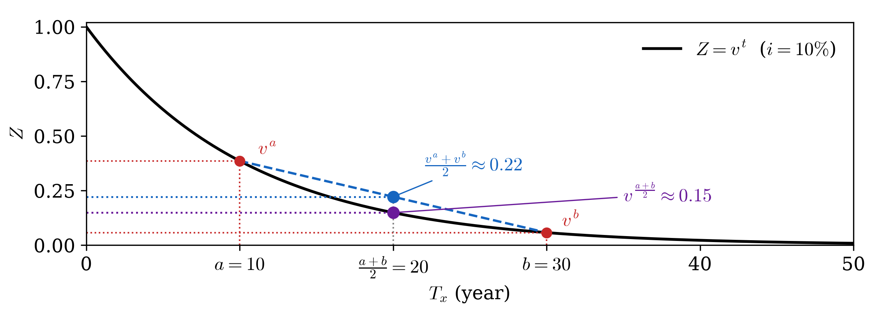
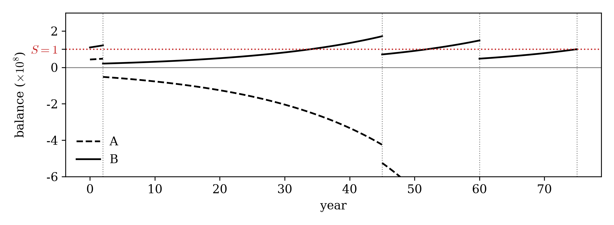
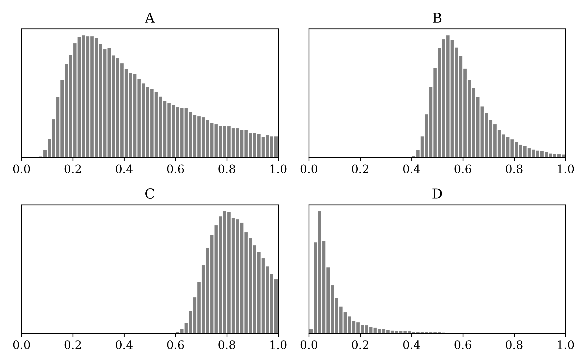



### 문제1

다음 중 옳지 않은 것은?

1. $Z = v^{T_x}$ 는 죽는 순간 받을 1원의 지금 값이고, $T_x$ 가 확률변수라 $Z$ 도 확률변수다.
2. $\bar A_x = \mathrm{E}[Z]$ 를 보험료로 받으면 회사의 손익이 평균적으로 0 이다.
3. 보험금 $S$ 는 회사가 «내주는» 돈이고 보험료는 가입자가 «내는» 돈이다.
4. $\bar A_x$ 를 보험료로 받으면 회사는 망하지 않는다.

::: {.callout-note collapse="true" title="풀이"}
답은 4. 손익이 평균적으로 0 이라는 것과 망하지 않는다는 것은 다르다. 

:::

### 문제2

$i = 0.05$ 다. $(x)$ 의 남은 수명 $T_x$ 가 확률 0.2 로 2년, 0.5 로 10년, 0.3 으로 30년이다.

`(a)` $\mathrm{E}[Z]$ 를 구하라.

::: {.callout-note collapse="true" title="풀이"}
$v = \dfrac{1}{1.05}$ 이다. $T_x$ 의 확률분포표는 아래와 같다.

| $t$ | 2 | 10 | 30 |
|---|---|---|---|
| $\Pr(T_x = t)$ | 0.2 | 0.5 | 0.3 |

$Z = v^{T_x}$ 이므로 $Z$ 의 확률분포표는 아래와 같다.

| $z$ | $v^{2} = 0.9070$ | $v^{10} = 0.6139$ | $v^{30} = 0.2314$ |
|---|---|---|---|
| $\Pr(Z = z)$ | 0.2 | 0.5 | 0.3 |

평균은 (값 × 확률)의 합이다.

$$
\mathrm{E}[Z] = 0.2 \times 0.9070 + 0.5 \times 0.6139 + 0.3 \times 0.2314 = 0.1814 + 0.3070 + 0.0694 = 0.5578
$$

:::

`(b)` $\mathrm{E}[T_x]$ 를 먼저 구하고 $v^{\mathrm{E}[T_x]}$ 를 구하라.

::: {.callout-note collapse="true" title="풀이"}
$$
\mathrm{E}[T_x] = 0.2 \times 2 + 0.5 \times 10 + 0.3 \times 30 = 0.4 + 5 + 9 = 14.4
$$

$$
v^{\mathrm{E}[T_x]} = 1.05^{-14.4} = 0.4953
$$

:::

`(c)` (a) 와 (b) 중 어느 쪽이 큰가. 보험회사가 (a)를 보험료로 받아야 하는가? 아니면 (b)를 보험료로 받아야 하는가?

::: {.callout-note collapse="true" title="풀이"}
(a) 가 크다: $0.5578 > 0.4953$. 그리고 (a) 를 받아야 한다.

:::

### 문제3

$\bar A_{20}$ 을 세 이자율에서 계산하니 아래와 같았다. 이자율은 $1\%$, $5\%$, $10\%$ 중 하나씩이다. 각 값에 이자율을 짝지어라.

|     | $\bar A_{20}$ | 이자율 |
| --- | ------------- | --- |
| (a) | 0.0310        |     |
| (b) | 0.1129        |     |
| (c) | 0.6006        |     |

::: {.callout-note collapse="true" title="풀이"}

| | $\bar A_{20}$ | 이자율 |
|---|---|---|
| (a) | 0.0310 | $10\%$ |
| (b) | 0.1129 | $5\%$ |
| (c) | 0.6006 | $1\%$ |

이자율이 높을수록 $(20)$이 가입해야할 보험료는 작아진다.

:::

### 문제4

아래는 $Z = v^{T_x}$ 를 $T_x$ 에 대해 그린 것이다. 이자율은 $1\%$, $5\%$, $10\%$ 중 하나씩이다. 회색 점선은 $Z = 0.5$ 다.

{width=75% fig-align="center"}

`(a)` $i = 5\%$ 인 곡선은 어느 것인가.

::: {.callout-note collapse="true" title="풀이"}
B.

$T_x = 10$ 으로 고정하고 세 곡선의 높이를 보자. 높이가 크다는 것은 10년 뒤에 줄 1원을 위해 지금 받아야 할 돈이 크다는 것, 곧 비싸다는 뜻이고, 그것이 이자율이 낮은 경우다. 그러므로 가장 높은 A 가 $1\%$, 가운데 B 가 $5\%$, 가장 낮은 C 가 $10\%$ 다.

:::

`(b)` 그 곡선이 $Z = 0.5$ 와 만나는 $T_x$ 를 그림에서 대략적으로 읽어라.

::: {.callout-note collapse="true" title="풀이"}
약 14년.

(계산으로 확인) $v^u = (1+i)^{-u} = (1.05)^{-u} = 0.5$ 를 풀면 $-u\log(1.05) = \log(0.5)$, 즉

$$
u = -\frac{\log 0.5}{\log 1.05} \approx 14.2
$$

5% 로 굴리면 돈이 두 배가 되는 데 약 14년이 걸린다는 뜻이다.

:::

`(c)` $i = 5\%$ 에서 어떤 사람에게 보험료로 0.5 (보험금 1원 기준) 를 받았다. 회사가 이 사람에게서 손해를 보는 것은 $T_x$ 가 (b)의 답보다 작을때인가? 클때인가?

::: {.callout-note collapse="true" title="풀이"}
작을 때다.

회사는 가입자가 오래 살수록 이득이다. 받은 0.5 를 굴릴 시간이 길어지기 때문이다. (b) 의 답 약 14.2년은 0.5 가 불어나 딱 1 이 되는 때, 곧 손익분기점에 해당한다. 그러므로 $T_x$ 가 (b) 의 답보다 크면 회사가 이득이고, 작으면 손해다.

:::

### 문제5

아래는 같은 이자율 $5\%$ 에서 두 나이의 $Z$ 를 각각 10만 번 뽑아 그린 히스토그램이다. 한쪽은 20세, 한쪽은 60세다. 빨간 파선은 $\bar A_x$ 이고, A 에서는 $0.44$, B 에서는 $0.11$ 이다.

{width=75% fig-align="center"}

`(a)` 60세는 어느 쪽이라고 생각하는가. 까닭을 한 줄로 써라.

::: {.callout-note collapse="true" title="풀이"}
A.
나이가 어릴수록 보험료가 싸니까 

:::

`(b)` 보험회사는 $S\bar A_x$ 만을 보험료로 받는다고 가정하자. 60세인 사람은 20세인 사람보다 몇 배나 더 비싸게 주고 보험에 가입해야 할까?

::: {.callout-note collapse="true" title="풀이"}
약 4 배.

:::

### 문제6

이투데이 2023년 1월 4일 기사 [「고금리 지속에 종신보험료 낮아진다…새해 예정이율 일제히 상향」](https://www.etoday.co.kr/news/view/2209444) 의 한 대목이다.

> 고금리 효과로 소비자들은 보험료 할인 혜택을 보게 됐다. 다수의 생명보험사들은 올해 들어 주력 상품들의 예정이율을 상향 조정해 보험료를 내렸다.

기사에 따르면 예정이율이란 「보험사가 보험금을 지급하기 위해 적용하는 이율」이다. (우리 강의노트의 기호로는 $i$ 다.) 이 기사가 왜 말이 되는지 설명하라. 

::: {.callout-note collapse="true" title="풀이"}
예정이율이 높아지면 보험사가 돈을 굴려서 이득을 볼 수 있으므로 보험료를 낮춘다. 

:::

### 문제7

$i = 0.05$, 보험금 $S = 1$억이다.

`(a)` $v$ 의 값을 구하라.

::: {.callout-note collapse="true" title="풀이"}
$$
v = \frac{1}{1+i} = \frac{1}{1.05} \approx 0.9524
$$

:::

`(b)` 10년 뒤에 죽는 사람의 $Z$ 를 구하라.

::: {.callout-note collapse="true" title="풀이"}
$T_x = 10$ 이므로

$$
Z = v^{10} = 1.05^{-10} \approx 0.6139
$$

:::

`(c)` 그 사람의 $SZ$ 를 만원 단위로 구하라.

::: {.callout-note collapse="true" title="풀이"}
$$
6{,}139 \ \text{만원}
$$

:::

`(d)` $\bar A_x = 0.3$ 인 사람에게 받아야 할 보험료 $S\bar A_x$ 를 만원 단위로 구하라.

::: {.callout-note collapse="true" title="풀이"}
$$
3{,}000 \ \text{만원}
$$

:::

`(e)` $Z = 0.99$ 인 사람은 가입 뒤 대략 몇 년 만에 죽은 것인가.

::: {.callout-note collapse="true" title="풀이"}
$$
\begin{aligned}
v^{T_x} = 0.99
&\iff 1.05^{-T_x} = 0.99 \\
&\iff -T_x \log(1.05) = \log(0.99) \\
&\iff T_x = -\frac{\log(0.99)}{\log(1.05)} = -\frac{-0.01005}{0.04879} \approx 0.206
\end{aligned}
$$

약 0.2년, 곧 두 달 반(약 75일) 만에 죽은 것이다.

:::

### 문제8

$i = 0.05$ 다. 갑은 남은 수명이 «확실히» 10년이다. 을은 확률 0.5 로 2년, 0.5 로 18년이다. 죽는 순간 1억을 준다.

`(a)` 두 사람의 $\mathrm{E}[T_x]$ 를 구하라.

::: {.callout-note collapse="true" title="풀이"}
- 갑: $\mathrm{E}[T_x] = 10$
- 을: $\mathrm{E}[T_x] = 0.5 \times 2 + 0.5 \times 18 = 1 + 9 = 10$

:::

`(b)` 두 사람의 $v^{\mathrm{E}[T_x]}$ 를 구하라.

::: {.callout-note collapse="true" title="풀이"}
$\mathrm{E}[T_x]$ 가 둘 다 10 이므로 둘 다

$$
v^{10} = 1.05^{-10} \approx 0.6139
$$

:::

`(c)` 두 사람의 $\mathrm{E}[Z]$ 를 구하라.

::: {.callout-note collapse="true" title="풀이"}
- 갑: $Z$ 가 언제나 $v^{10}$ 이므로 $\mathrm{E}[Z] = v^{10} \approx 0.6139$
- 을: $Z$ 는 확률 0.5 로 $v^2$, 확률 0.5 로 $v^{18}$ 이다.

$$
\mathrm{E}[Z] = 0.5 \times 1.05^{-2} + 0.5 \times 1.05^{-18} = 0.5 \times 0.9070 + 0.5 \times 0.4155 \approx 0.6613
$$

:::

`(d)` 보험회사가 $10^8 \times \mathrm{E}[Z]$ 를 보험료로 받는다고 하자. 두 사람 중 누가 더 많은 돈을 내야 할까? 이유를 써라.

::: {.callout-note collapse="true" title="풀이"}
을이 더 많이 낸다. 갑은 약 6,139만원, 을은 약 6,613만원이다.

(느낌) $T_x$ 가 작을수록 $Z$ 의 값이 크게 튀어 오른다($f(x) = 1.05^{-x}$ 꼴의 그래프이기 때문이다). 이 튀는 값이 $Z$ 의 평균을 크게 끌어올린다. 반면에 큰 $T_x$ 는 $Z$ 의 값을 그만큼 많이 누르지 못한다. 따라서 평균 수명이 같다면 $T_x$ 가 덜 퍼져 있을수록(분산이 작을수록) 보험료가 싸다.

(정식해설) 보험료는 $v^{\mathrm{E}[T_x]}$ 가 아니라 $\mathrm{E}[Z]$ 이다. 두 사람의 $v^{\mathrm{E}[T_x]}$ 는 같지만 $\mathrm{E}[Z]$ 는 을이 더 크다.

:::

### 문제9

남은 수명이 확률 0.5 로 $a$ 년, 0.5 로 $b$ 년일 때($a < b$), $\mathrm{E}[Z] > v^{\mathrm{E}[T_x]}$ 임을 $v^t$ 의 그래프 모양(문제4 의 그림)으로 설명하라.

::: {.callout-note collapse="true" title="풀이"}
먼저 두 값을 식으로 쓰자.

- $T_x$ 는 각각 반반의 확률로 $a$, $b$ 다.
- $\mathrm{E}[T_x] = \dfrac{a+b}{2}$ 이므로 $v^{\mathrm{E}[T_x]} = v^{\frac{a+b}{2}}$ 다.
- $\mathrm{E}[Z] = \mathrm{E}[v^{T_x}] = \dfrac{v^a + v^b}{2}$ 다.

그러니 보여야 할 것은 아래다.

$$
\frac{v^a + v^b}{2} > v^{\frac{a+b}{2}}
$$

좌변은 「높이의 평균」이고 우변은 「평균 위치의 높이」다. 문제4 그림의 C 곡선($i = 10\%$)에서 $a = 10$, $b = 30$ 으로 재 보자.

- 좌변: $T_x = 10$ 의 높이 $v^{10} \approx 0.39$ 와 $T_x = 30$ 의 높이 $v^{30} \approx 0.06$ 을 세로축에서 평균 내면 약 $0.22$ 다.
- 우변: 가로축에서 먼저 평균 내어 $T_x = 20$ 으로 간 뒤 높이를 읽으면 $v^{20} \approx 0.15$ 다.

{width=75% fig-align="center"}

$0.22 > 0.15$ 다. 곡선이 처음에 가파르게 떨어지다가 점점 완만해지기 때문이다. 일찍 죽는 $a$ 쪽의 높이는 크게 높고, 늦게 죽는 $b$ 쪽의 높이는 이미 바닥 근처라 더 내려갈 데가 없다. 그래서 높이를 평균 내면 $a$ 쪽이 평균을 위로 끌어올려, 가운데 위치의 높이보다 커진다.

문제8 에서 을($a = 2$, $b = 18$)의 $\mathrm{E}[Z] = 0.6613$ 이 $v^{10} = 0.6139$ 보다 컸던 것도 이것이다.

:::

### 문제10

03wk-2 예제5 의 네 사람(남은 수명 2·45·60·75년, 보험금 1억, $i = 0.05$)에게 같은 보험료를 받고 잔고를 따라간 그림이다. 한 선은 「수명 평균 45.5년을 넣어 만든 보험료 1,086만원」, 다른 선은 「$\mathrm{E}[Z]$ 로 만든 보험료 2,744만원」을 받은 것이다. 점선 세로줄은 사망 시각이다.

{width=75% fig-align="center"}

`(a)` $\mathrm{E}[Z]$ 로 만든 보험료를 받은 쪽은 A, B 중 어느 것인가.

::: {.callout-note collapse="true" title="풀이"}
B.

:::

`(b)` 다른 쪽은 언제 처음 잔고가 음수가 되는가. 그 뒤로 왜 점점 더 가파르게 내려가는가.

::: {.callout-note collapse="true" title="풀이"}
2년째, 첫 사람(남은 수명 2년)에게 1억을 내주는 순간이다.

그 뒤로 가파라지는 까닭은 빚에 이자가 붙고, 그 이자에 또 이자가 붙기 때문이다. 

:::

`(c)` $\mathrm{E}[Z]$ 로 만든 보험료를 받은 쪽은 75년째에 마지막 사람에게 1억을 내준 뒤 잔고가 얼마인가.

::: {.callout-note collapse="true" title="풀이"}
0 원이다. 네 사람 각각에게 필요한 돈을 평균 내어 받았으므로, 마지막 사람에게 1억을 내주면 딱 맞아떨어진다(03wk-2 예제5).

:::

### 문제11

$i = 0.05$ 다. $(x)$ 의 남은 수명이 확률 0.5 로 2년, 0.5 로 30년이다. 죽는 순간 1억을 준다.

`(a)` $10^8 \times \mathrm{E}[Z]$ 를 보험료로 받으면 이 한 사람에게서 회사의 잔고가 음수가 될(망할) 확률은 얼마인가.

::: {.callout-note collapse="true" title="풀이"}
2년살면 회사는 망한다. 30년살면 망하지 않는다. 따라서 망학확률은 0.5.

:::

`(b)` 그 확률을 0 으로 만들려면 보험료를 최소 얼마로 받아야 하는가.

::: {.callout-note collapse="true" title="풀이"}

$1억 \times v^2$ 만큼 받아야한다. 
따라서 $1억 \times \left(\frac{1}{1+i}\right)^2=1억 \times 0.9070295=9070만원$

:::

`(c)` (b) 의 보험료를 받으면 이 사람이 30년 뒤에 죽었을 때 회사는 얼마를 남기는가. (30년 뒤 시점의 금액으로.)

::: {.callout-note collapse="true" title="풀이"}
$$
9{,}070 \times 1.05^{30} \approx 39{,}201 \ \text{만원}
$$

에서 1억을 내주면 $39{,}201 - 10{,}000 = 29{,}201$ 만원이 남는다. 

(해석) 너무 많이 남겨먹는데? 이러면 아무도 가입하지 않을 것이다. 「절대 안 망하는 보험료」와 「평균적으로 손익이 0 인 보험료」 사이 어딘가를 골라야 하겠음. 

:::

### 문제12

어떤 사람에게 보험료로 0.5 (보험금 1원 기준) 를 받았다. 회사가 손해 보는 사건은 $T_x < u$ 이고 $u$ 는 이자율에 따라 다르다.

`(a)` $v^u = 0.5$ 에서 $u$ 를 이자율 $1\%$, $5\%$, $10\%$ 에 대해 각각 구하라. (계산기)

::: {.callout-note collapse="true" title="풀이"}

0.5원을 1원으로 불리는 시간만큼은 그 어떤사람이 살아줘야 회사입장에서 손해는 아니다. 그 0.5원을 1원으로 불리는 시간은 이자율에 따라 다르다. 

- 이자율이 1% 라면 $1.01^{??}=2$ 
- 이자율이 5% 라면 $1.05^{??}=2$ 
- 이자율이 10% 라면 $1.1^{??}=2$ 

이고 각각의 경우에 대하여 ??를 구하면 

- $\frac{\log 2}{\log 1.01} \approx 69.7$ 년
- $\frac{\log 2}{\log 1.05} \approx 14.2$ 년
- $\frac{\log 2}{\log 1.1} \approx 7.3$ 년

이다. 

(설명) ?? 가 곧 $u$ 다. $v^u = 0.5$ 는 $(1+i)^u = 2$ 와 같기 때문이다.

:::

`(b)` 이자율이 높을수록 회사가 손해 보는 $T_x$ 의 범위는 넓어지는가 좁아지는가.

::: {.callout-note collapse="true" title="풀이"}
가입자가 오래살아줄수록 회사입장에서는 좋은것이지만, 이자율이 높을수록 회사입장에서는 조금 덜 살아줘도 괜찮다. 따라서 회사가 손해보는 $T_x$의 범위는 좁아진다. 

:::

`(c)` (b) 에서는 이자율이 높을수록 회사가 손해 보는 범위가 좁아졌는데, 문제6 의 기사는 금리가 오르자 보험료를 «내렸다»고 한다. 둘이 모순이 아닌 까닭을 한 줄로 써라.

> 문항이 애매하게 출제되어 삭제합니다. 

### 문제13

아래 네 히스토그램은 나이 20세·60세와 이자율 $1\%$·$5\%$ 의 네 조합에서 $Z$ 를 10만 번 뽑아 그린 것이다.

{width=75% fig-align="center"}

각 그림이 어느 조합인지 아래의 표를 채워라.

| 그림 | 나이 | 이자율 |
|---|---|---|
| A | | |
| B | | |
| C | | |
| D | | |

:::{.callout-note collapse="true" title="풀이"}

| 그림 | 나이 | 이자율 |
|---|---|---|
| A | 60세 | $5\%$ |
| B | 20세 | $1\%$ |
| C | 60세 | $1\%$ |
| D | 20세 | $5\%$ |

:::

