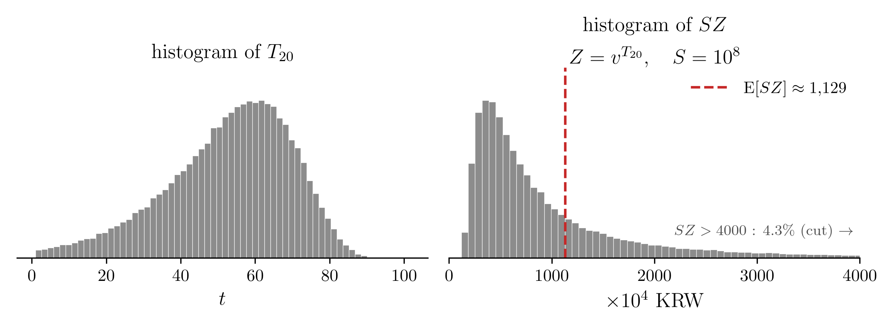
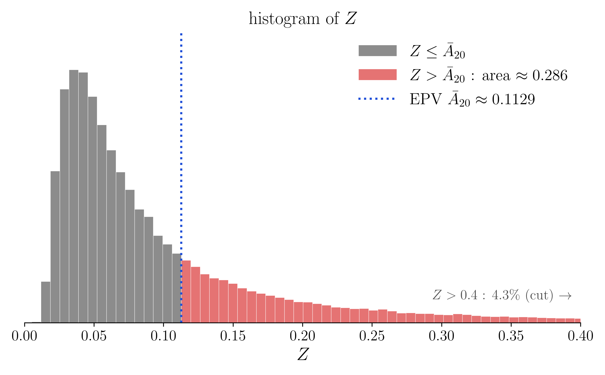

# 1. 강의영상



# 2. 보험료를 얼마로 받아야 하나? (2)

`-` "죽는 순간 보험금 $S$ 를 주는 약속"의 지금 값을 $SZ$ 라 하였다($Z = v^{T_x}$). 그리고 그 평균 $S\bar{A}_x$ 를 보험료로 받으면 회사의 손익이 평균적으로 0 임을 알게 되었다. 이 평균 $\mathrm{E}[SZ] = S\bar{A}_x$ 를 기대현재가치(expected present value), 줄여서 EPV 라 부른다. 03wk-2 에서 손익분기점이라 부른 것이 이것이다.

`-` 그러나 「손익이 평균적으로 0 인 것」과 「망하지 않는 것」은 다른 말이었다. 

`-` 퀴즈2 문제11: 남은 수명이 확률 0.5 로 2년, 0.5 로 30년인 사람 한 명에게 1억짜리 보험을 팔 때($i = 0.05$) 두 가지 보험료의 비교 

| 받은 보험료 | 망할 확률 | 비고 |
|:-------------------------|:----------:|:---------------------------|
| $10^8\,\mathrm{E}[Z] \approx 5{,}692$ 만원 (EPV) | $0.5$ | 회사가 위험하다 |
| $10^8 v^2 \approx 9{,}070$ 만원 | $0$ | 30년을 살면 29,201만원이 남는다(가입자에게 너무 비싸다) |

`-` 회사는 평균적으로 손익이 0 인 보험료와 절대 안 망하는 보험료 중 어떤 금액을 받아야 하는가? 평균적으로 손익이 0 인 보험료만 받는다면 보험금을 지급하지 못해 망할 것이다. 절대 안 망하는 보험료를 받는다면 가입자가 없어서 망할 것이다. 

# 3. 가입자를 한 명만 받은 회사가 망할 확률

`-` 보험금이 $S$ 원인 보험을 가입자 한 명에게 팔고 보험료 $P$ 원을 받았다고 하자. 받은 $P$ 는 $T_x$ 년 뒤에 $P(1+i)^{T_x}$ 가 되고 거기서 $S$ 를 내준다. 따라서

$$
\text{잔고가 음수} \iff P(1+i)^{T_x} < S \iff P < S v^{T_x} = SZ
$$

즉 가입자를 한 명만 받은 회사가 망할 확률은 $\Pr[SZ > P]$ 다.

`-` $Z$ 에 대한 확률은 $T_x$ 에 대한 확률로 바꿔 구한다. $P(1+i)^u = S$ 를 만족하는 $u$ 를 잡으면

$$
\Pr[SZ > P] = \Pr[S v^{T_x} > S v^u] = \Pr[T_x < u] = 1 - S_x(u), \qquad u = \frac{\log(S/P)}{\log(1+i)}
$$

  - $u$ 는 받은 $P$ 가 불어나 딱 $S$ 가 되는 데 걸리는 시간이다. 가입자가 그보다 일찍 죽으면 회사가 손해다. 그래서 $u$는 회사입장에서 "가입자가 적어도 이 정도는 살아 줬으면..." 하는 시간이다. 

`# 예제1` 20세인 사람에게 죽는 순간 $S = 10^8$ 원(1억)을 주는 보험을 판다. $i = 0.05$ 이고, 남은 수명 $T_{20}$ 의 생존함수는 아래와 같다.

$$S_{20}(t) = \exp\left\{-\frac{B}{\log c}\,c^{20}\left(c^t - 1\right)\right\}, \qquad B = 0.0003,\ c = 1.07$$

이 모형에서 EPV $S\bar{A}_{20}$ 을 구하려면 어려운 적분값을 계산해야 한다. 여기서는 그 계산을 건너뛰고 컴퓨터로 구한 값을 쓴다. $T_{20}$ 을 10만 번 뽑아 $T_{20}$ 과 $SZ$ 의 히스토그램을 그리고 $SZ$ 의 평균을 구하면 약 $1{,}128.5$ 만원이다(그림의 빨간 파선, 반올림해 1,129).

{width=100% fig-align="center"}

  - 오른쪽 그림은 꼬리가 오른쪽으로 너무 길어서 가로축을 4,000만원에서 잘랐다. 4,000만원을 넘는 경우가 약 $4.3\%$ 다.

`(a)` EPV 를 보험료로 받았다. $P(1+i)^u = S$ 인 $u$ 를 구하라.

`(b)` EPV 를 보험료로 받았을 경우 회사가 망할 확률은 얼마인가.

`(풀이)`

`(a)` $P = 1{,}128.5$ 만원, $S = 10{,}000$ 만원이다.

$$
u = \frac{\log(S/P)}{\log(1+i)} = \frac{\log(1/\bar{A}_{20})}{\log(1+i)} = \frac{\log(10{,}000/1{,}128.5)}{\log 1.05} = 44.72 \ \text{년}
$$

20세인 사람이 적어도 44.72년(64.72세까지)은 살아야 회사가 망하지 않는다(잔고가 음수가 되지 않는다).

`(b)` 미리 살펴본 식

$$
\Pr[SZ > P] = 1 - S_x(u), \qquad u = \frac{\log(S/P)}{\log(1+i)}
$$

에 $x = 20$ 과 (a) 의 $u = 44.72$ 를 대입하면

$$
\Pr[SZ > P] = 1 - S_{20}(44.72)
$$

이고, $S_{20}(44.72)$ 는 생존함수에 $t = 44.72$ 를 넣어 구한다.

$$
\begin{aligned}
S_{20}(44.72) &= \exp\left\{-\frac{0.0003}{\log 1.07}\times 1.07^{20}\times\left(1.07^{44.72}-1\right)\right\} \\
&= \exp\left\{-0.004434 \times 3.8697 \times 19.602\right\} = \exp(-0.3363) = 0.7144
\end{aligned}
$$

따라서 $\Pr[SZ > P] = 1 - 0.7144 = 0.2856$ 이다.

해석해 보자. EPV 를 받았는데도 열 번에 세 번꼴로 망한다.

{width=75% fig-align="center"}

  - 가로축은 위 그림처럼 0.4 에서 잘랐다. 0.4 를 넘는 약 $4.3\%$ 는 그림 밖에 있고, 아래의 빨간 넓이 $28.56\%$ 에는 이것까지 들어 있다.
  - 파란 점선의 값 $\bar{A}_{20}$는 히스토그램이 그리는 $Z$의 평균값이다. 따라서 파란 선을 기준(0)으로 놓고 히스토그램을 보면, 곧 $Z - \bar{A}_{20}$ 을 보면 그 평균은 0 이다. 손익이 평균적으로 0 이라는 말이 이것이다.
  - 그러나 파란 점선의 값 $\bar{A}_{20}$가 히스토그램이 그리는 $Z$의 중앙값은 아니다. 즉 파란 선을 기준(0)으로 놓고 히스토그램을 볼때, 오른쪽의 넓이는 전체의 $50\%$ 가 아니라 약 $28.56\%$ 다.

`#`
