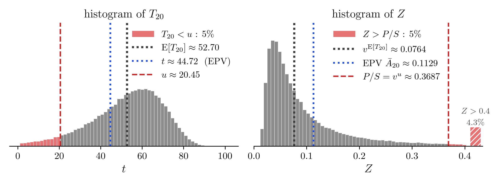

# 1. 강의영상

# 2. 가입자를 한 명만 받은 회사가 망할 확률 (2)

`# 예제1` 20세 한 사람만 받는데 망할 확률을 $5\%$ 로 줄이고 싶다. 보험료를 얼마로 받아야 하는가($i = 0.05$, $S = 10^8$). 생존함수는 05wk-1 예제1 과 같다.

$$S_{20}(t) = \exp\left\{-\frac{B}{\log c}\,c^{20}\left(c^t - 1\right)\right\}, \qquad B = 0.0003,\ c = 1.07$$

`(풀이)`

망할 확률을 $5\%$ 로 셋팅한다.

$$
\Pr[SZ > P] = 1 - S_{20}(u) = 0.05
$$

이제 $S_{20}(u) = 0.95$ 인 $u$ 를 찾는다. 

$$
\begin{aligned}
S_{20}(u) = 0.95
&\iff \exp\left\{-\frac{B}{\log c}\,c^{20}\left(c^u - 1\right)\right\} = 0.95 \\
&\iff \frac{B}{\log c}\,c^{20}\left(c^u - 1\right) = -\log 0.95 \\
&\iff c^u = 1 - \frac{\log c}{B c^{20}}\log 0.95 \\
&\iff u = \frac{1}{\log c}\log\left(1 - \frac{\log c}{B c^{20}}\log 0.95\right)
\end{aligned}
$$

$B = 0.0003$, $c = 1.07$ 을 넣으면

$$
u = \frac{1}{\log 1.07}\log\left(1 - \frac{\log 1.07}{0.0003 \times 1.07^{20}}\log 0.95\right) = 20.45 \ \text{년}
$$

따라서 

$$
P = S v^{u} = 10{,}000 \times 1.05^{-20.45} = 3{,}687 \ \text{만원}
$$

해석해보자. 

{width=100% fig-align="center"}

  - 왼쪽은 $T_{20}$, 오른쪽은 $Z$ 의 히스토그램이다.
  - 오른쪽 그림도 가로축을 0.4 에서 잘랐다. 0.4 밖에 있는 약 $4.3\%$ 는 오른쪽 끝의 빗금 막대 하나로 모아 그렸다. 두 히스토그램은 전체 넓이가 같도록 그렸으므로 빨간 넓이도 좌우가 같다(둘 다 $5\%$).
  - 선은 세 쌍이다. 빨간 파선은 망할 확률을 $5\%$ 로 맞춘 $u \approx 20.45$ 와 그때의 보험료 $P/S = v^u \approx 0.3687$ 이다. 파란 점선은 EPV $\bar{A}_{20} \approx 0.1129$ 와 그에 대응하는 $t \approx 44.72$ 다. 검은 점선은 03wk-2 에서 본 평균 수명 $\mathrm{E}[T_{20}] \approx 52.70$ 과 $v^{\mathrm{E}[T_{20}]} \approx 0.0764$ 로, 참고로 그렸다.
  - 왼쪽 그림에서 $T_{20} < u \approx 20.45$ 인 사람들은 40.45세 전에 죽는 사람들이며, 이 경우가 $5\%$ 다.
  - 오른쪽 그림에서 파란 점선 EPV $\bar{A}_{20} \approx 0.1129$ 에 해당하는 보험료를 받으면 05wk-1 예제1 에서처럼 $28.6\%$ 로 망한다. 이 파란 선을 오른쪽으로 밀어 빨간 선까지 가야 망할 확률이 $5\%$ 가 된다. 그러다 보니 EPV(1,129만원)의 세 배가 넘는 가격까지 밀어야 한다.
  - 20세가 40.45세 전에 죽는 $5\%$ 의 경우까지 대비하려면 이만큼 받아야 한다. (그렇지만 너무 비싸서 아무도 가입하지 않을 것이다.)
