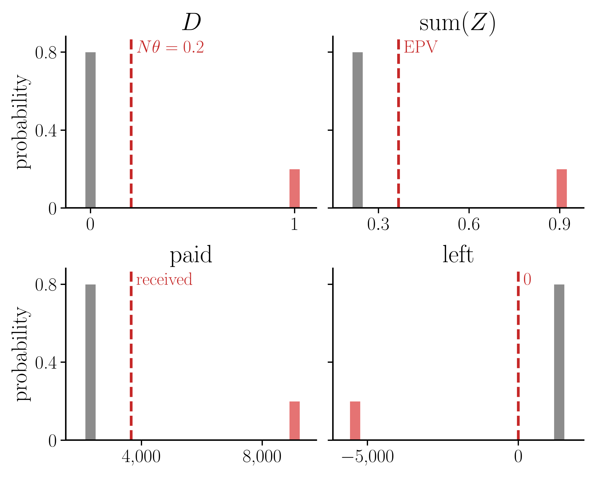
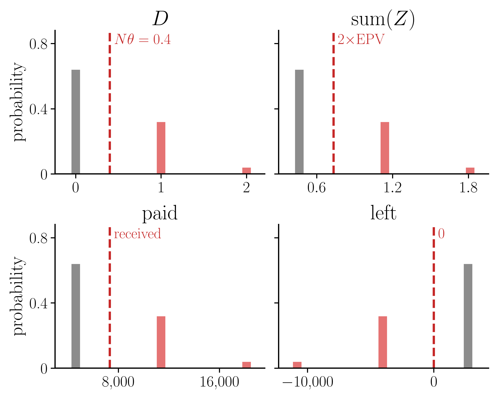
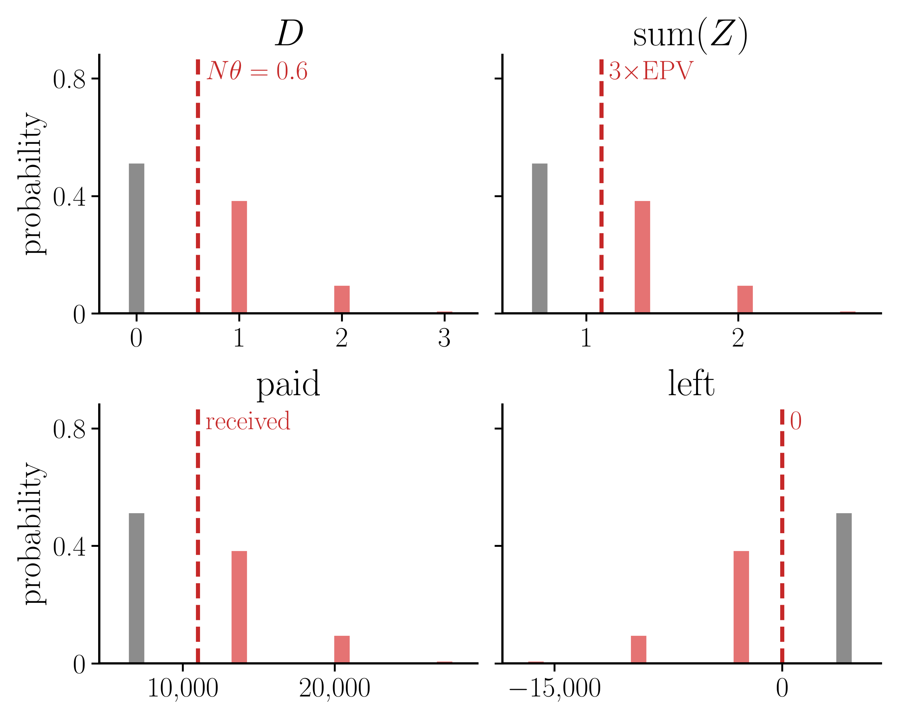
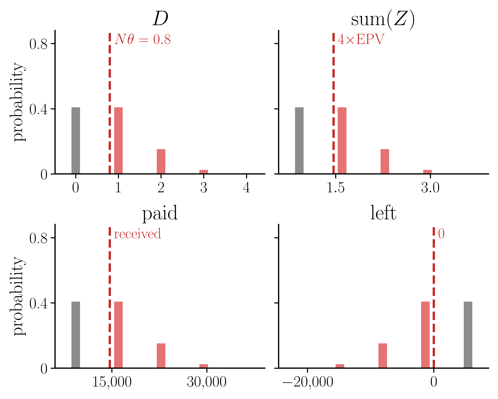
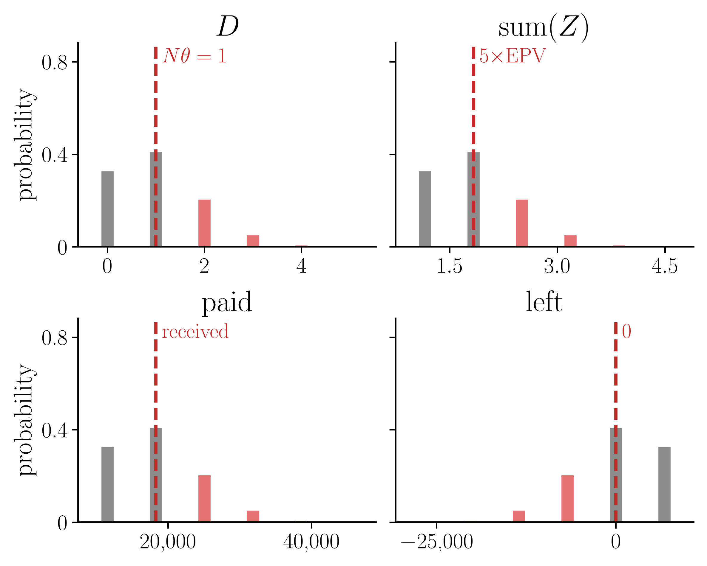
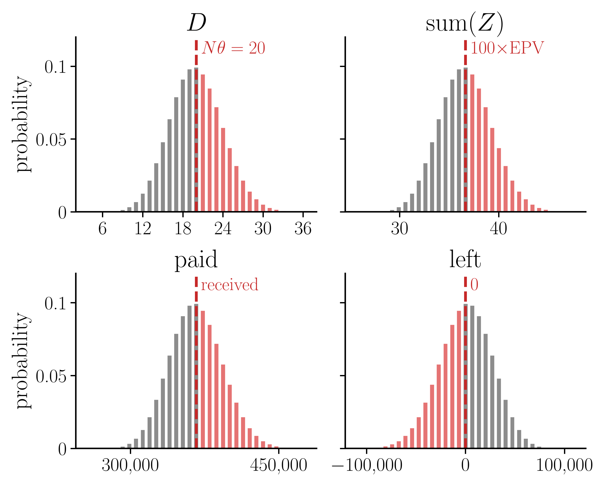
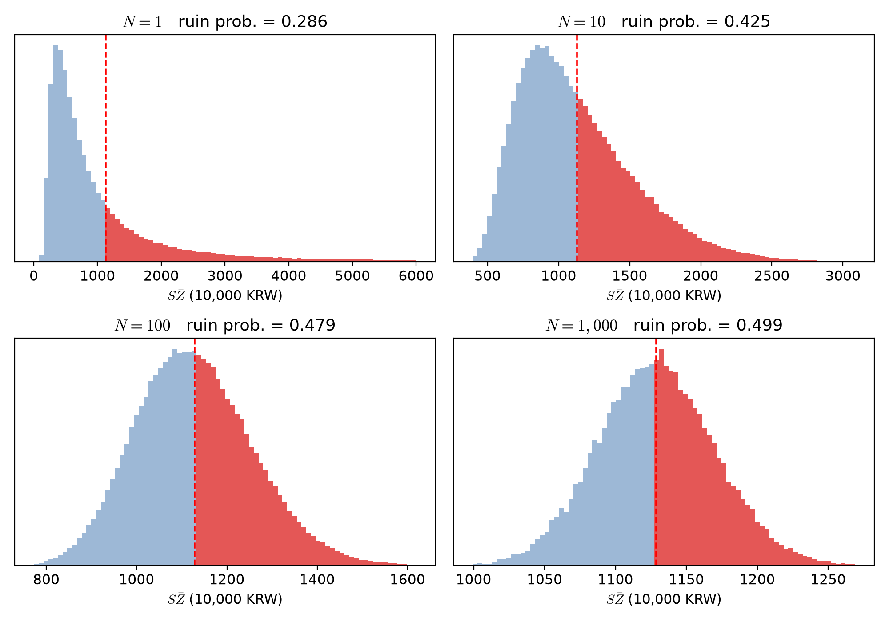
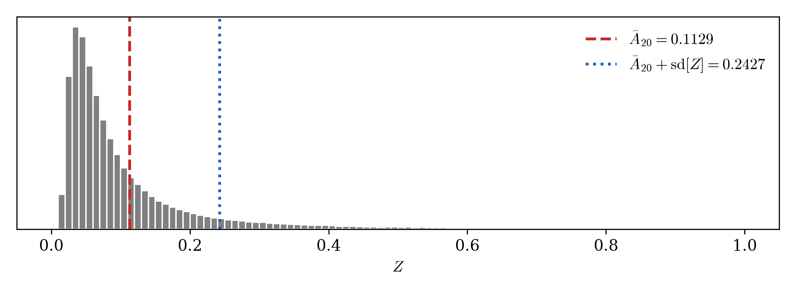
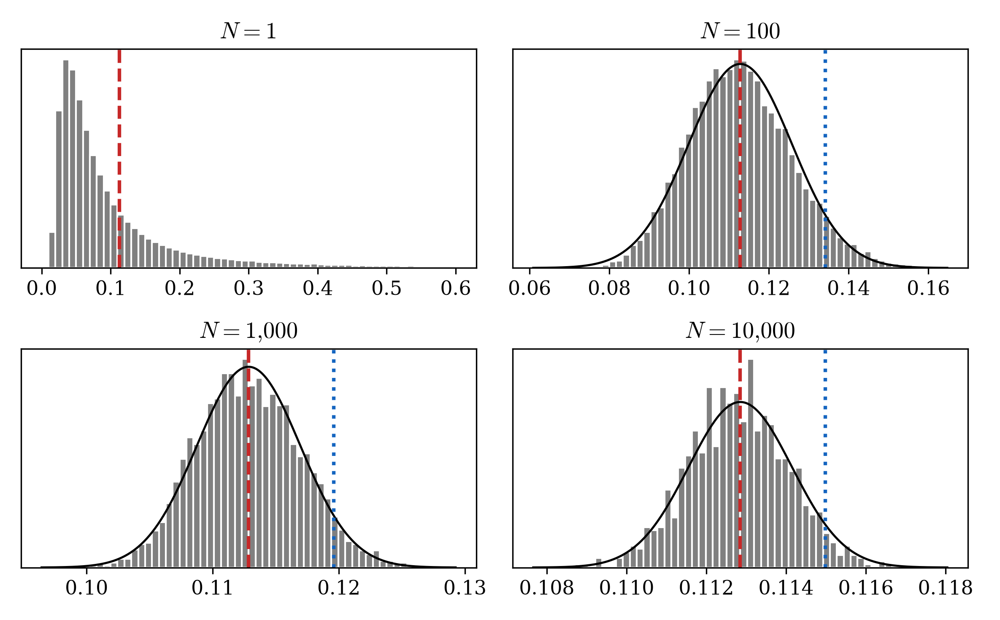
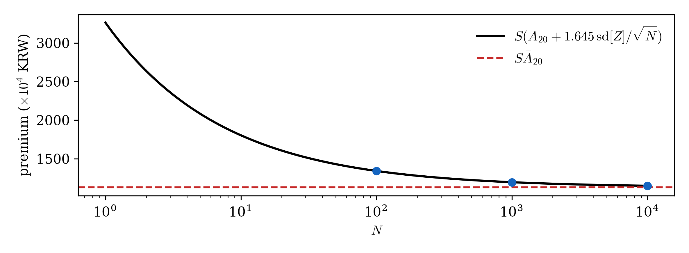

# 1. 강의영상

# 2. 가입자를 한 명만 받은 회사가 망할 확률 (2)

`# 예제1` 보험금이 $S = 10^8$ 원(1억)이고 $i = 0.05$ 다. 보험료로 $P = 5{,}000$ 만원을 받았다. $P(1+i)^u = S$ 인 $u$ 를 구하라.

`(풀이)` $u = \log(S/P)/\log(1+i) = \log 2/\log 1.05 = 14.21$ 년. 받은 보험료 $P$ 가 이자로 불어나 딱 보험금 $S$ 가 되는 데 걸리는 시간이다.

`# 예제2` 가입자는 1명이다. 보험료 $P$ 를 받았고, $P(1+i)^u = S$ 인 $u$ 를 잡았다. 옳은 것을 모두 고르라.

1. 가입자가 $u$ 보다 일찍 죽으면 회사는 손해다.
2. 가입자가 딱 $u$ 년을 살고 죽으면 회사는 이득이다.
3. 가입자가 $u$ 보다 오래 살면 회사는 이득이다.
4. 가입자가 딱 $u$ 년을 살고 죽으면 회사는 망하지 않는다.

`(풀이)` 답은 1, 3, 4. 딱 $u$ 년이면 불어난 보험료가 딱 $S$ 라 잔고가 0 이다. 이득도 손해도 아니지만 음수가 아니므로 망하지는 않는다.

`# 예제3` 보험금 $S$ 는 그대로다. 아래 1~4 가 일어나면 $u$ 는 커지는가, 작아지는가?

1. 보험료 $P$ 를 더 많이 받는다.
2. 보험료 $P$ 를 더 적게 받는다.
3. 이자율 $i$ 가 오른다.
4. 이자율 $i$ 가 내린다.

`(풀이)` 1 은 작아진다, 2 는 커진다, 3 은 작아진다, 4 는 커진다. 받은 돈이 많거나 이자가 크면 $S$ 까지 빨리 불어난다.

`# 예제4` 보험금이 1억, 보험료가 5,000만원이다. 이자율이 $i = 0.05$ 에서 $i = 0.10$ 으로 오르면 $u$ 는 몇 년에서 몇 년으로 바뀌는가?

`(풀이)` $u = \log 2/\log 1.05 = 14.21$ 년에서 $u = \log 2/\log 1.10 = 7.27$ 년으로 줄어든다. 이자가 크면 $P$ 가 $S$ 까지 빨리 불어난다.

`# 예제5` 보험금이 1억이고 $i = 0.05$ 다. $u = 10$ 년이 되게 하려면 보험료를 얼마 받아야 하는가?

`(풀이)` $P = S v^{u} = 10{,}000 \times 1.05^{-10} = 6{,}139$ 만원. 10년 뒤 1억의 지금 값이다.

`# 예제6` 20세인 사람에게 보험금 1억인 보험을 팔고 보험료 1,128.5만원을 받았다($i = 0.05$). 20세인 사람이 64.72세 전에 죽을 확률은 $28.56\%$ 다. 회사가 망할 확률은?

1. $5\%$
2. $28.56\%$
3. $50\%$
4. $71.44\%$

`(풀이)` 답은 2. $u = \log(10{,}000/1{,}128.5)/\log 1.05 = 44.72$ 년이므로 가입자가 64.72세 전에 죽으면 망한다. 1,128.5만원은 손익분기점(EPV)인데도 열 번에 세 번꼴로 망한다.

`# 예제7` 20세인 사람에게 보험금 1억인 보험을 팔고 보험료 5,000만원을 받았다($i = 0.05$). 생존함수가 아래와 같을 때 회사가 망할 확률은 얼마인가?

$$S_{20}(t) = \exp\left\{-\frac{B}{\log c}\,c^{20}\left(c^t - 1\right)\right\}, \qquad B = 0.0003,\ c = 1.07$$

`(풀이)` $u = \log 2/\log 1.05 = 14.207$ 년이다. 생존함수에 넣으면

$$
\begin{aligned}
S_{20}(14.207) &= \exp\left\{-\frac{0.0003}{\log 1.07}\times 1.07^{20}\times\left(1.07^{14.207}-1\right)\right\} \\
&= \exp\left\{-0.004434 \times 3.8697 \times 1.6149\right\} = \exp(-0.0277) = 0.9727
\end{aligned}
$$

이므로 망할 확률은 $1 - 0.9727 = 0.0273$, 약 $2.7\%$ 다.

`# 예제8` -- 20세 한 사람만 받는데 망할 확률을 $5\%$ 로 줄이고 싶다. 보험료를 얼마로 받아야 하는가($i = 0.05$, $S = 10^8$). 생존함수는 아래와 같다.

$$S_{20}(t) = \exp\left\{-\frac{B}{\log c}\,c^{20}\left(c^t - 1\right)\right\}, \qquad B = 0.0003,\ c = 1.07$$

`(풀이)`

망할 확률을 $5\%$ 로 셋팅한다.

$$
\Pr[SZ > P] = 1 - S_{20}(u) = 0.05
$$

이제 $S_{20}(u) = 0.95$ 인 $u$ 를 찾는다. 

$$
\begin{aligned}
S_{20}(u) = 0.95
&\iff \exp\left\{-\frac{B}{\log c}\,c^{20}\left(c^u - 1\right)\right\} = 0.95 \\
&\iff \frac{B}{\log c}\,c^{20}\left(c^u - 1\right) = -\log 0.95 \\
&\iff c^u = 1 - \frac{\log c}{B c^{20}}\log 0.95 \\
&\iff u = \frac{1}{\log c}\log\left(1 - \frac{\log c}{B c^{20}}\log 0.95\right)
\end{aligned}
$$

$B = 0.0003$, $c = 1.07$ 을 넣으면

$$
u = \frac{1}{\log 1.07}\log\left(1 - \frac{\log 1.07}{0.0003 \times 1.07^{20}}\log 0.95\right) = 20.45 \ \text{년}
$$

따라서 

$$
P = S v^{u} = 10{,}000 \times 1.05^{-20.45} = 3{,}687 \ \text{만원}
$$

# 3. $N$ 명을 받으면?

`# 예제10` 남은 수명이 확률 0.2 로 2년, 확률 0.8 로 30년인 사람들이 있다. 이런 사람들을 서로 독립으로 $N$ 명 받는다. 보험금은 1억, $i = 0.05$ 이고, 한 사람당 EPV 를 받는다. $N = 1, 2, \dots, 10$ 일 때 회사가 망할 확률을 각각 구하라.

`(풀이)` 

::::: {.hyper-grid style="display: grid; grid-template-columns: 40% 60%; align-items: center; border: 1px solid #c8c8c8; padding: 10px 14px; margin: 0 0 -1px 0;"}
:::: {.hyper-left}
::: {style="overflow-x: auto; border-right: 1px solid #c8c8c8; padding-right: 12px;"}
**$N = 1$** · 망할 확률 $0.2$ 받은 돈 3,665

| $D$ | 확률 | $\mathrm{sum}(Z)$ | paid | left |
|---|---|---|---|---|
| 0 | 0.8 | 0.231 | 2,314 | 1,351 |
| [1]{style="color:#C62828"} | [0.2]{style="color:#C62828"} | [0.907]{style="color:#C62828"} | [9,070]{style="color:#C62828"} | [−5,405]{style="color:#C62828"} |

: {.sm tbl-colwidths="[11,17,22,24,26]"}
:::
::::

:::::

::::: {.hyper-grid style="display: grid; grid-template-columns: 40% 60%; align-items: center; border: 1px solid #c8c8c8; padding: 10px 14px; margin: 0 0 -1px 0;"}
:::: {.hyper-left}
::: {style="overflow-x: auto; border-right: 1px solid #c8c8c8; padding-right: 12px;"}
**$N = 2$** · 망할 확률 $0.36$ 받은 돈 7,330

| $D$ | 확률 | $\mathrm{sum}(Z)$ | paid | left |
|---|---|---|---|---|
| 0 | 0.64 | 0.463 | 4,628 | 2,703 |
| [1]{style="color:#C62828"} | [0.32]{style="color:#C62828"} | [1.138]{style="color:#C62828"} | [11,384]{style="color:#C62828"} | [−4,054]{style="color:#C62828"} |
| [2]{style="color:#C62828"} | [0.04]{style="color:#C62828"} | [1.814]{style="color:#C62828"} | [18,141]{style="color:#C62828"} | [−10,810]{style="color:#C62828"} |

: {.sm tbl-colwidths="[11,17,22,24,26]"}
:::
::::

:::::

::::: {.hyper-grid style="display: grid; grid-template-columns: 40% 60%; align-items: center; border: 1px solid #c8c8c8; padding: 10px 14px; margin: 0 0 -1px 0;"}
:::: {.hyper-left}
::: {style="overflow-x: auto; border-right: 1px solid #c8c8c8; padding-right: 12px;"}
**$N = 3$** · 망할 확률 $0.488$ 받은 돈 10,995

| $D$ | 확률 | $\mathrm{sum}(Z)$ | paid | left |
|---|---|---|---|---|
| 0 | 0.512 | 0.694 | 6,941 | 4,054 |
| [1]{style="color:#C62828"} | [0.384]{style="color:#C62828"} | [1.370]{style="color:#C62828"} | [13,698]{style="color:#C62828"} | [−2,703]{style="color:#C62828"} |
| [2]{style="color:#C62828"} | [0.096]{style="color:#C62828"} | [2.045]{style="color:#C62828"} | [20,454]{style="color:#C62828"} | [−9,459]{style="color:#C62828"} |
| [3]{style="color:#C62828"} | [0.008]{style="color:#C62828"} | [2.721]{style="color:#C62828"} | [27,211]{style="color:#C62828"} | [−16,216]{style="color:#C62828"} |

: {.sm tbl-colwidths="[11,17,22,24,26]"}
:::
::::

:::::

::::: {.hyper-grid style="display: grid; grid-template-columns: 40% 60%; align-items: center; border: 1px solid #c8c8c8; padding: 10px 14px; margin: 0 0 -1px 0;"}
:::: {.hyper-left}
::: {style="overflow-x: auto; border-right: 1px solid #c8c8c8; padding-right: 12px;"}
**$N = 4$** · 망할 확률 $0.5904$ 받은 돈 14,660

| $D$ | 확률 | $\mathrm{sum}(Z)$ | paid | left |
|---|---|---|---|---|
| 0 | 0.4096 | 0.926 | 9,255 | 5,405 |
| [1]{style="color:#C62828"} | [0.4096]{style="color:#C62828"} | [1.601]{style="color:#C62828"} | [16,012]{style="color:#C62828"} | [−1,351]{style="color:#C62828"} |
| [2]{style="color:#C62828"} | [0.1536]{style="color:#C62828"} | [2.277]{style="color:#C62828"} | [22,768]{style="color:#C62828"} | [−8,108]{style="color:#C62828"} |
| [3]{style="color:#C62828"} | [0.0256]{style="color:#C62828"} | [2.952]{style="color:#C62828"} | [29,525]{style="color:#C62828"} | [−14,864]{style="color:#C62828"} |
| [4]{style="color:#C62828"} | [0.0016]{style="color:#C62828"} | [3.628]{style="color:#C62828"} | [36,281]{style="color:#C62828"} | [−21,621]{style="color:#C62828"} |

: {.sm tbl-colwidths="[11,17,22,24,26]"}
:::
::::

:::::

::::: {.hyper-grid style="display: grid; grid-template-columns: 40% 60%; align-items: center; border: 1px solid #c8c8c8; padding: 10px 14px; margin: 0 0 -1px 0;"}
:::: {.hyper-left}
::: {style="overflow-x: auto; border-right: 1px solid #c8c8c8; padding-right: 12px;"}
**$N = 5$** · 망할 확률 $0.26272$ 받은 돈 18,325

| $D$ | 확률 | $\mathrm{sum}(Z)$ | paid | left |
|---|---|---|---|---|
| 0 | 0.32768 | 1.157 | 11,569 | 6,757 |
| 1 | 0.4096 | 1.833 | 18,325 | 0 |
| [2]{style="color:#C62828"} | [0.2048]{style="color:#C62828"} | [2.508]{style="color:#C62828"} | [25,082]{style="color:#C62828"} | [−6,757]{style="color:#C62828"} |
| [3]{style="color:#C62828"} | [0.0512]{style="color:#C62828"} | [3.184]{style="color:#C62828"} | [31,838]{style="color:#C62828"} | [−13,513]{style="color:#C62828"} |
| [4]{style="color:#C62828"} | [0.0064]{style="color:#C62828"} | [3.859]{style="color:#C62828"} | [38,595]{style="color:#C62828"} | [−20,270]{style="color:#C62828"} |
| [5]{style="color:#C62828"} | [0.00032]{style="color:#C62828"} | [4.535]{style="color:#C62828"} | [45,351]{style="color:#C62828"} | [−27,026]{style="color:#C62828"} |

: {.sm tbl-colwidths="[11,17,22,24,26]"}
:::
::::

:::::

::::: {layout="[[38,31,31]]" style="text-align: center; font-size: 1.5em; line-height: 1.1; border: 1px solid #c8c8c8; padding: 10px 14px; margin: 0 0 -1px 0;"}
⋮

⋮

⋮
:::::

::::: {.hyper-grid style="display: grid; grid-template-columns: 40% 60%; align-items: center; border: 1px solid #c8c8c8; padding: 10px 14px; margin: 0 0 -1px 0;"}
:::: {.hyper-left}
::: {style="font-size: 0.92em; overflow-x: auto; border-right: 1px solid #c8c8c8; padding-right: 12px;"}
**$N = 100$** · 망할 확률 $0.44054$ 받은 돈 366,508

| $D$ | 확률 | $\mathrm{sum}(Z)$ | paid | left |
|---|---|---|---|---|
| 0 | 0.0000 | 23.138 | 231,377 | 135,130 |
| ⋮ | ⋮ | ⋮ | ⋮ | ⋮ |
| 18 | 0.0909 | 35.299 | 352,995 | 13,513 |
| 19 | 0.0981 | 35.975 | 359,751 | 6,757 |
| 20 | 0.0993 | 36.651 | 366,508 | 0 |
| [21]{style="color:#C62828"} | [0.0946]{style="color:#C62828"} | [37.326]{style="color:#C62828"} | [373,264]{style="color:#C62828"} | [−6,757]{style="color:#C62828"} |
| [22]{style="color:#C62828"} | [0.0849]{style="color:#C62828"} | [38.002]{style="color:#C62828"} | [380,021]{style="color:#C62828"} | [−13,513]{style="color:#C62828"} |
| ⋮ | ⋮ | ⋮ | ⋮ | ⋮ |
| [100]{style="color:#C62828"} | [0.0000]{style="color:#C62828"} | [90.703]{style="color:#C62828"} | [907,029]{style="color:#C62828"} | [−540,522]{style="color:#C62828"} |

: {.sm tbl-colwidths="[11,17,22,24,26]"}
:::
::::

:::::

`-` 이번에는 수명이 두 가지뿐인 예가 아니라 예제8 의 생존함수(곰페르츠, $B = 0.0003$, $c = 1.07$)로 해 보자. 20세 $N$ 명을 서로 독립으로 받고, 한 사람당 EPV $10^8 \bar A_{20} = 1{,}128.5$ 만원을 받는다($i = 0.05$, 보험금 1억).

  - $k$ 번째 사람에게 내줄 돈의 지금 값을 $S Z_k$ 라 하고, 그 평균을 $S\bar Z = \frac{S}{N}\sum_{k=1}^{N} Z_k$ 라 하자. 한 사람당 받은 돈이 1,128.5 만원이므로 $S\bar Z > 1{,}128.5$ 만원이면 망한다.
  - 수명이 연속이라 경우를 다 셀 수 없다. 그래서 컴퓨터로 20세 $N$ 명의 수명을 뽑아 $S\bar Z$ 를 하나 만들고, 이것을 여러 번 되풀이해 히스토그램을 그렸다.

{width=100% fig-align="center"}

  - 빨간 파선이 EPV 1,128.5 만원이고, 빨간 부분이 망하는 경우다. 빨간 넓이가 망할 확률이다.
  - $N = 1$ 은 왼쪽에 몰리고 오른쪽 꼬리가 긴 모양이다. 대부분 오래 살아서 내줄 돈의 지금 값이 작지만, 일찍 죽는 소수가 큰 돈을 가져간다. 그래서 망할 확률이 $0.286$ 이다.
  - $N$ 이 커질수록 가로축 폭이 좁아지고(EPV 쪽으로 모인다) 모양은 좌우대칭인 종 모양이 된다. 중심극한정리다.
  - 종 모양이 EPV 를 가운데에 두니 빨간 넓이는 절반으로 간다. 예제10 처럼 톱니로 오르내리지 않고 매끈하게 오른다.

| $N$ | 1 | 10 | 100 | 1,000 |
|---|---|---|---|---|
| 망할 확률 | 0.286 | 0.425 | 0.479 | 0.499 |
| $S\bar Z$ 의 표준편차 (만원) | 1,302 | 410 | 130 | 41 |

: {.sm}

  - $N = 1$ 의 망할 확률은 정확한 값($1 - S_{20}(u)$, $u = 44.72$)이고, 나머지는 시뮬레이션이다($N = 10, 100$ 은 20만 번, $N = 1{,}000$ 은 4만 번 되풀이).

# 4. $Z$ 의 흔들림

`-` 흔들림은 분산으로 잰다. $\mathrm{V}[Z] = \mathrm{E}[Z^2] - \mathrm{E}[Z]^2$ 이고, $\mathrm{E}[Z] = \bar{A}_x$ 는 이미 있으니 $\mathrm{E}[Z^2]$ 만 있으면 된다.

`-` 그런데 $Z^2 = \left(v^{T_x}\right)^2 = \left(v^2\right)^{T_x}$ 이다. 즉 $Z^2$ 은 할인계수를 $v$ 대신 $v^2$ 으로 쓴 $Z$ 다. 그러므로 $\mathrm{E}[Z^2]$ 은 이자율을 $j$ 로 놓고 $\bar{A}_x$ 를 한 번 더 구한 것이다.

  - 여기서 $j$ 는 $\dfrac{1}{1+j} = v^2$ 이 되게 잡은 이자율이다. 즉 $1 + j = (1+i)^2$ 이다. $i = 0.05$ 이면 $j = 1.05^2 - 1 = 0.1025$, 곧 $10.25\%$ 다.
  - 이렇게 구한 $\mathrm{E}[Z^2]$ 을 ${}^2\bar{A}_x$ 라 쓴다. 왼쪽 위의 2 는 이자율을 $j$ 로 바꿔 구했다는 표시이지 제곱이 아니다.

$$
\mathrm{V}[Z] = {}^2\bar{A}_x - \bar{A}_x^{\,2}
$$

`# 예제11` $x = 20$, $i = 0.05$, $S = 10^8$ 이다. ${}^2\bar{A}_{20}$, $\mathrm{V}[Z]$, $Z$ 의 표준편차 $\mathrm{sd}[Z]$ 를 구하고, $SZ$ 의 평균과 표준편차를 만원 단위로 써라.

`(풀이)` ${}^2\bar{A}_{20}$ 은 $\bar{A}_{20}$ 과 같은 계산을 이자율 $10.25\%$ 로 한 번 더 한 것이다. $0.0296$ 이 나온다.

  - 검산: 퀴즈2 문제3 에서 이자율 $10\%$ 의 $\bar{A}_{20}$ 이 $0.0310$ 이었다. 이자율이 조금 더 높은 $10.25\%$ 에서는 그보다 조금 작아야 하고, 실제로 그렇다.

$$
\begin{aligned}
\mathrm{V}[Z] &= {}^2\bar{A}_{20} - \bar{A}_{20}^{\,2} = 0.0296 - 0.1129^2 = 0.0168 \\
\mathrm{sd}[Z] &= \sqrt{0.0168} = 0.1298
\end{aligned}
$$

보험금을 곱하면 평균도 표준편차도 $S$ 배다.

| | $Z$ | $SZ$ |
|---|---|---|
| 평균 | $\bar{A}_{20} = 0.1129$ | 1,129만원 |
| 표준편차 | $\mathrm{sd}[Z] = 0.1298$ | 1,298만원 |

표준편차가 평균보다 크다. 평균이 1,129만원인데 흔들림이 1,298만원이라는 말이다.

{width=75% fig-align="center"}

  - 03wk-2 처럼 $T_{20}$ 을 20만 번 뽑아 $Z$ 를 그렸다. 빨간 파선이 평균 $\bar{A}_{20}$, 파란 점선이 평균에 표준편차 하나를 더한 자리다.
  - 대부분은 0.1 아래에 몰려 있는데, 일찍 죽는 소수가 오른쪽으로 길게 꼬리를 끈다. 표준편차를 크게 만드는 것이 이 꼬리다.

# 5. $N$ 명을 받으면 언제 망하나

`-` 이제 같은 보험에 $N$ 명을 받는다. 먼저 $N$ 명을 받은 회사가 망한다는 것을 식으로 쓰자. 03wk-2 예제5 의 네 사람(남은 수명 2·45·60·75년, $i = 0.05$, 보험금 1억)으로 시작한다. 퀴즈2 문제10 에서 그림으로 다시 본 그 네 사람이다.

`# 예제12` 03wk-2 예제5 에서 네 사람에게 2,744만원씩 받았을 때의 잔고 표를 다시 보자.

| 시각 | 이자 불린 잔고 | 지급 | 남은 잔고 |
|---|---:|---:|---:|
| 0년 | | | 10,976만원 |
| 2년 | 12,101만원 | 1억 | 2,101만원 |
| 45년 | 17,124만원 | 1억 | 7,124만원 |
| 60년 | 14,810만원 | 1억 | 4,810만원 |
| 75년 | 10,000만원 | 1억 | 0 |

2년째의 남은 잔고 2,101만원을 지금 값으로 되돌려 보면 무엇이 되는가.

`(풀이)` 2년 동안 이자가 붙은 값이므로 $1.05^2$ 으로 나눈다.

$$
\frac{2{,}101}{1.05^2} = 1{,}906 \ \text{만원} = 10{,}976 - 9{,}070
$$

받은 돈 10,976만원에서 A 에게 내줄 돈의 지금 값 $10^8 v^2 = 9{,}070$ 만원을 뺀 것이다. 같은 방법으로 45년째의 7,124만원은 $10{,}976 - 9{,}070 - 1{,}113$ 을 45년 불린 것이다.

`-` 즉 어느 시각이든 남은 잔고는 받은 돈에서 그때까지 죽은 사람들의 $SZ$ 합을 뺀 것을 그 시각까지 불린 것이다.

$$
\text{시각 } t \text{ 의 남은 잔고} = \Big( N S P - \sum_{t \text{ 까지 죽은 사람}} S Z_k \Big)(1+i)^t
$$

  - 괄호 안은 사람이 죽을 때마다 줄어들기만 한다. 그러니 괄호 안이 가장 작은 것은 마지막 사람까지 다 죽은 뒤다.
  - 따라서 잔고가 한 번이라도 음수가 되는 것은 마지막에 음수인 것과 같다.

$$
\text{망한다} \iff \sum_{k=1}^{N} S Z_k > N S P \iff \frac{1}{N}\sum_{k=1}^{N} Z_k > P
$$

`-` $\bar Z = \dfrac{1}{N}\sum_{k=1}^N Z_k$ 라 쓰자. 한 사람당 내줄 돈의 지금 값의 평균이다. $N$ 명을 받은 회사가 망할 확률은 $\Pr[\bar Z > P]$ 다. $N = 1$ 이면 한 명만 받은 회사의 $\Pr[Z > P]$ 그대로다.

# 6. $\bar Z$ 의 평균과 표준편차

`-` 가정 둘을 둔다.

  - 동일: $N$ 명이 모두 같은 나이 $x$ 이고 같은 생존함수를 따른다. 그래서 $Z_1, \dots, Z_N$ 이 모두 $Z$ 와 같은 분포다.
  - 독립: 한 사람이 언제 죽는지가 다른 사람이 언제 죽는지와 상관이 없다.

`-` 그러면 수리통계에서 배운 대로

$$
\mathrm{E}\Big[\sum_{k=1}^N Z_k\Big] = N \bar{A}_x, \qquad \mathrm{V}\Big[\sum_{k=1}^N Z_k\Big] = N\,\mathrm{V}[Z]
$$

  - 평균은 독립이 아니어도 더해진다. 분산이 그냥 더해지는 것은 독립이라서다.

`-` $N$ 으로 나누면 한 사람당 $\bar Z$ 의 평균과 표준편차가 나온다.

$$
\mathrm{E}[\bar Z] = \bar{A}_x, \qquad \mathrm{sd}[\bar Z] = \frac{\mathrm{sd}[Z]}{\sqrt N}
$$

  - 평균은 그대로다. 사람을 모아도 한 사람당 내줄 돈의 지금 값의 평균은 $\bar{A}_x$ 다.
  - 흔들림은 $\sqrt N$ 으로 준다. 100명이면 10분의 1, 10,000명이면 100분의 1 이다.

`# 예제13` $x = 20$, $i = 0.05$ 에서 $\mathrm{sd}[Z] = 0.1298$ 이다. $N = 1, 100, 1{,}000, 10{,}000$ 일 때 $\mathrm{sd}[\bar Z]$ 를 구하라.

`(풀이)`

| $N$ | 1 | 100 | 1,000 | 10,000 |
|---|---|---|---|---|
| $\mathrm{sd}[\bar Z] = 0.1298/\sqrt N$ | 0.1298 | 0.0130 | 0.0041 | 0.0013 |
| 보험금 1억이면 | 1,298만원 | 130만원 | 41만원 | 13만원 |

평균 1,129만원은 그대로인데 흔들림이 1,298만원에서 13만원으로 준다.

`-` 그림으로 보자. 20세 $N$ 명의 $T$ 를 뽑아 $\bar Z$ 를 하나 만들고, 이것을 여러 번 되풀이해 히스토그램을 그렸다.

{width=75% fig-align="center"}

  - 빨간 파선이 $\bar{A}_{20} = 0.1129$ 다. 네 그림 모두 같은 자리다.
  - 가로축 눈금을 보라. $N$ 이 커질수록 폭이 좁아진다($N = 1$ 은 0 ~ 0.6, $N = 10{,}000$ 은 0.108 ~ 0.118).
  - 모양도 바뀐다. $N = 1$ 은 오른쪽 꼬리가 긴 모양인데, $N = 100$ 부터는 검정 곡선(정규분포)과 거의 겹친다. 중심극한정리다.
  - 파란 점선은 아래에서 구할 보험료다.

# 7. 평균만 받으면 모아도 망한다

`-` 이제 질문. 사람을 모으면 흔들림이 준다. 그러면 EPV 만 받아도 망할 확률이 줄어들까? 가장 단순한 보험으로 먼저 보자.

`# 예제14` 1년 정기보험이 있다. 1년 안에 죽으면 그 해 말에 1,000원을 주고, 살면 아무것도 주지 않는다. 1년 안에 죽을 확률은 $0.01$ 이고 $i = 0.05$ 다. (03wk-2 예제6 처럼 이 예제에서만 보험금이 그 해 말에 나간다.)

`(a)` EPV 를 구하라.

`(b)` 한 명에게 (a) 를 받았을 때 회사가 망할 확률은 얼마인가.

`(c)` 서로 독립인 100명에게 (a) 를 받았을 때 회사가 망할 확률은 얼마인가.

`(풀이)`

`(a)` 나갈 돈의 지금 값은 확률 $0.01$ 로 $1{,}000v$, 확률 $0.99$ 로 $0$ 이다. 그 평균은

$$
P = 0.01 \times \frac{1{,}000}{1.05} = 9.52 \ \text{원}
$$

`(b)` 죽으면 $1{,}000v - P = 942.86$ 원을 손해 보고, 살면 $9.52$ 원을 번다. 손익의 평균은 $0.01 \times 942.86 - 0.99 \times 9.52 = 0$ 이지만, 망할 확률은 죽을 확률 그대로 $0.01$ 이다. 이익은 작고 자주, 손해는 크고 드물다.

`(c)` 100명에게 받은 돈은 $952$ 원이고 1년 뒤 $1{,}000$ 원이 된다. 한 명이 죽으면 딱 맞고, 둘 이상 죽으면 망한다. 죽는 사람 수를 $D$ 라 하면 $D \sim B(100, 0.01)$ 이므로

$$
\Pr[D \ge 2] = 1 - \Pr[D \le 1] = 1 - 0.7358 = 0.2642
$$

한 명일 때의 $0.01$ 보다 훨씬 크다.

`-` 사람 수를 더 늘려 보자. $N$ 명이면 죽는 사람이 $0.01N$ 명을 넘을 때 망한다.

| $N$ | 1 | 100 | 1,000 | 10,000 | 100,000 |
|---|---|---|---|---|---|
| 망할 확률 $\Pr[D > 0.01N]$ | $0.010$ | $0.264$ | $0.417$ | $0.473$ | $0.492$ |

줄지 않는다. 오히려 $0.5$ 쪽으로 커진다.

  - 한 명일 때는 죽는 경우 하나만 손해라서 망할 확률이 작았다.
  - $N$ 이 커지면 죽는 사람의 비율 $D/N$ 이 $0.01$ 을 가운데 둔 좌우대칭 종 모양으로 몰린다. 그러면 $0.01$ 을 넘을 확률은 절반, $50\%$ 로 간다.

`-` 20세 종신보험에서도 같다. 20세 $N$ 명에게 각자 $\bar{A}_{20} = 0.1129$ 를 받고 망할 확률 $\Pr[\bar Z > \bar{A}_{20}]$ 을 셌다. $N = 1$ 은 05wk-1 예제1 의 값이고, $N = 100, 1{,}000$ 은 시뮬레이션이다($N = 100$ 은 2만 번, $N = 1{,}000$ 은 4천 번 되풀이).

| $N$ | 1 | 100 | 1,000 |
|---|---|---|---|
| EPV 만 받았을 때 망할 확률 | $0.286$ | 약 $0.48$ | 약 $0.49$ |

`-` 위의 $\bar Z$ 히스토그램으로 보면 이렇다.

  - $N = 1$ 은 오른쪽 꼬리가 길어서 평균(빨간 선)이 몸통보다 오른쪽에 있었다. 그래서 평균을 넘는 쪽이 $28.6\%$ 뿐이었다.
  - $N$ 이 커지면 $\bar Z$ 의 분포가 평균을 가운데 둔 좌우대칭 종 모양이 된다. 그러면 평균을 넘을 확률은 절반, $50\%$ 로 간다.
  - 폭이 아무리 좁아져도 평균의 오른쪽 절반은 남는다. 평균만 받으면 그 절반에서 망한다.

`-` 사람을 모으는 것이 줄여 주는 것은 망할 확률이 아니라 폭이다. 폭이 좁아지면 평균에 조금만 얹어도 오른쪽 끝까지 덮을 수 있다. 얼마를 얹으면 되는지가 다음 절이다.

  - 03wk-2 에서 손익이 평균적으로 0 인 것과 망하지 않는 것이 다르다고 했다. 사람을 많이 모아도 이 말은 여전히 참이다.

# 8. 5% 만 망하게 하는 보험료

`-` $N$ 이 크면 중심극한정리로 $\bar Z$ 가 평균 $\bar{A}_x$, 표준편차 $\mathrm{sd}[Z]/\sqrt N$ 인 정규분포를 따른다고 본다. 표준화하면

$$
\Pr[\bar Z > P] = \Pr\left[\frac{\bar Z - \bar{A}_x}{\mathrm{sd}[Z]/\sqrt N} > \frac{P - \bar{A}_x}{\mathrm{sd}[Z]/\sqrt N}\right] \approx 1 - \Phi\left(\frac{P - \bar{A}_x}{\mathrm{sd}[Z]/\sqrt N}\right)
$$

  - $\Phi$ 는 표준정규분포의 분포함수다. $\Phi(1.645) = 0.95$ 다.

`-` 이것을 $0.05$ 로 만들려면 괄호 안이 $1.645$ 이면 된다. 따라서

$$
P = \bar{A}_x + 1.645\,\frac{\mathrm{sd}[Z]}{\sqrt N}
$$

  - 평균에 표준편차의 1.645배를 얹는 것이다. 이때의 표준편차는 한 사람의 $\mathrm{sd}[Z]$ 가 아니라 $\bar Z$ 의 $\mathrm{sd}[Z]/\sqrt N$ 이다. 그래서 $N$ 이 커질수록 얹는 돈이 준다.
  - 이렇게 $N$ 명 전체가 손해 볼 확률을 정해 둔 값(여기서는 $5\%$)으로 맞추는 보험료를 포트폴리오 백분위 보험료(portfolio percentile premium)라 부른다.

`# 예제15` $x = 20$, $i = 0.05$, $S = 10^8$ 이다. $N = 100$ 명을 받을 때 망할 확률을 $5\%$ 로 하는 한 사람당 보험료를 구하라.

`(풀이)`

$$
P = 0.1129 + 1.645 \times \frac{0.1298}{\sqrt{100}} = 0.1129 + 1.645 \times 0.01298 = 0.1129 + 0.0213 = 0.1342
$$

보험금 1억이면 $SP = 1{,}342$ 만원이다. EPV 1,129만원에 213만원을 얹었다. 한 명만 받을 때의 3,687만원과 비교하면 훨씬 싸다.

`# 예제16` 같은 계산을 $N = 1{,}000$, $10{,}000$ 에 대해서도 하고, $N = 1$ 과 함께 표로 정리하라.

`(풀이)`

| $N$ | 1 | 100 | 1,000 | 10,000 |
|---|---|---|---|---|
| 얹는 돈 $1.645\,\mathrm{sd}[Z]/\sqrt N$ | (정규근사 안 씀) | 213만원 | 67만원 | 21만원 |
| 한 사람당 보험료 | 3,687만원 | 1,342만원 | 1,196만원 | 1,150만원 |

  - $N = 1$ 은 정규근사를 쓰지 않고 정확히 구한 값이다(한 명만 받고 망할 확률이 $5\%$ 인 보험료).
  - $N$ 이 커질수록 보험료가 EPV 1,129만원으로 내려간다. 하지만 EPV 아래로는 안 내려간다.

{width=75% fig-align="center"}

  - 가로축은 $N$ 을 로그 눈금으로 그렸다. 검정 곡선이 정규근사 보험료, 빨간 파선이 EPV $S\bar{A}_{20}$ 이다. 파란 점이 표의 세 값이다.

`-` 정말 $5\%$ 로 망하는지 시뮬레이션으로 셌다(EPV 만 받았을 때와 같은 시뮬레이션).

| $N$ | 100 | 1,000 |
|---|---|---|
| EPV $\bar{A}_{20}$ 만 받으면 | 약 $48\%$ | 약 $49\%$ |
| 위 표의 보험료를 받으면 | 약 $5.7\%$ | 약 $5.2\%$ |

목표 $5\%$ 에 가깝다. $N = 100$ 에서 조금 넘는 것은 $\bar Z$ 가 아직 완전한 종 모양이 아니고 오른쪽 꼬리가 조금 남아 있기 때문이다(위 $\bar Z$ 히스토그램의 $N = 100$ 을 보라).

`# 예제17` $N = 1$ 에도 정규근사 공식을 쓰면 $P = 0.1129 + 1.645 \times 0.1298 = 0.3264$, 곧 3,264만원이 나온다. 이 보험료를 받으면 실제로 망할 확률은 얼마인가.

`(풀이)` $v^u = 0.3264$ 인 $u$ 를 구하면 $u = 22.9$ 년이고,

$$
\Pr[Z > 0.3264] = \Pr[T_{20} < 22.9] = 1 - S_{20}(22.9) \approx 0.062
$$

$5\%$ 가 아니라 약 $6.2\%$ 다. 한 사람의 $Z$ 는 오른쪽 꼬리가 긴 분포라 정규분포로 보면 안 된다. 그래서 한 명일 때는 정규근사 대신 정확히 구한 3,687만원을 쓴다. 정규근사는 $N$ 이 충분히 클 때(대략 30 보다 클 때) 쓴다.

`# 예제18` 망할 확률을 $5\%$ 가 아니라 $1\%$ 로 하고 싶다. $\Phi(2.326) = 0.99$ 를 써서 $N = 100, 1{,}000, 10{,}000$ 의 한 사람당 보험료를 구하라.

`(풀이)` 1.645 자리에 2.326 을 넣는다: $P = 0.1129 + 2.326 \times 0.1298 / \sqrt N$.

| $N$ | 100 | 1,000 | 10,000 |
|---|---|---|---|
| $5\%$ 기준 | 1,342만원 | 1,196만원 | 1,150만원 |
| $1\%$ 기준 | 1,430만원 | 1,224만원 | 1,159만원 |

더 안전하게 하려면 더 얹어야 한다. 그러나 $N$ 이 크면 그 차이도 작다($N = 10{,}000$ 에서 9만원).

# 9. 정리

`-` 03wk-2 부터 이번 강의까지의 줄기를 한 줄씩.

| 물음 | 답 |
|---|---|
| 한 사람에게 죽는 순간 1원을 주려면 지금 얼마가 필요한가 | $Z = v^{T_x}$. 언제 죽느냐에 따라 다른 확률변수 |
| 평균적으로 손익이 0 이 되는 보험료는 | $\bar{A}_x = \mathrm{E}[Z]$ (EPV) |
| 그것을 받으면 안 망하나 | 아니다. 20세 한 명이면 $28.6\%$ 로 망한다 |
| 한 명만 받고 $5\%$ 만 망하려면 | 20세 1억: 3,687만원. EPV 의 세 배가 넘는다 |
| 흔들림은 | $\mathrm{V}[Z] = {}^2\bar{A}_x - \bar{A}_x^{\,2}$. ${}^2\bar{A}_x$ 는 이자율만 $(1+i)^2 - 1$ 로 바꾼 $\bar{A}_x$ |
| 여럿을 모으면 | 한 사람당 평균은 그대로, 흔들림은 $\sqrt N$ 으로 준다 |
| 모으면 평균만 받아도 되나 | 아니다. 망할 확률은 $50\%$ 쪽으로 간다. 모으는 것은 얹을 돈을 줄인다 |
| 그래서 얼마를 받나 | $\bar{A}_x + 1.645\,\mathrm{sd}[Z]/\sqrt N$ (망할 확률 $5\%$). 20세 1억: 100명 1,342만원 · 10,000명 1,150만원 |

`-` 보험이 여럿을 모아 하는 일인 이유가 마지막 줄에 있다. 한 사람만 받으면 3,687만원을 불러야 하는 보험을, 만 명을 모으면 1,150만원에 팔 수 있다. 퀴즈2 문제11 에서 고르라던 두 보험료 사이의 값은 사람을 모을수록 EPV 쪽으로 다가간다.

  - 단, 여기에는 독립 가정이 있다. 사망률이나 금리처럼 모든 가입자가 같이 겪는 값이 불확실하면 분산에 $N^2$ 에 비례하는 조각이 생기고, 사람을 아무리 모아도 한 사람당 흔들림이 0 으로 가지 않는다. 이런 위험을 분산 불가능 위험이라 한다.

<!-- 수·그림: 보험소미 책상 codes/260926_보험소미_분산포트폴리오.py (곰페르츠 B=0.0003 c=1.07, seed 20260926) -->
