# 1. 강의영상

# 2. $N$ 명을 받으면?

`-` 한 사람당 EPV 만큼 받으면

- $N$ 이 작을 때: EPV 만큼 받음 $\neq$ 안 망함, EPV 만큼 받음 $\neq$ 50% 만 망함. 
- $N$ 이 클 때: EPV 만큼 받음 $\neq$ 안 망함, EPV 만큼 받음 $\approx$ 50% 만 망함. 

`# 예제1` 남은 수명이 확률 0.2 로 2년, 확률 0.8 로 30년인 사람들이 있다. 이런 사람들을 서로 독립으로 $N$ 명 받는다. 보험금은 1억, $i = 0.05$ 이고, 한 사람당 EPV 를 받는다. $N = 1, 2, \dots, 100$ 일 때 회사가 망할 확률을 각각 구하라.

`(풀이)` 

::::: {.hyper-grid style="border: 1px solid #c8c8c8; padding: 10px 14px; margin: 0 0 -1px 0;"}
:::: {.hyper-left}
::: {style="font-size: 0.85em; overflow-x: auto;"}
**$N = 1$**&emsp;//&emsp;망할 확률 $0.2$&emsp;//&emsp;받은 돈 $=$ EPV $\times\, S \times N = 0.3665 \times 10{,}000 \times 1 = 3{,}665$ 만원

```{=html}
<table class="ztab">
<thead><tr class="grp"><th rowspan="2">case</th><th rowspan="2">확률</th><th colspan="1" class="sep">사람별 <span class="math inline">\(Z\)</span></th><th colspan="4" class="sep"><span class="math inline">\(t=0\)</span></th><th colspan="2" class="sep"><span class="math inline">\(t=2\)</span></th><th colspan="2" class="sep"><span class="math inline">\(t=30\)</span></th></tr><tr><th class="sep"><span class="math inline">\(Z_{1}\)</span></th><th class="sep"><span class="math inline">\(\mathrm{sum}(Z)\)</span></th><th><span class="math inline">\(\mathrm{E}(Z)\)</span></th><th><span class="math inline">\(N\,\mathrm{E}(Z)\)</span></th><th>received</th><th class="sep">남은 돈</th><th>파산</th><th class="sep">남은 돈</th><th>파산</th></tr></thead>
<tbody>
<tr class="ok gstart"><td rowspan="1">0 · 1</td><td rowspan="1">0.8</td><td class="sep">0.231</td><td rowspan="1" class="sep">0.2314</td><td rowspan="1">0.3665</td><td rowspan="1">0.3665</td><td rowspan="1">3,665</td><td rowspan="1" class="sep">4,041</td><td rowspan="1">X</td><td rowspan="1" class="sep">5,840</td><td rowspan="1">X</td></tr>
<tr class="ruin gstart"><td rowspan="1">1 · 0</td><td rowspan="1">0.2</td><td class="sep">0.907</td><td rowspan="1" class="sep">0.9070</td><td rowspan="1">0.3665</td><td rowspan="1">0.3665</td><td rowspan="1">3,665</td><td rowspan="1" class="sep">−5,959</td><td rowspan="1"><b>O</b></td><td rowspan="1" class="sep">−23,361</td><td rowspan="1"><b>O</b></td></tr>
</tbody>
</table>
```

::: {style="font-size: 0.92em; color: #666; margin-top: 4px;"}
**case** $=$ (2년 시점 사망 수) $\cdot$ (30년 시점 사망 수)
:::
:::
::::

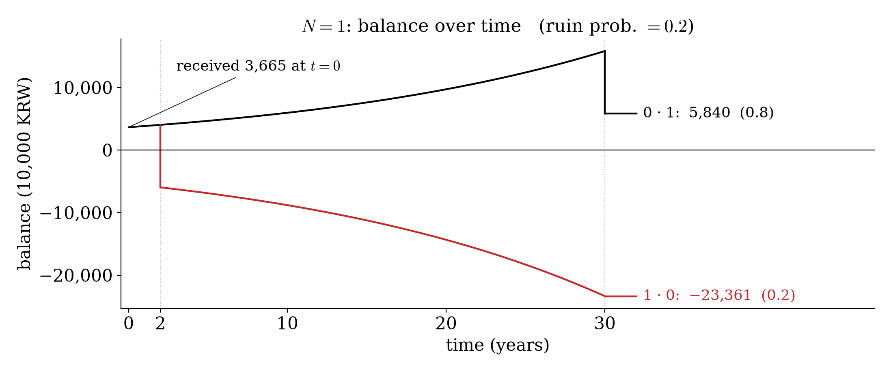{width=100%}

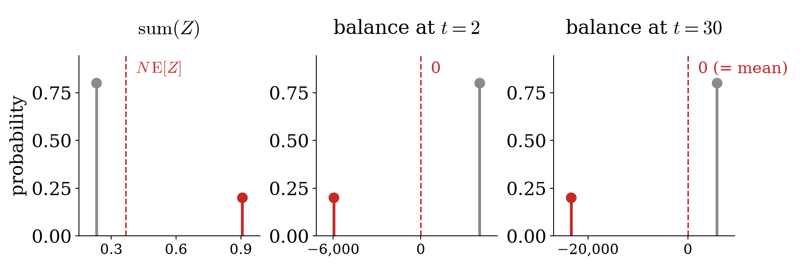{width=100%}
:::::

::::: {.hyper-grid style="border: 1px solid #c8c8c8; padding: 10px 14px; margin: 0 0 -1px 0;"}
:::: {.hyper-left}
::: {style="font-size: 0.85em; overflow-x: auto;"}
**$N = 2$**&emsp;//&emsp;망할 확률 $0.36$&emsp;//&emsp;받은 돈 $=$ EPV $\times\, S \times N = 0.3665 \times 10{,}000 \times 2 = 7{,}330$ 만원

```{=html}
<table class="ztab">
<thead><tr class="grp"><th rowspan="2">case</th><th rowspan="2">확률</th><th colspan="2" class="sep">사람별 <span class="math inline">\(Z\)</span></th><th colspan="4" class="sep"><span class="math inline">\(t=0\)</span></th><th colspan="2" class="sep"><span class="math inline">\(t=2\)</span></th><th colspan="2" class="sep"><span class="math inline">\(t=30\)</span></th></tr><tr><th class="sep"><span class="math inline">\(Z_{1}\)</span></th><th><span class="math inline">\(Z_{2}\)</span></th><th class="sep"><span class="math inline">\(\mathrm{sum}(Z)\)</span></th><th><span class="math inline">\(\mathrm{E}(Z)\)</span></th><th><span class="math inline">\(N\,\mathrm{E}(Z)\)</span></th><th>received</th><th class="sep">남은 돈</th><th>파산</th><th class="sep">남은 돈</th><th>파산</th></tr></thead>
<tbody>
<tr class="ok gstart"><td rowspan="1">0 · 2</td><td rowspan="1">0.64</td><td class="sep">0.231</td><td>0.231</td><td rowspan="1" class="sep">0.4628</td><td rowspan="1">0.3665</td><td rowspan="1">0.7330</td><td rowspan="1">7,330</td><td rowspan="1" class="sep">8,081</td><td rowspan="1">X</td><td rowspan="1" class="sep">11,681</td><td rowspan="1">X</td></tr>
<tr class="ruin gstart"><td rowspan="2">1 · 1</td><td rowspan="2">0.32</td><td class="sep">0.907</td><td>0.231</td><td rowspan="2" class="sep">1.1384</td><td rowspan="2">0.3665</td><td rowspan="2">0.7330</td><td rowspan="2">7,330</td><td rowspan="2" class="sep">−1,919</td><td rowspan="2"><b>O</b></td><td rowspan="2" class="sep">−17,521</td><td rowspan="2"><b>O</b></td></tr>
<tr class="ruin"><td class="sep">0.231</td><td>0.907</td></tr>
<tr class="ruin gstart"><td rowspan="1">2 · 0</td><td rowspan="1">0.04</td><td class="sep">0.907</td><td>0.907</td><td rowspan="1" class="sep">1.8141</td><td rowspan="1">0.3665</td><td rowspan="1">0.7330</td><td rowspan="1">7,330</td><td rowspan="1" class="sep">−11,919</td><td rowspan="1"><b>O</b></td><td rowspan="1" class="sep">−46,722</td><td rowspan="1"><b>O</b></td></tr>
</tbody>
</table>
```

::: {style="font-size: 0.92em; color: #666; margin-top: 4px;"}
**case** $=$ (2년 시점 사망 수) $\cdot$ (30년 시점 사망 수)
:::
:::
::::

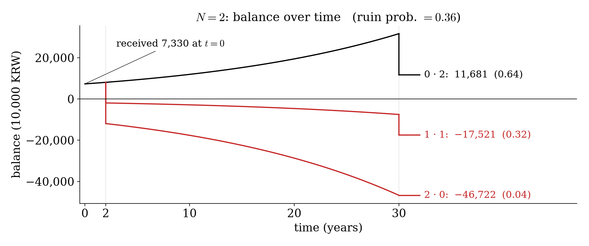{width=100%}

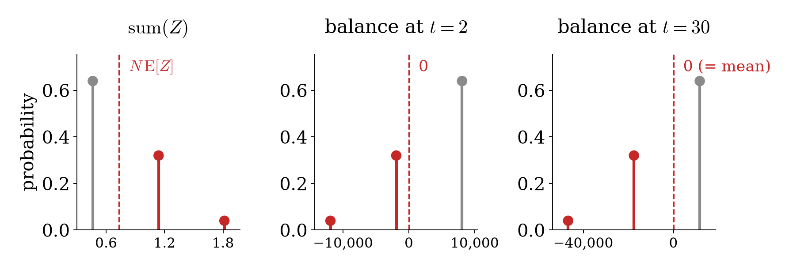{width=100%}
:::::

::::: {.hyper-grid style="border: 1px solid #c8c8c8; padding: 10px 14px; margin: 0 0 -1px 0;"}
:::: {.hyper-left}
::: {style="font-size: 0.85em; overflow-x: auto;"}
**$N = 3$**&emsp;//&emsp;망할 확률 $0.488$&emsp;//&emsp;받은 돈 $=$ EPV $\times\, S \times N = 0.3665 \times 10{,}000 \times 3 = 10{,}995$ 만원

```{=html}
<table class="ztab">
<thead><tr class="grp"><th rowspan="2">case</th><th rowspan="2">확률</th><th colspan="3" class="sep">사람별 <span class="math inline">\(Z\)</span></th><th colspan="4" class="sep"><span class="math inline">\(t=0\)</span></th><th colspan="2" class="sep"><span class="math inline">\(t=2\)</span></th><th colspan="2" class="sep"><span class="math inline">\(t=30\)</span></th></tr><tr><th class="sep"><span class="math inline">\(Z_{1}\)</span></th><th><span class="math inline">\(Z_{2}\)</span></th><th><span class="math inline">\(Z_{3}\)</span></th><th class="sep"><span class="math inline">\(\mathrm{sum}(Z)\)</span></th><th><span class="math inline">\(\mathrm{E}(Z)\)</span></th><th><span class="math inline">\(N\,\mathrm{E}(Z)\)</span></th><th>received</th><th class="sep">남은 돈</th><th>파산</th><th class="sep">남은 돈</th><th>파산</th></tr></thead>
<tbody>
<tr class="ok gstart"><td rowspan="1">0 · 3</td><td rowspan="1">0.512</td><td class="sep">0.231</td><td>0.231</td><td>0.231</td><td rowspan="1" class="sep">0.6941</td><td rowspan="1">0.3665</td><td rowspan="1">1.0995</td><td rowspan="1">10,995</td><td rowspan="1" class="sep">12,122</td><td rowspan="1">X</td><td rowspan="1" class="sep">17,521</td><td rowspan="1">X</td></tr>
<tr class="ruin gstart"><td rowspan="3">1 · 2</td><td rowspan="3">0.384</td><td class="sep">0.907</td><td>0.231</td><td>0.231</td><td rowspan="3" class="sep">1.3698</td><td rowspan="3">0.3665</td><td rowspan="3">1.0995</td><td rowspan="3">10,995</td><td rowspan="3" class="sep">2,122</td><td rowspan="3">X</td><td rowspan="3" class="sep">−11,681</td><td rowspan="3"><b>O</b></td></tr>
<tr class="ruin"><td class="sep">0.231</td><td>0.907</td><td>0.231</td></tr>
<tr class="ruin"><td class="sep">0.231</td><td>0.231</td><td>0.907</td></tr>
<tr class="ruin gstart"><td rowspan="3">2 · 1</td><td rowspan="3">0.096</td><td class="sep">0.907</td><td>0.907</td><td>0.231</td><td rowspan="3" class="sep">2.0454</td><td rowspan="3">0.3665</td><td rowspan="3">1.0995</td><td rowspan="3">10,995</td><td rowspan="3" class="sep">−7,878</td><td rowspan="3"><b>O</b></td><td rowspan="3" class="sep">−40,882</td><td rowspan="3"><b>O</b></td></tr>
<tr class="ruin"><td class="sep">0.907</td><td>0.231</td><td>0.907</td></tr>
<tr class="ruin"><td class="sep">0.231</td><td>0.907</td><td>0.907</td></tr>
<tr class="ruin gstart"><td rowspan="1">3 · 0</td><td rowspan="1">0.008</td><td class="sep">0.907</td><td>0.907</td><td>0.907</td><td rowspan="1" class="sep">2.7211</td><td rowspan="1">0.3665</td><td rowspan="1">1.0995</td><td rowspan="1">10,995</td><td rowspan="1" class="sep">−17,878</td><td rowspan="1"><b>O</b></td><td rowspan="1" class="sep">−70,083</td><td rowspan="1"><b>O</b></td></tr>
</tbody>
</table>
```

::: {style="font-size: 0.92em; color: #666; margin-top: 4px;"}
**case** $=$ (2년 시점 사망 수) $\cdot$ (30년 시점 사망 수)
:::
:::
::::

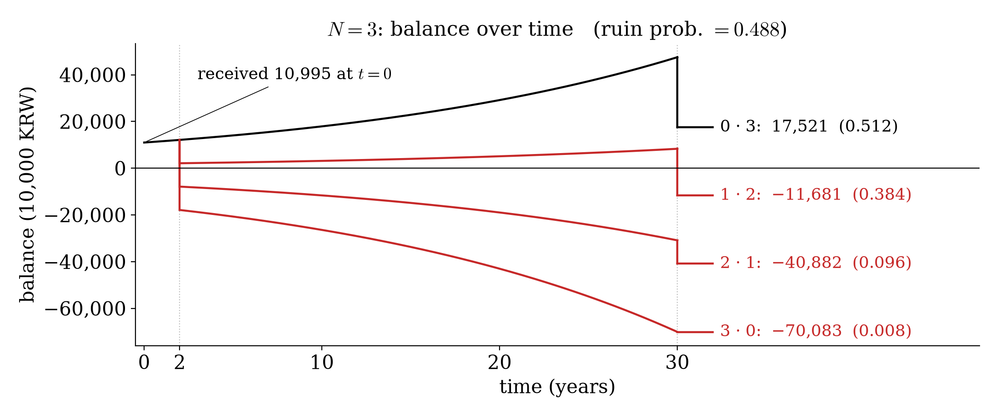{width=100%}

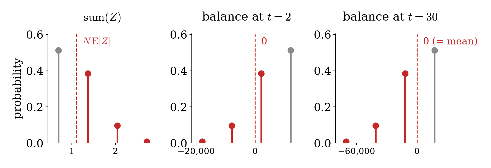{width=100%}
:::::

::::: {.hyper-grid style="border: 1px solid #c8c8c8; padding: 10px 14px; margin: 0 0 -1px 0;"}
:::: {.hyper-left}
::: {style="font-size: 0.85em; overflow-x: auto;"}
**$N = 4$**&emsp;//&emsp;망할 확률 $0.5904$&emsp;//&emsp;받은 돈 $=$ EPV $\times\, S \times N = 0.3665 \times 10{,}000 \times 4 = 14{,}660$ 만원

```{=html}
<table class="ztab">
<thead><tr class="grp"><th rowspan="2">case</th><th rowspan="2">확률</th><th colspan="4" class="sep">사람별 <span class="math inline">\(Z\)</span></th><th colspan="4" class="sep"><span class="math inline">\(t=0\)</span></th><th colspan="2" class="sep"><span class="math inline">\(t=2\)</span></th><th colspan="2" class="sep"><span class="math inline">\(t=30\)</span></th></tr><tr><th class="sep"><span class="math inline">\(Z_{1}\)</span></th><th><span class="math inline">\(Z_{2}\)</span></th><th><span class="math inline">\(Z_{3}\)</span></th><th><span class="math inline">\(Z_{4}\)</span></th><th class="sep"><span class="math inline">\(\mathrm{sum}(Z)\)</span></th><th><span class="math inline">\(\mathrm{E}(Z)\)</span></th><th><span class="math inline">\(N\,\mathrm{E}(Z)\)</span></th><th>received</th><th class="sep">남은 돈</th><th>파산</th><th class="sep">남은 돈</th><th>파산</th></tr></thead>
<tbody>
<tr class="ok gstart"><td rowspan="1">0 · 4</td><td rowspan="1">0.4096</td><td class="sep">0.231</td><td>0.231</td><td>0.231</td><td>0.231</td><td rowspan="1" class="sep">0.9255</td><td rowspan="1">0.3665</td><td rowspan="1">1.4660</td><td rowspan="1">14,660</td><td rowspan="1" class="sep">16,163</td><td rowspan="1">X</td><td rowspan="1" class="sep">23,361</td><td rowspan="1">X</td></tr>
<tr class="ruin gstart"><td rowspan="4">1 · 3</td><td rowspan="4">0.4096</td><td class="sep">0.907</td><td>0.231</td><td>0.231</td><td>0.231</td><td rowspan="4" class="sep">1.6012</td><td rowspan="4">0.3665</td><td rowspan="4">1.4660</td><td rowspan="4">14,660</td><td rowspan="4" class="sep">6,163</td><td rowspan="4">X</td><td rowspan="4" class="sep">−5,840</td><td rowspan="4"><b>O</b></td></tr>
<tr class="ruin"><td class="sep">0.231</td><td>0.907</td><td>0.231</td><td>0.231</td></tr>
<tr class="ruin"><td class="sep">0.231</td><td>0.231</td><td>0.907</td><td>0.231</td></tr>
<tr class="ruin"><td class="sep">0.231</td><td>0.231</td><td>0.231</td><td>0.907</td></tr>
<tr class="ruin gstart"><td rowspan="4">2 · 2</td><td rowspan="4">0.1536</td><td class="sep">0.907</td><td>0.907</td><td>0.231</td><td>0.231</td><td rowspan="4" class="sep">2.2768</td><td rowspan="4">0.3665</td><td rowspan="4">1.4660</td><td rowspan="4">14,660</td><td rowspan="4" class="sep">−3,837</td><td rowspan="4"><b>O</b></td><td rowspan="4" class="sep">−35,042</td><td rowspan="4"><b>O</b></td></tr>
<tr class="ruin"><td class="sep">0.907</td><td>0.231</td><td>0.907</td><td>0.231</td></tr>
<tr class="ruin"><td class="sep dots">⋮</td><td class="dots">⋮</td><td class="dots">⋮</td><td class="dots">⋮</td></tr>
<tr class="ruin"><td class="sep">0.231</td><td>0.231</td><td>0.907</td><td>0.907</td></tr>
<tr class="ruin gstart"><td rowspan="4">3 · 1</td><td rowspan="4">0.0256</td><td class="sep">0.907</td><td>0.907</td><td>0.907</td><td>0.231</td><td rowspan="4" class="sep">2.9525</td><td rowspan="4">0.3665</td><td rowspan="4">1.4660</td><td rowspan="4">14,660</td><td rowspan="4" class="sep">−13,837</td><td rowspan="4"><b>O</b></td><td rowspan="4" class="sep">−64,243</td><td rowspan="4"><b>O</b></td></tr>
<tr class="ruin"><td class="sep">0.907</td><td>0.907</td><td>0.231</td><td>0.907</td></tr>
<tr class="ruin"><td class="sep">0.907</td><td>0.231</td><td>0.907</td><td>0.907</td></tr>
<tr class="ruin"><td class="sep">0.231</td><td>0.907</td><td>0.907</td><td>0.907</td></tr>
<tr class="ruin gstart"><td rowspan="1">4 · 0</td><td rowspan="1">0.0016</td><td class="sep">0.907</td><td>0.907</td><td>0.907</td><td>0.907</td><td rowspan="1" class="sep">3.6281</td><td rowspan="1">0.3665</td><td rowspan="1">1.4660</td><td rowspan="1">14,660</td><td rowspan="1" class="sep">−23,837</td><td rowspan="1"><b>O</b></td><td rowspan="1" class="sep">−93,444</td><td rowspan="1"><b>O</b></td></tr>
</tbody>
</table>
```

::: {style="font-size: 0.92em; color: #666; margin-top: 4px;"}
**case** $=$ (2년 시점 사망 수) $\cdot$ (30년 시점 사망 수)
:::
:::
::::

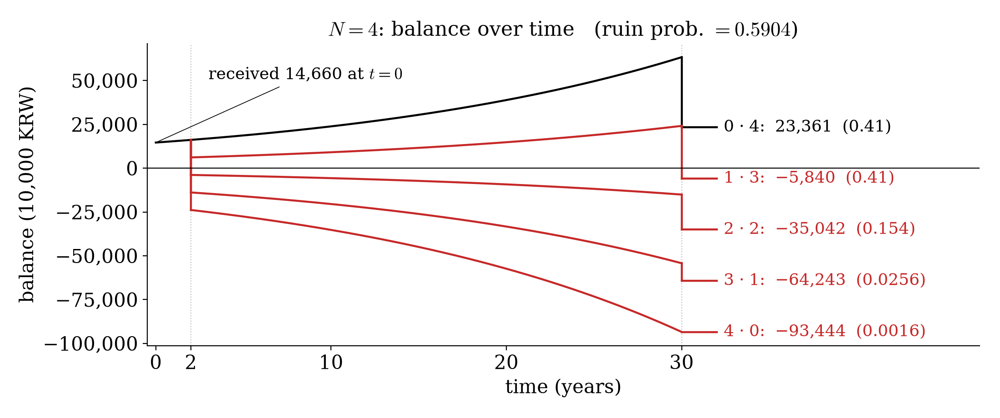{width=100%}

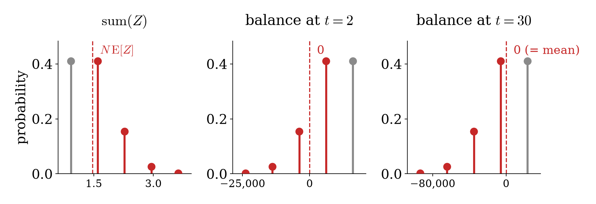{width=100%}
:::::

::::: {.hyper-grid style="border: 1px solid #c8c8c8; padding: 10px 14px; margin: 0 0 -1px 0;"}
:::: {.hyper-left}
::: {style="font-size: 0.78em; overflow-x: auto;"}
**$N = 5$**&emsp;//&emsp;망할 확률 $0.26272$&emsp;//&emsp;받은 돈 $=$ EPV $\times\, S \times N = 0.3665 \times 10{,}000 \times 5 = 18{,}325$ 만원

```{=html}
<table class="ztab">
<thead><tr class="grp"><th rowspan="2">case</th><th rowspan="2">확률</th><th colspan="5" class="sep">사람별 <span class="math inline">\(Z\)</span></th><th colspan="4" class="sep"><span class="math inline">\(t=0\)</span></th><th colspan="2" class="sep"><span class="math inline">\(t=2\)</span></th><th colspan="2" class="sep"><span class="math inline">\(t=30\)</span></th></tr><tr><th class="sep"><span class="math inline">\(Z_{1}\)</span></th><th><span class="math inline">\(Z_{2}\)</span></th><th><span class="math inline">\(Z_{3}\)</span></th><th><span class="math inline">\(Z_{4}\)</span></th><th><span class="math inline">\(Z_{5}\)</span></th><th class="sep"><span class="math inline">\(\mathrm{sum}(Z)\)</span></th><th><span class="math inline">\(\mathrm{E}(Z)\)</span></th><th><span class="math inline">\(N\,\mathrm{E}(Z)\)</span></th><th>received</th><th class="sep">남은 돈</th><th>파산</th><th class="sep">남은 돈</th><th>파산</th></tr></thead>
<tbody>
<tr class="ok gstart"><td rowspan="1">0 · 5</td><td rowspan="1">0.32768</td><td class="sep">0.231</td><td>0.231</td><td>0.231</td><td>0.231</td><td>0.231</td><td rowspan="1" class="sep">1.1569</td><td rowspan="1">0.3665</td><td rowspan="1">1.8325</td><td rowspan="1">18,325</td><td rowspan="1" class="sep">20,204</td><td rowspan="1">X</td><td rowspan="1" class="sep">29,201</td><td rowspan="1">X</td></tr>
<tr class="ok gstart"><td rowspan="4">1 · 4</td><td rowspan="4">0.4096</td><td class="sep">0.907</td><td>0.231</td><td>0.231</td><td>0.231</td><td>0.231</td><td rowspan="4" class="sep">1.8325</td><td rowspan="4">0.3665</td><td rowspan="4">1.8325</td><td rowspan="4">18,325</td><td rowspan="4" class="sep">10,204</td><td rowspan="4">X</td><td rowspan="4" class="sep">0</td><td rowspan="4">X</td></tr>
<tr class="ok"><td class="sep">0.231</td><td>0.907</td><td>0.231</td><td>0.231</td><td>0.231</td></tr>
<tr class="ok"><td class="sep dots">⋮</td><td class="dots">⋮</td><td class="dots">⋮</td><td class="dots">⋮</td><td class="dots">⋮</td></tr>
<tr class="ok"><td class="sep">0.231</td><td>0.231</td><td>0.231</td><td>0.231</td><td>0.907</td></tr>
<tr class="ruin gstart"><td rowspan="4">2 · 3</td><td rowspan="4">0.2048</td><td class="sep">0.907</td><td>0.907</td><td>0.231</td><td>0.231</td><td>0.231</td><td rowspan="4" class="sep">2.5082</td><td rowspan="4">0.3665</td><td rowspan="4">1.8325</td><td rowspan="4">18,325</td><td rowspan="4" class="sep">204</td><td rowspan="4">X</td><td rowspan="4" class="sep">−29,201</td><td rowspan="4"><b>O</b></td></tr>
<tr class="ruin"><td class="sep">0.907</td><td>0.231</td><td>0.907</td><td>0.231</td><td>0.231</td></tr>
<tr class="ruin"><td class="sep dots">⋮</td><td class="dots">⋮</td><td class="dots">⋮</td><td class="dots">⋮</td><td class="dots">⋮</td></tr>
<tr class="ruin"><td class="sep">0.231</td><td>0.231</td><td>0.231</td><td>0.907</td><td>0.907</td></tr>
<tr class="ruin gstart"><td rowspan="4">3 · 2</td><td rowspan="4">0.0512</td><td class="sep">0.907</td><td>0.907</td><td>0.907</td><td>0.231</td><td>0.231</td><td rowspan="4" class="sep">3.1838</td><td rowspan="4">0.3665</td><td rowspan="4">1.8325</td><td rowspan="4">18,325</td><td rowspan="4" class="sep">−9,796</td><td rowspan="4"><b>O</b></td><td rowspan="4" class="sep">−58,403</td><td rowspan="4"><b>O</b></td></tr>
<tr class="ruin"><td class="sep">0.907</td><td>0.907</td><td>0.231</td><td>0.907</td><td>0.231</td></tr>
<tr class="ruin"><td class="sep dots">⋮</td><td class="dots">⋮</td><td class="dots">⋮</td><td class="dots">⋮</td><td class="dots">⋮</td></tr>
<tr class="ruin"><td class="sep">0.231</td><td>0.231</td><td>0.907</td><td>0.907</td><td>0.907</td></tr>
<tr class="ruin gstart"><td rowspan="4">4 · 1</td><td rowspan="4">0.0064</td><td class="sep">0.907</td><td>0.907</td><td>0.907</td><td>0.907</td><td>0.231</td><td rowspan="4" class="sep">3.8595</td><td rowspan="4">0.3665</td><td rowspan="4">1.8325</td><td rowspan="4">18,325</td><td rowspan="4" class="sep">−19,796</td><td rowspan="4"><b>O</b></td><td rowspan="4" class="sep">−87,604</td><td rowspan="4"><b>O</b></td></tr>
<tr class="ruin"><td class="sep">0.907</td><td>0.907</td><td>0.907</td><td>0.231</td><td>0.907</td></tr>
<tr class="ruin"><td class="sep dots">⋮</td><td class="dots">⋮</td><td class="dots">⋮</td><td class="dots">⋮</td><td class="dots">⋮</td></tr>
<tr class="ruin"><td class="sep">0.231</td><td>0.907</td><td>0.907</td><td>0.907</td><td>0.907</td></tr>
<tr class="ruin gstart"><td rowspan="1">5 · 0</td><td rowspan="1">0.00032</td><td class="sep">0.907</td><td>0.907</td><td>0.907</td><td>0.907</td><td>0.907</td><td rowspan="1" class="sep">4.5351</td><td rowspan="1">0.3665</td><td rowspan="1">1.8325</td><td rowspan="1">18,325</td><td rowspan="1" class="sep">−29,796</td><td rowspan="1"><b>O</b></td><td rowspan="1" class="sep">−116,805</td><td rowspan="1"><b>O</b></td></tr>
</tbody>
</table>
```

::: {style="font-size: 0.92em; color: #666; margin-top: 4px;"}
**case** $=$ (2년 시점 사망 수) $\cdot$ (30년 시점 사망 수)
:::
:::
::::

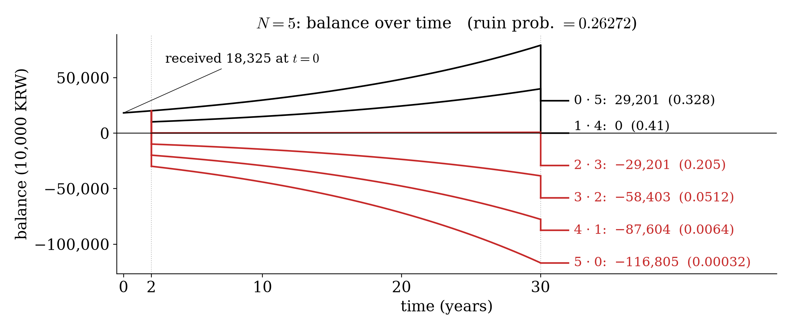{width=100%}

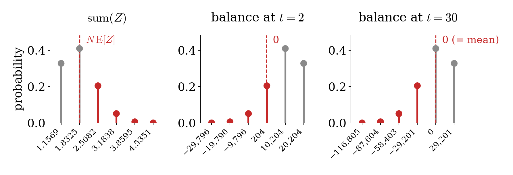{width=100%}
:::::

::::: {layout="[[38,31,31]]" style="text-align: center; font-size: 1.5em; line-height: 1.1; border: 1px solid #c8c8c8; padding: 10px 14px; margin: 0 0 -1px 0;"}
⋮

⋮

⋮
:::::

::::: {.hyper-grid style="border: 1px solid #c8c8c8; padding: 10px 14px; margin: 0 0 -1px 0;"}
:::: {.hyper-left}
::: {style="font-size: 0.85em; overflow-x: auto;"}
**$N = 100$**&emsp;//&emsp;망할 확률 $0.44054$&emsp;//&emsp;받은 돈 $=$ EPV $\times\, S \times N = 0.366508 \times 10{,}000 \times 100 = 366{,}508$ 만원

```{=html}
<table class="ztab">
<thead><tr class="grp"><th rowspan="2">case</th><th rowspan="2">확률</th><th colspan="1" class="sep">사람별 <span class="math inline">\(Z\)</span></th><th colspan="4" class="sep"><span class="math inline">\(t=0\)</span></th><th colspan="2" class="sep"><span class="math inline">\(t=2\)</span></th><th colspan="2" class="sep"><span class="math inline">\(t=30\)</span></th></tr><tr><th class="sep"><span class="math inline">\(Z_1, \dots, Z_{100}\)</span></th><th class="sep"><span class="math inline">\(\mathrm{sum}(Z)\)</span></th><th><span class="math inline">\(\mathrm{E}(Z)\)</span></th><th><span class="math inline">\(N\,\mathrm{E}(Z)\)</span></th><th>received</th><th class="sep">남은 돈</th><th>파산</th><th class="sep">남은 돈</th><th>파산</th></tr></thead>
<tbody>
<tr class="ok gstart"><td rowspan="1">0 · 100</td><td rowspan="1">0.0000</td><td rowspan="9" class="sep">0.907<br>또는<br>0.231</td><td rowspan="1" class="sep">23.1377</td><td rowspan="1">0.3665</td><td rowspan="1">36.6508</td><td rowspan="1">366,508</td><td rowspan="1" class="sep">404,075</td><td rowspan="1">X</td><td rowspan="1" class="sep">584,026</td><td rowspan="1">X</td></tr>
<tr class="dotsrow"><td>⋮</td><td>⋮</td><td class="sep">⋮</td><td>⋮</td><td>⋮</td><td>⋮</td><td class="sep">⋮</td><td></td><td class="sep">⋮</td><td></td></tr>
<tr class="ok gstart"><td rowspan="1">18 · 82</td><td rowspan="1">0.0909</td><td rowspan="1" class="sep">35.2995</td><td rowspan="1">0.3665</td><td rowspan="1">36.6508</td><td rowspan="1">366,508</td><td rowspan="1" class="sep">224,075</td><td rowspan="1">X</td><td rowspan="1" class="sep">58,403</td><td rowspan="1">X</td></tr>
<tr class="ok gstart"><td rowspan="1">19 · 81</td><td rowspan="1">0.0981</td><td rowspan="1" class="sep">35.9751</td><td rowspan="1">0.3665</td><td rowspan="1">36.6508</td><td rowspan="1">366,508</td><td rowspan="1" class="sep">214,075</td><td rowspan="1">X</td><td rowspan="1" class="sep">29,201</td><td rowspan="1">X</td></tr>
<tr class="ok gstart"><td rowspan="1">20 · 80</td><td rowspan="1">0.0993</td><td rowspan="1" class="sep">36.6508</td><td rowspan="1">0.3665</td><td rowspan="1">36.6508</td><td rowspan="1">366,508</td><td rowspan="1" class="sep">204,075</td><td rowspan="1">X</td><td rowspan="1" class="sep">0</td><td rowspan="1">X</td></tr>
<tr class="ruin gstart"><td rowspan="1">21 · 79</td><td rowspan="1">0.0946</td><td rowspan="1" class="sep">37.3264</td><td rowspan="1">0.3665</td><td rowspan="1">36.6508</td><td rowspan="1">366,508</td><td rowspan="1" class="sep">194,075</td><td rowspan="1">X</td><td rowspan="1" class="sep">−29,201</td><td rowspan="1"><b>O</b></td></tr>
<tr class="ruin gstart"><td rowspan="1">22 · 78</td><td rowspan="1">0.0849</td><td rowspan="1" class="sep">38.0021</td><td rowspan="1">0.3665</td><td rowspan="1">36.6508</td><td rowspan="1">366,508</td><td rowspan="1" class="sep">184,075</td><td rowspan="1">X</td><td rowspan="1" class="sep">−58,403</td><td rowspan="1"><b>O</b></td></tr>
<tr class="dotsrow"><td>⋮</td><td>⋮</td><td class="sep">⋮</td><td>⋮</td><td>⋮</td><td>⋮</td><td class="sep">⋮</td><td></td><td class="sep">⋮</td><td></td></tr>
<tr class="ruin gstart"><td rowspan="1">100 · 0</td><td rowspan="1">0.0000</td><td rowspan="1" class="sep">90.7029</td><td rowspan="1">0.3665</td><td rowspan="1">36.6508</td><td rowspan="1">366,508</td><td rowspan="1" class="sep">−595,925</td><td rowspan="1"><b>O</b></td><td rowspan="1" class="sep">−2,336,103</td><td rowspan="1"><b>O</b></td></tr>
</tbody>
</table>
```

::: {style="font-size: 0.92em; color: #666; margin-top: 4px;"}
**case** $=$ (2년 시점 사망 수) $\cdot$ (30년 시점 사망 수)

사람별 $Z$ 는 2년 시점에 죽은 사람이면 $0.907$, 30년 시점에 죽은 사람이면 $0.231$ 이다. 예를 들어 case 가 $18 \cdot 82$ 면 $0.907$ 인 사람이 18명, $0.231$ 인 사람이 82명이다.
:::
:::
::::

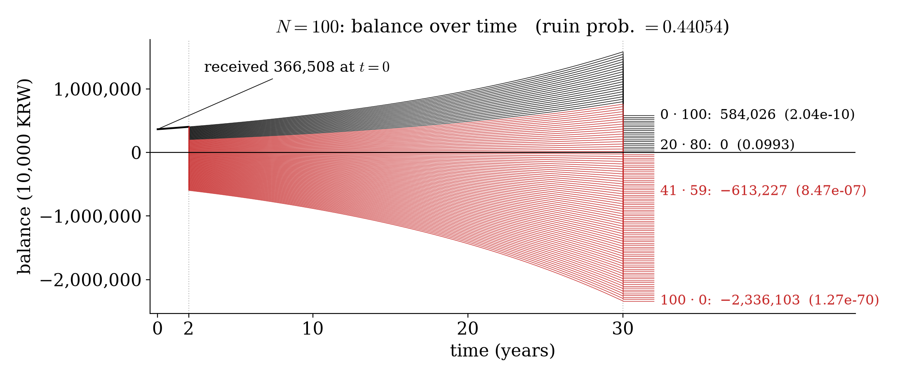{width=100%}

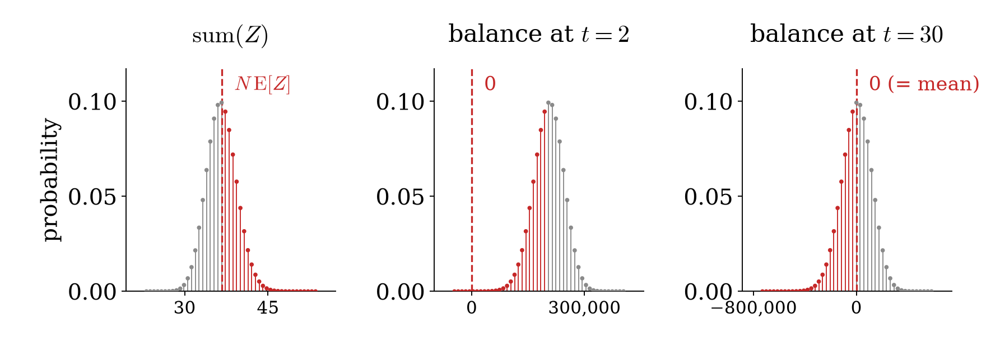{width=100%}
:::::

<div style="height: 1.5em;"></div>

`#` 

`-` 예제1에서 $N$ 에 따라 망할 확률이 아래처럼 변한다.

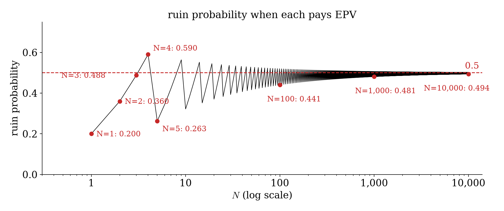{width=100%}

`# 예제2` 남은 수명이 확률 0.8 로 2년, 확률 0.2 로 30년인 사람들이 있다(예제1 과 확률이 반대다). 이런 사람들을 서로 독립으로 $N$ 명 받는다. 보험금은 1억, $i = 0.05$ 이고, 한 사람당 EPV 를 받는다. $N = 1, 2, \dots, 100$ 일 때 회사가 망할 확률을 각각 구하라.

`(풀이)` 

::::: {.hyper-grid style="border: 1px solid #c8c8c8; padding: 10px 14px; margin: 0 0 -1px 0;"}
:::: {.hyper-left}
::: {style="font-size: 0.85em; overflow-x: auto;"}
**$N = 1$**&emsp;//&emsp;망할 확률 $0.8$&emsp;//&emsp;받은 돈 $=$ EPV $\times\, S \times N = 0.7719 \times 10{,}000 \times 1 = 7{,}719$ 만원

```{=html}
<table class="ztab">
<thead><tr class="grp"><th rowspan="2">case</th><th rowspan="2">확률</th><th colspan="1" class="sep">사람별 <span class="math inline">\(Z\)</span></th><th colspan="4" class="sep"><span class="math inline">\(t=0\)</span></th><th colspan="2" class="sep"><span class="math inline">\(t=2\)</span></th><th colspan="2" class="sep"><span class="math inline">\(t=30\)</span></th></tr><tr><th class="sep"><span class="math inline">\(Z_{1}\)</span></th><th class="sep"><span class="math inline">\(\mathrm{sum}(Z)\)</span></th><th><span class="math inline">\(\mathrm{E}(Z)\)</span></th><th><span class="math inline">\(N\,\mathrm{E}(Z)\)</span></th><th>received</th><th class="sep">남은 돈</th><th>파산</th><th class="sep">남은 돈</th><th>파산</th></tr></thead>
<tbody>
<tr class="ok gstart"><td rowspan="1">0 · 1</td><td rowspan="1">0.2</td><td class="sep">0.231</td><td rowspan="1" class="sep">0.2314</td><td rowspan="1">0.7719</td><td rowspan="1">0.7719</td><td rowspan="1">7,719</td><td rowspan="1" class="sep">8,510</td><td rowspan="1">X</td><td rowspan="1" class="sep">23,361</td><td rowspan="1">X</td></tr>
<tr class="ruin gstart"><td rowspan="1">1 · 0</td><td rowspan="1">0.8</td><td class="sep">0.907</td><td rowspan="1" class="sep">0.9070</td><td rowspan="1">0.7719</td><td rowspan="1">0.7719</td><td rowspan="1">7,719</td><td rowspan="1" class="sep">−1,490</td><td rowspan="1"><b>O</b></td><td rowspan="1" class="sep">−5,840</td><td rowspan="1"><b>O</b></td></tr>
</tbody>
</table>
```

::: {style="font-size: 0.92em; color: #666; margin-top: 4px;"}
**case** $=$ (2년 시점 사망 수) $\cdot$ (30년 시점 사망 수)
:::
:::
::::

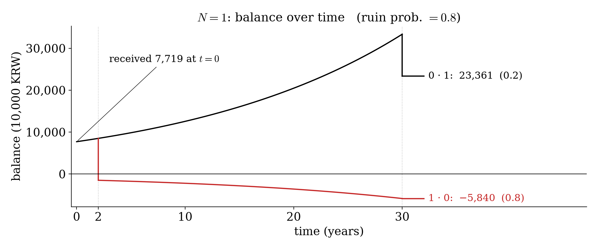{width=100%}

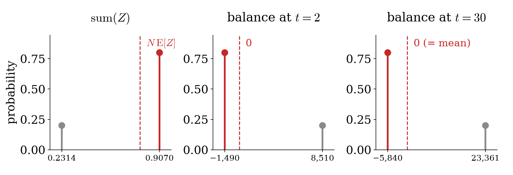{width=100%}
:::::

::::: {.hyper-grid style="border: 1px solid #c8c8c8; padding: 10px 14px; margin: 0 0 -1px 0;"}
:::: {.hyper-left}
::: {style="font-size: 0.85em; overflow-x: auto;"}
**$N = 2$**&emsp;//&emsp;망할 확률 $0.64$&emsp;//&emsp;받은 돈 $=$ EPV $\times\, S \times N = 0.7719 \times 10{,}000 \times 2 = 15{,}438$ 만원

```{=html}
<table class="ztab">
<thead><tr class="grp"><th rowspan="2">case</th><th rowspan="2">확률</th><th colspan="2" class="sep">사람별 <span class="math inline">\(Z\)</span></th><th colspan="4" class="sep"><span class="math inline">\(t=0\)</span></th><th colspan="2" class="sep"><span class="math inline">\(t=2\)</span></th><th colspan="2" class="sep"><span class="math inline">\(t=30\)</span></th></tr><tr><th class="sep"><span class="math inline">\(Z_{1}\)</span></th><th><span class="math inline">\(Z_{2}\)</span></th><th class="sep"><span class="math inline">\(\mathrm{sum}(Z)\)</span></th><th><span class="math inline">\(\mathrm{E}(Z)\)</span></th><th><span class="math inline">\(N\,\mathrm{E}(Z)\)</span></th><th>received</th><th class="sep">남은 돈</th><th>파산</th><th class="sep">남은 돈</th><th>파산</th></tr></thead>
<tbody>
<tr class="ok gstart"><td rowspan="1">0 · 2</td><td rowspan="1">0.04</td><td class="sep">0.231</td><td>0.231</td><td rowspan="1" class="sep">0.4628</td><td rowspan="1">0.7719</td><td rowspan="1">1.5438</td><td rowspan="1">15,438</td><td rowspan="1" class="sep">17,020</td><td rowspan="1">X</td><td rowspan="1" class="sep">46,722</td><td rowspan="1">X</td></tr>
<tr class="ok gstart"><td rowspan="2">1 · 1</td><td rowspan="2">0.32</td><td class="sep">0.907</td><td>0.231</td><td rowspan="2" class="sep">1.1384</td><td rowspan="2">0.7719</td><td rowspan="2">1.5438</td><td rowspan="2">15,438</td><td rowspan="2" class="sep">7,020</td><td rowspan="2">X</td><td rowspan="2" class="sep">17,521</td><td rowspan="2">X</td></tr>
<tr class="ok"><td class="sep">0.231</td><td>0.907</td></tr>
<tr class="ruin gstart"><td rowspan="1">2 · 0</td><td rowspan="1">0.64</td><td class="sep">0.907</td><td>0.907</td><td rowspan="1" class="sep">1.8141</td><td rowspan="1">0.7719</td><td rowspan="1">1.5438</td><td rowspan="1">15,438</td><td rowspan="1" class="sep">−2,980</td><td rowspan="1"><b>O</b></td><td rowspan="1" class="sep">−11,681</td><td rowspan="1"><b>O</b></td></tr>
</tbody>
</table>
```

::: {style="font-size: 0.92em; color: #666; margin-top: 4px;"}
**case** $=$ (2년 시점 사망 수) $\cdot$ (30년 시점 사망 수)
:::
:::
::::

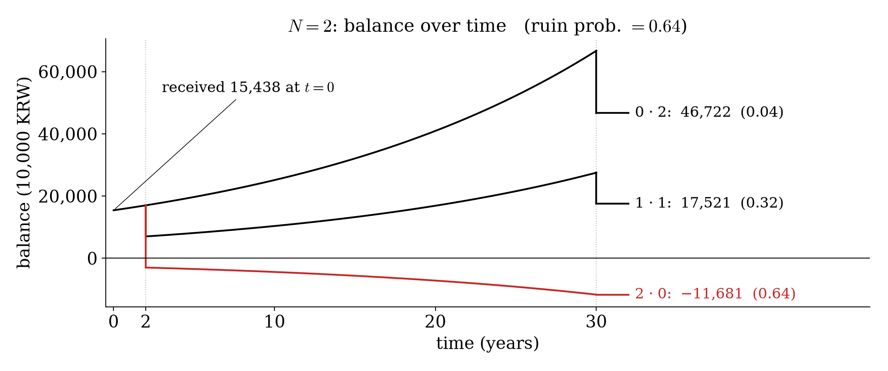{width=100%}

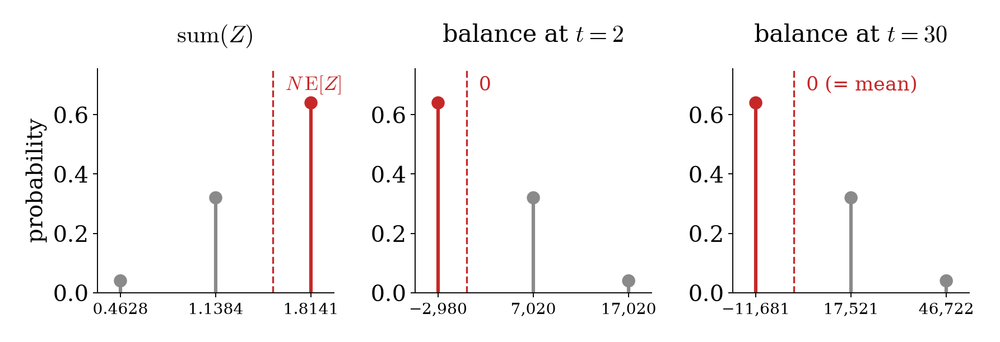{width=100%}
:::::

::::: {.hyper-grid style="border: 1px solid #c8c8c8; padding: 10px 14px; margin: 0 0 -1px 0;"}
:::: {.hyper-left}
::: {style="font-size: 0.85em; overflow-x: auto;"}
**$N = 3$**&emsp;//&emsp;망할 확률 $0.512$&emsp;//&emsp;받은 돈 $=$ EPV $\times\, S \times N = 0.7719 \times 10{,}000 \times 3 = 23{,}157$ 만원

```{=html}
<table class="ztab">
<thead><tr class="grp"><th rowspan="2">case</th><th rowspan="2">확률</th><th colspan="3" class="sep">사람별 <span class="math inline">\(Z\)</span></th><th colspan="4" class="sep"><span class="math inline">\(t=0\)</span></th><th colspan="2" class="sep"><span class="math inline">\(t=2\)</span></th><th colspan="2" class="sep"><span class="math inline">\(t=30\)</span></th></tr><tr><th class="sep"><span class="math inline">\(Z_{1}\)</span></th><th><span class="math inline">\(Z_{2}\)</span></th><th><span class="math inline">\(Z_{3}\)</span></th><th class="sep"><span class="math inline">\(\mathrm{sum}(Z)\)</span></th><th><span class="math inline">\(\mathrm{E}(Z)\)</span></th><th><span class="math inline">\(N\,\mathrm{E}(Z)\)</span></th><th>received</th><th class="sep">남은 돈</th><th>파산</th><th class="sep">남은 돈</th><th>파산</th></tr></thead>
<tbody>
<tr class="ok gstart"><td rowspan="1">0 · 3</td><td rowspan="1">0.008</td><td class="sep">0.231</td><td>0.231</td><td>0.231</td><td rowspan="1" class="sep">0.6941</td><td rowspan="1">0.7719</td><td rowspan="1">2.3157</td><td rowspan="1">23,157</td><td rowspan="1" class="sep">25,531</td><td rowspan="1">X</td><td rowspan="1" class="sep">70,083</td><td rowspan="1">X</td></tr>
<tr class="ok gstart"><td rowspan="3">1 · 2</td><td rowspan="3">0.096</td><td class="sep">0.907</td><td>0.231</td><td>0.231</td><td rowspan="3" class="sep">1.3698</td><td rowspan="3">0.7719</td><td rowspan="3">2.3157</td><td rowspan="3">23,157</td><td rowspan="3" class="sep">15,531</td><td rowspan="3">X</td><td rowspan="3" class="sep">40,882</td><td rowspan="3">X</td></tr>
<tr class="ok"><td class="sep">0.231</td><td>0.907</td><td>0.231</td></tr>
<tr class="ok"><td class="sep">0.231</td><td>0.231</td><td>0.907</td></tr>
<tr class="ok gstart"><td rowspan="3">2 · 1</td><td rowspan="3">0.384</td><td class="sep">0.907</td><td>0.907</td><td>0.231</td><td rowspan="3" class="sep">2.0454</td><td rowspan="3">0.7719</td><td rowspan="3">2.3157</td><td rowspan="3">23,157</td><td rowspan="3" class="sep">5,531</td><td rowspan="3">X</td><td rowspan="3" class="sep">11,681</td><td rowspan="3">X</td></tr>
<tr class="ok"><td class="sep">0.907</td><td>0.231</td><td>0.907</td></tr>
<tr class="ok"><td class="sep">0.231</td><td>0.907</td><td>0.907</td></tr>
<tr class="ruin gstart"><td rowspan="1">3 · 0</td><td rowspan="1">0.512</td><td class="sep">0.907</td><td>0.907</td><td>0.907</td><td rowspan="1" class="sep">2.7211</td><td rowspan="1">0.7719</td><td rowspan="1">2.3157</td><td rowspan="1">23,157</td><td rowspan="1" class="sep">−4,469</td><td rowspan="1"><b>O</b></td><td rowspan="1" class="sep">−17,521</td><td rowspan="1"><b>O</b></td></tr>
</tbody>
</table>
```

::: {style="font-size: 0.92em; color: #666; margin-top: 4px;"}
**case** $=$ (2년 시점 사망 수) $\cdot$ (30년 시점 사망 수)
:::
:::
::::

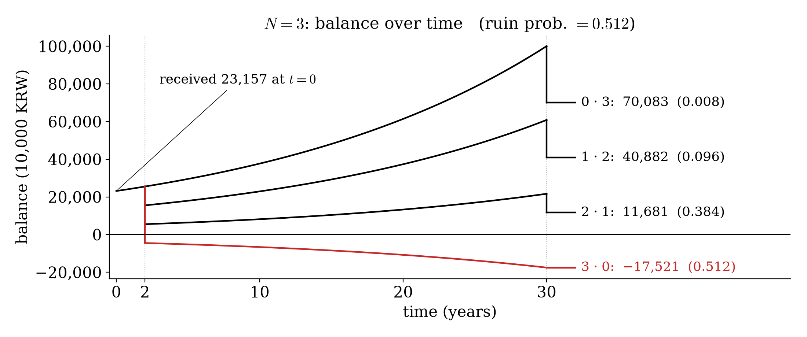{width=100%}

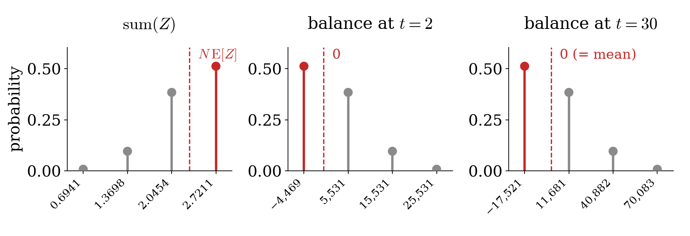{width=100%}
:::::

::::: {.hyper-grid style="border: 1px solid #c8c8c8; padding: 10px 14px; margin: 0 0 -1px 0;"}
:::: {.hyper-left}
::: {style="font-size: 0.85em; overflow-x: auto;"}
**$N = 4$**&emsp;//&emsp;망할 확률 $0.4096$&emsp;//&emsp;받은 돈 $=$ EPV $\times\, S \times N = 0.7719 \times 10{,}000 \times 4 = 30{,}876$ 만원

```{=html}
<table class="ztab">
<thead><tr class="grp"><th rowspan="2">case</th><th rowspan="2">확률</th><th colspan="4" class="sep">사람별 <span class="math inline">\(Z\)</span></th><th colspan="4" class="sep"><span class="math inline">\(t=0\)</span></th><th colspan="2" class="sep"><span class="math inline">\(t=2\)</span></th><th colspan="2" class="sep"><span class="math inline">\(t=30\)</span></th></tr><tr><th class="sep"><span class="math inline">\(Z_{1}\)</span></th><th><span class="math inline">\(Z_{2}\)</span></th><th><span class="math inline">\(Z_{3}\)</span></th><th><span class="math inline">\(Z_{4}\)</span></th><th class="sep"><span class="math inline">\(\mathrm{sum}(Z)\)</span></th><th><span class="math inline">\(\mathrm{E}(Z)\)</span></th><th><span class="math inline">\(N\,\mathrm{E}(Z)\)</span></th><th>received</th><th class="sep">남은 돈</th><th>파산</th><th class="sep">남은 돈</th><th>파산</th></tr></thead>
<tbody>
<tr class="ok gstart"><td rowspan="1">0 · 4</td><td rowspan="1">0.0016</td><td class="sep">0.231</td><td>0.231</td><td>0.231</td><td>0.231</td><td rowspan="1" class="sep">0.9255</td><td rowspan="1">0.7719</td><td rowspan="1">3.0876</td><td rowspan="1">30,876</td><td rowspan="1" class="sep">34,041</td><td rowspan="1">X</td><td rowspan="1" class="sep">93,444</td><td rowspan="1">X</td></tr>
<tr class="ok gstart"><td rowspan="4">1 · 3</td><td rowspan="4">0.0256</td><td class="sep">0.907</td><td>0.231</td><td>0.231</td><td>0.231</td><td rowspan="4" class="sep">1.6012</td><td rowspan="4">0.7719</td><td rowspan="4">3.0876</td><td rowspan="4">30,876</td><td rowspan="4" class="sep">24,041</td><td rowspan="4">X</td><td rowspan="4" class="sep">64,243</td><td rowspan="4">X</td></tr>
<tr class="ok"><td class="sep">0.231</td><td>0.907</td><td>0.231</td><td>0.231</td></tr>
<tr class="ok"><td class="sep">0.231</td><td>0.231</td><td>0.907</td><td>0.231</td></tr>
<tr class="ok"><td class="sep">0.231</td><td>0.231</td><td>0.231</td><td>0.907</td></tr>
<tr class="ok gstart"><td rowspan="4">2 · 2</td><td rowspan="4">0.1536</td><td class="sep">0.907</td><td>0.907</td><td>0.231</td><td>0.231</td><td rowspan="4" class="sep">2.2768</td><td rowspan="4">0.7719</td><td rowspan="4">3.0876</td><td rowspan="4">30,876</td><td rowspan="4" class="sep">14,041</td><td rowspan="4">X</td><td rowspan="4" class="sep">35,042</td><td rowspan="4">X</td></tr>
<tr class="ok"><td class="sep">0.907</td><td>0.231</td><td>0.907</td><td>0.231</td></tr>
<tr class="ok"><td class="sep dots">⋮</td><td class="dots">⋮</td><td class="dots">⋮</td><td class="dots">⋮</td></tr>
<tr class="ok"><td class="sep">0.231</td><td>0.231</td><td>0.907</td><td>0.907</td></tr>
<tr class="ok gstart"><td rowspan="4">3 · 1</td><td rowspan="4">0.4096</td><td class="sep">0.907</td><td>0.907</td><td>0.907</td><td>0.231</td><td rowspan="4" class="sep">2.9525</td><td rowspan="4">0.7719</td><td rowspan="4">3.0876</td><td rowspan="4">30,876</td><td rowspan="4" class="sep">4,041</td><td rowspan="4">X</td><td rowspan="4" class="sep">5,840</td><td rowspan="4">X</td></tr>
<tr class="ok"><td class="sep">0.907</td><td>0.907</td><td>0.231</td><td>0.907</td></tr>
<tr class="ok"><td class="sep">0.907</td><td>0.231</td><td>0.907</td><td>0.907</td></tr>
<tr class="ok"><td class="sep">0.231</td><td>0.907</td><td>0.907</td><td>0.907</td></tr>
<tr class="ruin gstart"><td rowspan="1">4 · 0</td><td rowspan="1">0.4096</td><td class="sep">0.907</td><td>0.907</td><td>0.907</td><td>0.907</td><td rowspan="1" class="sep">3.6281</td><td rowspan="1">0.7719</td><td rowspan="1">3.0876</td><td rowspan="1">30,876</td><td rowspan="1" class="sep">−5,959</td><td rowspan="1"><b>O</b></td><td rowspan="1" class="sep">−23,361</td><td rowspan="1"><b>O</b></td></tr>
</tbody>
</table>
```

::: {style="font-size: 0.92em; color: #666; margin-top: 4px;"}
**case** $=$ (2년 시점 사망 수) $\cdot$ (30년 시점 사망 수)
:::
:::
::::

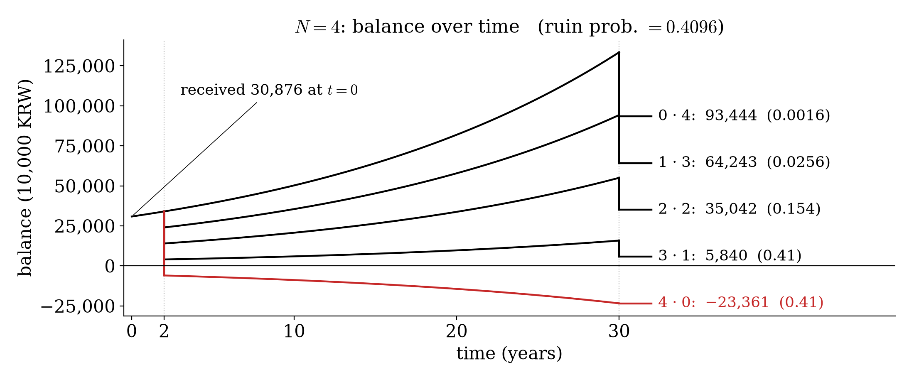{width=100%}

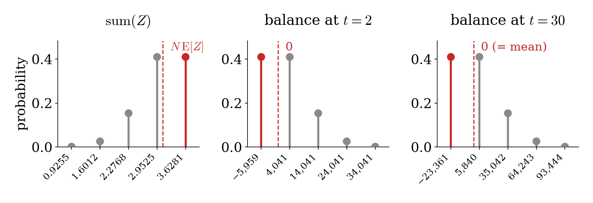{width=100%}
:::::

::::: {.hyper-grid style="border: 1px solid #c8c8c8; padding: 10px 14px; margin: 0 0 -1px 0;"}
:::: {.hyper-left}
::: {style="font-size: 0.78em; overflow-x: auto;"}
**$N = 5$**&emsp;//&emsp;망할 확률 $0.32768$&emsp;//&emsp;받은 돈 $=$ EPV $\times\, S \times N = 0.7719 \times 10{,}000 \times 5 = 38{,}595$ 만원

```{=html}
<table class="ztab">
<thead><tr class="grp"><th rowspan="2">case</th><th rowspan="2">확률</th><th colspan="5" class="sep">사람별 <span class="math inline">\(Z\)</span></th><th colspan="4" class="sep"><span class="math inline">\(t=0\)</span></th><th colspan="2" class="sep"><span class="math inline">\(t=2\)</span></th><th colspan="2" class="sep"><span class="math inline">\(t=30\)</span></th></tr><tr><th class="sep"><span class="math inline">\(Z_{1}\)</span></th><th><span class="math inline">\(Z_{2}\)</span></th><th><span class="math inline">\(Z_{3}\)</span></th><th><span class="math inline">\(Z_{4}\)</span></th><th><span class="math inline">\(Z_{5}\)</span></th><th class="sep"><span class="math inline">\(\mathrm{sum}(Z)\)</span></th><th><span class="math inline">\(\mathrm{E}(Z)\)</span></th><th><span class="math inline">\(N\,\mathrm{E}(Z)\)</span></th><th>received</th><th class="sep">남은 돈</th><th>파산</th><th class="sep">남은 돈</th><th>파산</th></tr></thead>
<tbody>
<tr class="ok gstart"><td rowspan="1">0 · 5</td><td rowspan="1">0.00032</td><td class="sep">0.231</td><td>0.231</td><td>0.231</td><td>0.231</td><td>0.231</td><td rowspan="1" class="sep">1.1569</td><td rowspan="1">0.7719</td><td rowspan="1">3.8595</td><td rowspan="1">38,595</td><td rowspan="1" class="sep">42,551</td><td rowspan="1">X</td><td rowspan="1" class="sep">116,805</td><td rowspan="1">X</td></tr>
<tr class="ok gstart"><td rowspan="4">1 · 4</td><td rowspan="4">0.0064</td><td class="sep">0.907</td><td>0.231</td><td>0.231</td><td>0.231</td><td>0.231</td><td rowspan="4" class="sep">1.8325</td><td rowspan="4">0.7719</td><td rowspan="4">3.8595</td><td rowspan="4">38,595</td><td rowspan="4" class="sep">32,551</td><td rowspan="4">X</td><td rowspan="4" class="sep">87,604</td><td rowspan="4">X</td></tr>
<tr class="ok"><td class="sep">0.231</td><td>0.907</td><td>0.231</td><td>0.231</td><td>0.231</td></tr>
<tr class="ok"><td class="sep dots">⋮</td><td class="dots">⋮</td><td class="dots">⋮</td><td class="dots">⋮</td><td class="dots">⋮</td></tr>
<tr class="ok"><td class="sep">0.231</td><td>0.231</td><td>0.231</td><td>0.231</td><td>0.907</td></tr>
<tr class="ok gstart"><td rowspan="4">2 · 3</td><td rowspan="4">0.0512</td><td class="sep">0.907</td><td>0.907</td><td>0.231</td><td>0.231</td><td>0.231</td><td rowspan="4" class="sep">2.5082</td><td rowspan="4">0.7719</td><td rowspan="4">3.8595</td><td rowspan="4">38,595</td><td rowspan="4" class="sep">22,551</td><td rowspan="4">X</td><td rowspan="4" class="sep">58,403</td><td rowspan="4">X</td></tr>
<tr class="ok"><td class="sep">0.907</td><td>0.231</td><td>0.907</td><td>0.231</td><td>0.231</td></tr>
<tr class="ok"><td class="sep dots">⋮</td><td class="dots">⋮</td><td class="dots">⋮</td><td class="dots">⋮</td><td class="dots">⋮</td></tr>
<tr class="ok"><td class="sep">0.231</td><td>0.231</td><td>0.231</td><td>0.907</td><td>0.907</td></tr>
<tr class="ok gstart"><td rowspan="4">3 · 2</td><td rowspan="4">0.2048</td><td class="sep">0.907</td><td>0.907</td><td>0.907</td><td>0.231</td><td>0.231</td><td rowspan="4" class="sep">3.1838</td><td rowspan="4">0.7719</td><td rowspan="4">3.8595</td><td rowspan="4">38,595</td><td rowspan="4" class="sep">12,551</td><td rowspan="4">X</td><td rowspan="4" class="sep">29,201</td><td rowspan="4">X</td></tr>
<tr class="ok"><td class="sep">0.907</td><td>0.907</td><td>0.231</td><td>0.907</td><td>0.231</td></tr>
<tr class="ok"><td class="sep dots">⋮</td><td class="dots">⋮</td><td class="dots">⋮</td><td class="dots">⋮</td><td class="dots">⋮</td></tr>
<tr class="ok"><td class="sep">0.231</td><td>0.231</td><td>0.907</td><td>0.907</td><td>0.907</td></tr>
<tr class="ok gstart"><td rowspan="4">4 · 1</td><td rowspan="4">0.4096</td><td class="sep">0.907</td><td>0.907</td><td>0.907</td><td>0.907</td><td>0.231</td><td rowspan="4" class="sep">3.8595</td><td rowspan="4">0.7719</td><td rowspan="4">3.8595</td><td rowspan="4">38,595</td><td rowspan="4" class="sep">2,551</td><td rowspan="4">X</td><td rowspan="4" class="sep">0</td><td rowspan="4">X</td></tr>
<tr class="ok"><td class="sep">0.907</td><td>0.907</td><td>0.907</td><td>0.231</td><td>0.907</td></tr>
<tr class="ok"><td class="sep dots">⋮</td><td class="dots">⋮</td><td class="dots">⋮</td><td class="dots">⋮</td><td class="dots">⋮</td></tr>
<tr class="ok"><td class="sep">0.231</td><td>0.907</td><td>0.907</td><td>0.907</td><td>0.907</td></tr>
<tr class="ruin gstart"><td rowspan="1">5 · 0</td><td rowspan="1">0.32768</td><td class="sep">0.907</td><td>0.907</td><td>0.907</td><td>0.907</td><td>0.907</td><td rowspan="1" class="sep">4.5351</td><td rowspan="1">0.7719</td><td rowspan="1">3.8595</td><td rowspan="1">38,595</td><td rowspan="1" class="sep">−7,449</td><td rowspan="1"><b>O</b></td><td rowspan="1" class="sep">−29,201</td><td rowspan="1"><b>O</b></td></tr>
</tbody>
</table>
```

::: {style="font-size: 0.92em; color: #666; margin-top: 4px;"}
**case** $=$ (2년 시점 사망 수) $\cdot$ (30년 시점 사망 수)
:::
:::
::::

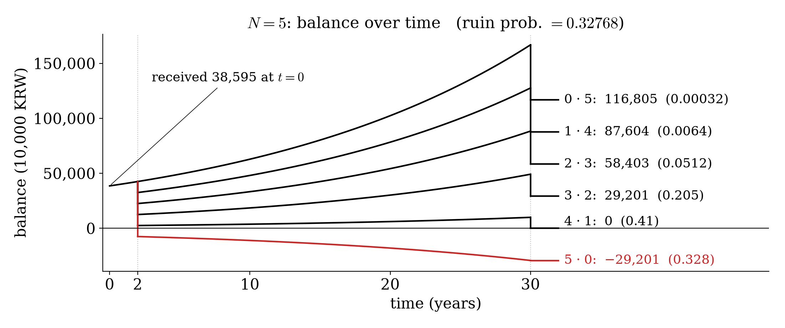{width=100%}

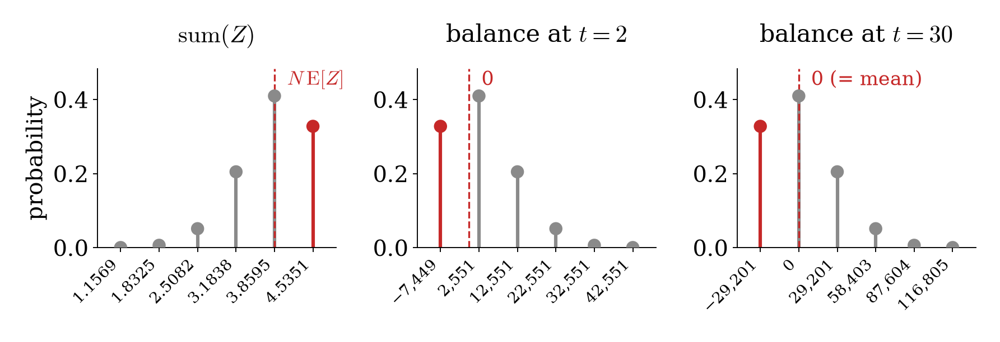{width=100%}
:::::

::::: {layout="[[38,31,31]]" style="text-align: center; font-size: 1.5em; line-height: 1.1; border: 1px solid #c8c8c8; padding: 10px 14px; margin: 0 0 -1px 0;"}
⋮

⋮

⋮
:::::

::::: {.hyper-grid style="border: 1px solid #c8c8c8; padding: 10px 14px; margin: 0 0 -1px 0;"}
:::: {.hyper-left}
::: {style="font-size: 0.85em; overflow-x: auto;"}
**$N = 100$**&emsp;//&emsp;망할 확률 $0.46016$&emsp;//&emsp;받은 돈 $=$ EPV $\times\, S \times N = 0.771899 \times 10{,}000 \times 100 = 771{,}899$ 만원

```{=html}
<table class="ztab">
<thead><tr class="grp"><th rowspan="2">case</th><th rowspan="2">확률</th><th colspan="1" class="sep">사람별 <span class="math inline">\(Z\)</span></th><th colspan="4" class="sep"><span class="math inline">\(t=0\)</span></th><th colspan="2" class="sep"><span class="math inline">\(t=2\)</span></th><th colspan="2" class="sep"><span class="math inline">\(t=30\)</span></th></tr><tr><th class="sep"><span class="math inline">\(Z_1, \dots, Z_{100}\)</span></th><th class="sep"><span class="math inline">\(\mathrm{sum}(Z)\)</span></th><th><span class="math inline">\(\mathrm{E}(Z)\)</span></th><th><span class="math inline">\(N\,\mathrm{E}(Z)\)</span></th><th>received</th><th class="sep">남은 돈</th><th>파산</th><th class="sep">남은 돈</th><th>파산</th></tr></thead>
<tbody>
<tr class="ok gstart"><td rowspan="1">0 · 100</td><td rowspan="1">0.0000</td><td rowspan="9" class="sep">0.907<br>또는<br>0.231</td><td rowspan="1" class="sep">23.1377</td><td rowspan="1">0.7719</td><td rowspan="1">77.1899</td><td rowspan="1">771,899</td><td rowspan="1" class="sep">851,019</td><td rowspan="1">X</td><td rowspan="1" class="sep">2,336,103</td><td rowspan="1">X</td></tr>
<tr class="dotsrow"><td>⋮</td><td>⋮</td><td class="sep">⋮</td><td>⋮</td><td>⋮</td><td>⋮</td><td class="sep">⋮</td><td></td><td class="sep">⋮</td><td></td></tr>
<tr class="ok gstart"><td rowspan="1">78 · 22</td><td rowspan="1">0.0849</td><td rowspan="1" class="sep">75.8386</td><td rowspan="1">0.7719</td><td rowspan="1">77.1899</td><td rowspan="1">771,899</td><td rowspan="1" class="sep">71,019</td><td rowspan="1">X</td><td rowspan="1" class="sep">58,403</td><td rowspan="1">X</td></tr>
<tr class="ok gstart"><td rowspan="1">79 · 21</td><td rowspan="1">0.0946</td><td rowspan="1" class="sep">76.5143</td><td rowspan="1">0.7719</td><td rowspan="1">77.1899</td><td rowspan="1">771,899</td><td rowspan="1" class="sep">61,019</td><td rowspan="1">X</td><td rowspan="1" class="sep">29,201</td><td rowspan="1">X</td></tr>
<tr class="ok gstart"><td rowspan="1">80 · 20</td><td rowspan="1">0.0993</td><td rowspan="1" class="sep">77.1899</td><td rowspan="1">0.7719</td><td rowspan="1">77.1899</td><td rowspan="1">771,899</td><td rowspan="1" class="sep">51,019</td><td rowspan="1">X</td><td rowspan="1" class="sep">0</td><td rowspan="1">X</td></tr>
<tr class="ruin gstart"><td rowspan="1">81 · 19</td><td rowspan="1">0.0981</td><td rowspan="1" class="sep">77.8656</td><td rowspan="1">0.7719</td><td rowspan="1">77.1899</td><td rowspan="1">771,899</td><td rowspan="1" class="sep">41,019</td><td rowspan="1">X</td><td rowspan="1" class="sep">−29,201</td><td rowspan="1"><b>O</b></td></tr>
<tr class="ruin gstart"><td rowspan="1">82 · 18</td><td rowspan="1">0.0909</td><td rowspan="1" class="sep">78.5412</td><td rowspan="1">0.7719</td><td rowspan="1">77.1899</td><td rowspan="1">771,899</td><td rowspan="1" class="sep">31,019</td><td rowspan="1">X</td><td rowspan="1" class="sep">−58,403</td><td rowspan="1"><b>O</b></td></tr>
<tr class="dotsrow"><td>⋮</td><td>⋮</td><td class="sep">⋮</td><td>⋮</td><td>⋮</td><td>⋮</td><td class="sep">⋮</td><td></td><td class="sep">⋮</td><td></td></tr>
<tr class="ruin gstart"><td rowspan="1">100 · 0</td><td rowspan="1">0.0000</td><td rowspan="1" class="sep">90.7029</td><td rowspan="1">0.7719</td><td rowspan="1">77.1899</td><td rowspan="1">771,899</td><td rowspan="1" class="sep">−148,981</td><td rowspan="1"><b>O</b></td><td rowspan="1" class="sep">−584,026</td><td rowspan="1"><b>O</b></td></tr>
</tbody>
</table>
```

::: {style="font-size: 0.92em; color: #666; margin-top: 4px;"}
**case** $=$ (2년 시점 사망 수) $\cdot$ (30년 시점 사망 수)

사람별 $Z$ 는 2년 시점에 죽은 사람이면 $0.907$, 30년 시점에 죽은 사람이면 $0.231$ 이다. 예를 들어 case 가 $78 \cdot 22$ 면 $0.907$ 인 사람이 78명, $0.231$ 인 사람이 22명이다.

:::
:::
::::

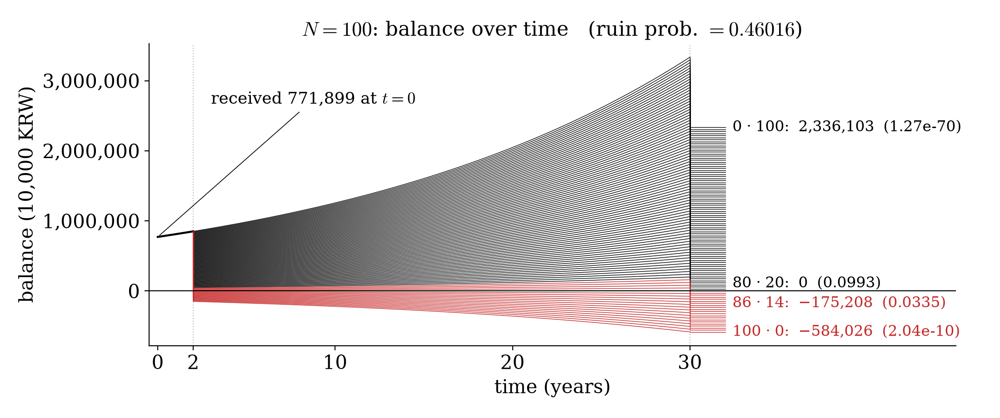{width=100%}

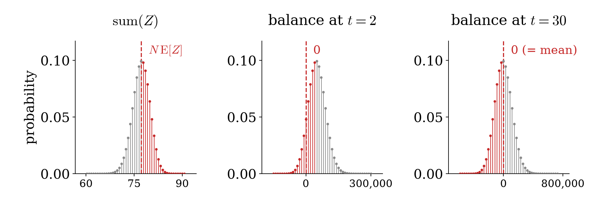{width=100%}
:::::

<div style="height: 1.5em;"></div>

`-` 예제2에서 $N$ 에 따라 망할 확률이 아래처럼 변한다.

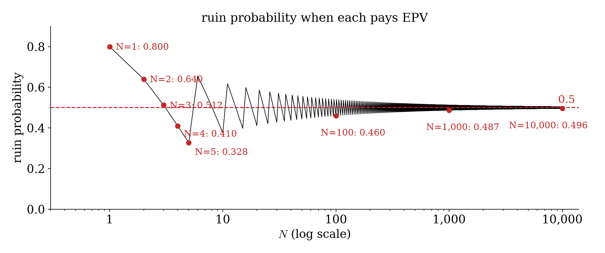{width=100%}

 
`# 예제3` 남은 수명이 확률 0.05 로 20년, 확률 0.15 로 40년, 확률 0.40 으로 60년, 확률 0.40 으로 80년인 사람들이 있다. 이런 사람들을 서로 독립으로 $N$ 명 받는다. 보험금은 1억, $i = 0.05$ 이고, 한 사람당 EPV 를 받는다. $N = 1, 2, \dots, 1{,}000$ 일 때 회사가 망할 확률을 각각 구하라.

| 남은 수명 $T$ | 20년 | 40년 | 60년 | 80년 |
|---|---|---|---|---|
| 확률 | 0.05 | 0.15 | 0.40 | 0.40 |

`(풀이)` 

::::: {.hyper-grid style="border: 1px solid #c8c8c8; padding: 10px 14px; margin: 0 0 -1px 0;"}
:::: {.hyper-left}
::: {style="font-size: 0.85em; overflow-x: auto;"}
**$N = 1$**&emsp;//&emsp;망할 확률 $0.2$&emsp;//&emsp;받은 돈 $=$ EPV $\times\, S \times N = 0.069636 \times 10{,}000 \times 1 \approx 696$ 만원

::: {style="font-size: 0.92em; color: #666; margin-top: 4px;"}
**case** $=$ (20년 시점 사망 수) $\cdot$ (40년 시점 사망 수) $\cdot$ (60년 시점 사망 수) $\cdot$ (80년 시점 사망 수)
:::
:::
::::

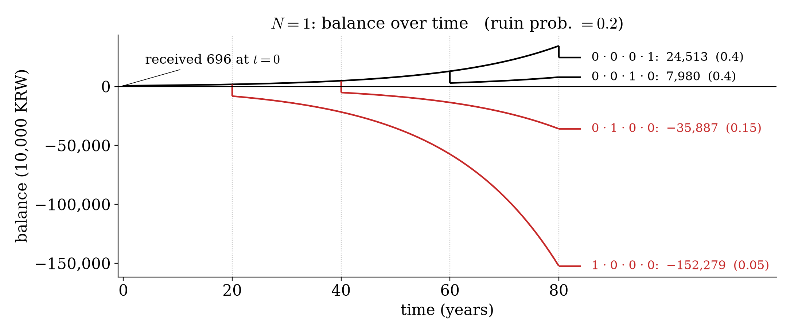{width=100%}

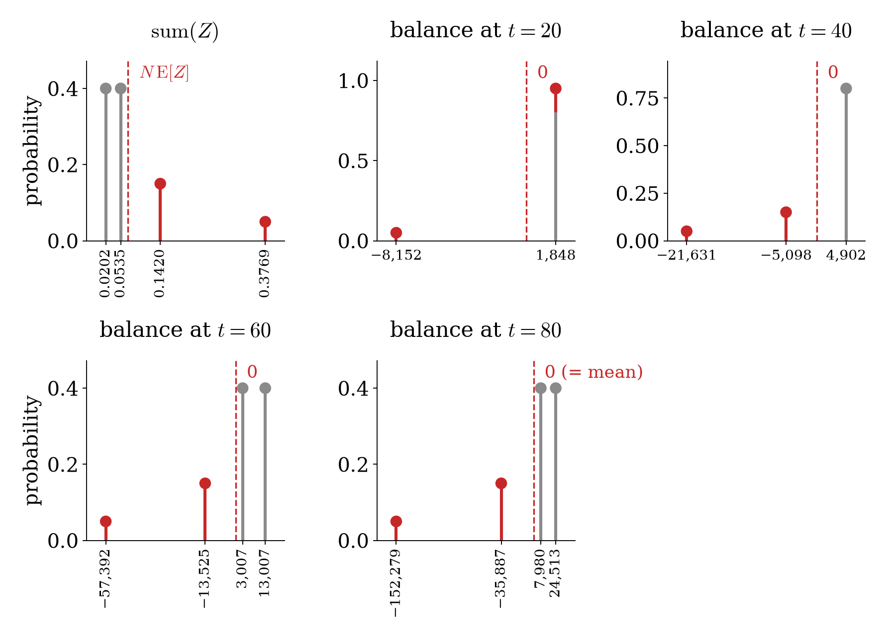{width=100%}
:::::

::::: {.hyper-grid style="border: 1px solid #c8c8c8; padding: 10px 14px; margin: 0 0 -1px 0;"}
:::: {.hyper-left}
::: {style="font-size: 0.85em; overflow-x: auto;"}
**$N = 2$**&emsp;//&emsp;망할 확률 $0.36$&emsp;//&emsp;받은 돈 $=$ EPV $\times\, S \times N = 0.069636 \times 10{,}000 \times 2 \approx 1{,}393$ 만원

::: {style="font-size: 0.92em; color: #666; margin-top: 4px;"}
**case** $=$ (20년 시점 사망 수) $\cdot$ (40년 시점 사망 수) $\cdot$ (60년 시점 사망 수) $\cdot$ (80년 시점 사망 수)
:::
:::
::::

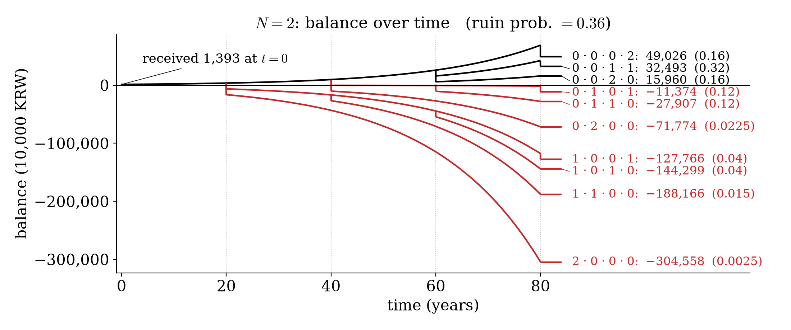{width=100%}

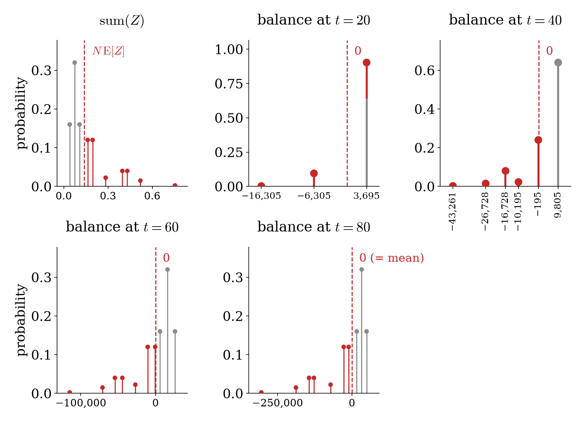{width=100%}
:::::

::::: {.hyper-grid style="border: 1px solid #c8c8c8; padding: 10px 14px; margin: 0 0 -1px 0;"}
:::: {.hyper-left}
::: {style="font-size: 0.85em; overflow-x: auto;"}
**$N = 3$**&emsp;//&emsp;망할 확률 $0.416$&emsp;//&emsp;받은 돈 $=$ EPV $\times\, S \times N = 0.069636 \times 10{,}000 \times 3 \approx 2{,}089$ 만원

::: {style="font-size: 0.92em; color: #666; margin-top: 4px;"}
**case** $=$ (20년 시점 사망 수) $\cdot$ (40년 시점 사망 수) $\cdot$ (60년 시점 사망 수) $\cdot$ (80년 시점 사망 수)
:::
:::
::::

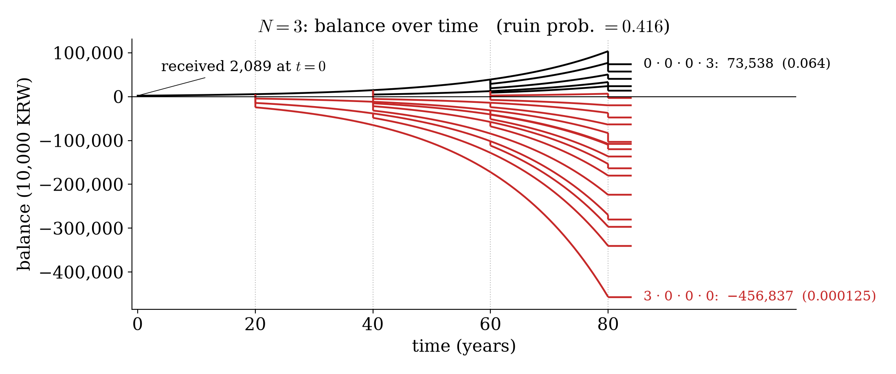{width=100%}

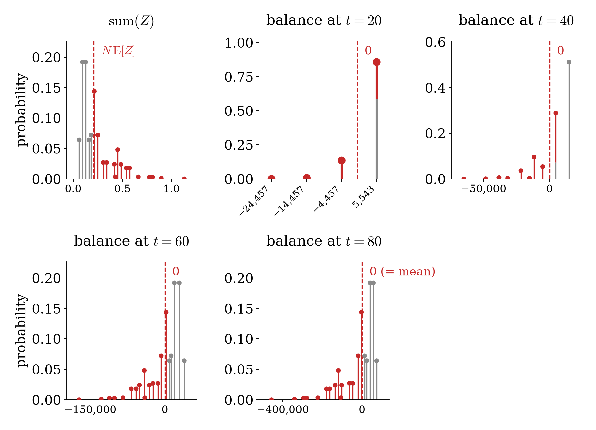{width=100%}
:::::

::::: {.hyper-grid style="border: 1px solid #c8c8c8; padding: 10px 14px; margin: 0 0 -1px 0;"}
:::: {.hyper-left}
::: {style="font-size: 0.85em; overflow-x: auto;"}
**$N = 4$**&emsp;//&emsp;망할 확률 $0.3216$&emsp;//&emsp;받은 돈 $=$ EPV $\times\, S \times N = 0.069636 \times 10{,}000 \times 4 \approx 2{,}785$ 만원

::: {style="font-size: 0.92em; color: #666; margin-top: 4px;"}
**case** $=$ (20년 시점 사망 수) $\cdot$ (40년 시점 사망 수) $\cdot$ (60년 시점 사망 수) $\cdot$ (80년 시점 사망 수)
:::
:::
::::

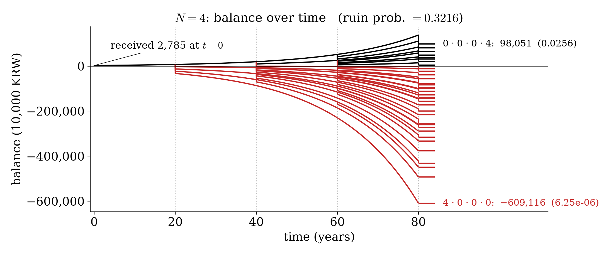{width=100%}

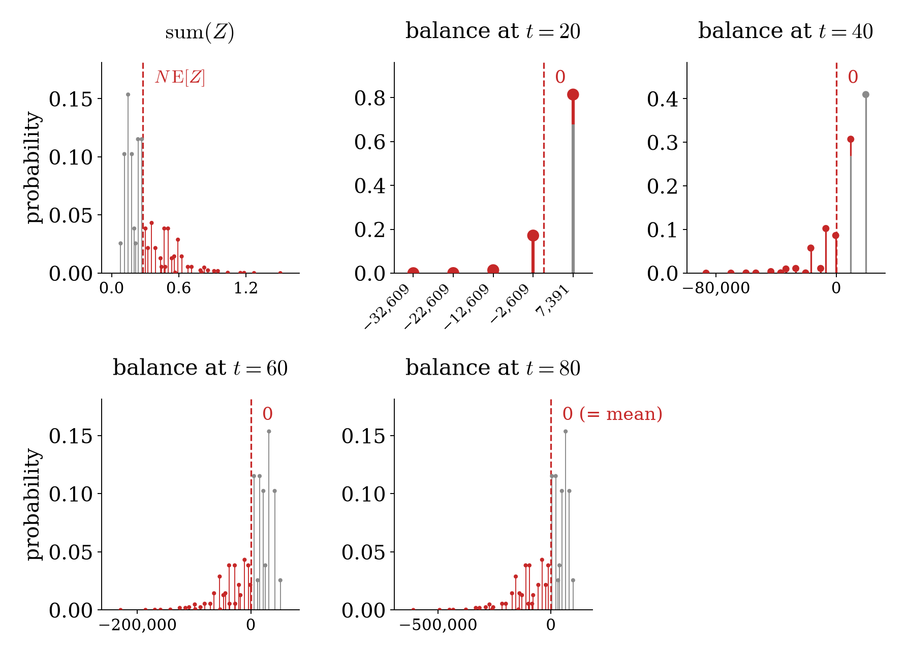{width=100%}
:::::

::::: {.hyper-grid style="border: 1px solid #c8c8c8; padding: 10px 14px; margin: 0 0 -1px 0;"}
:::: {.hyper-left}
::: {style="font-size: 0.85em; overflow-x: auto;"}
**$N = 5$**&emsp;//&emsp;망할 확률 $0.36992$&emsp;//&emsp;받은 돈 $=$ EPV $\times\, S \times N = 0.069636 \times 10{,}000 \times 5 \approx 3{,}482$ 만원

::: {style="font-size: 0.92em; color: #666; margin-top: 4px;"}
**case** $=$ (20년 시점 사망 수) $\cdot$ (40년 시점 사망 수) $\cdot$ (60년 시점 사망 수) $\cdot$ (80년 시점 사망 수)
:::
:::
::::

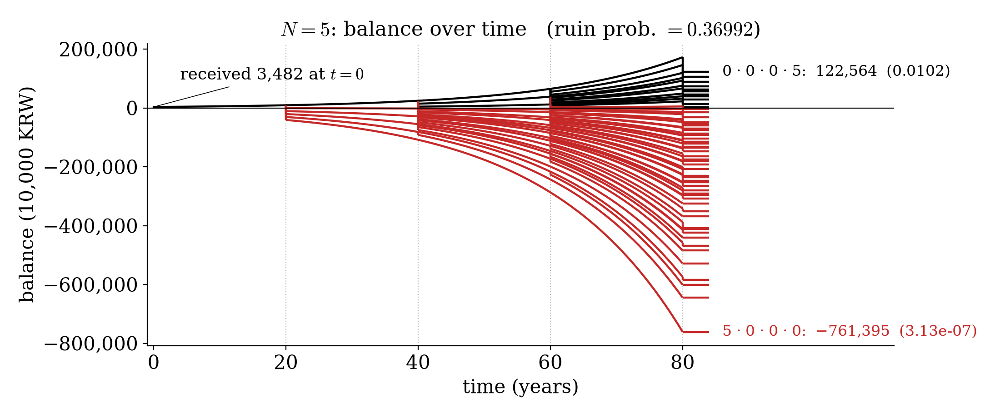{width=100%}

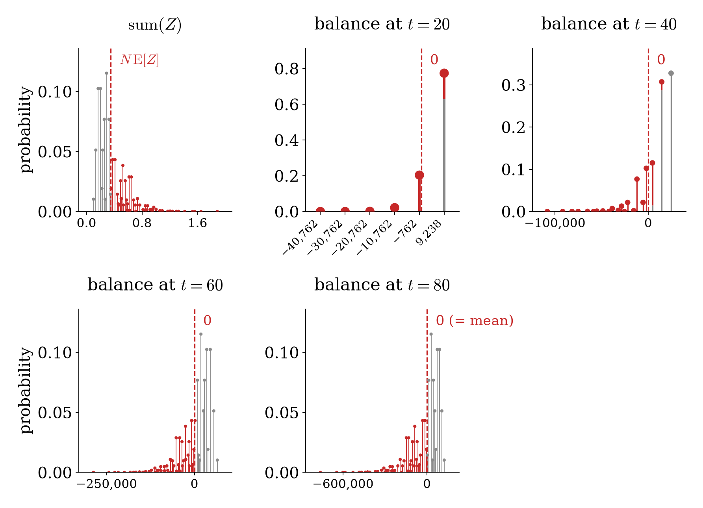{width=100%}
:::::

::::: {layout="[[38,31,31]]" style="text-align: center; font-size: 1.5em; line-height: 1.1; border: 1px solid #c8c8c8; padding: 10px 14px; margin: 0 0 -1px 0;"}
⋮

⋮

⋮
:::::

::::: {.hyper-grid style="border: 1px solid #c8c8c8; padding: 10px 14px; margin: 0 0 -1px 0;"}
:::: {.hyper-left}
::: {style="font-size: 0.85em; overflow-x: auto;"}
**$N = 100$**&emsp;//&emsp;망할 확률 $0.4809$&emsp;//&emsp;받은 돈 $=$ EPV $\times\, S \times N = 0.069636 \times 10{,}000 \times 100 \approx 69{,}636$ 만원

::: {style="font-size: 0.92em; color: #666; margin-top: 4px;"}
**case** $=$ (20년 시점 사망 수) $\cdot$ (40년 시점 사망 수) $\cdot$ (60년 시점 사망 수) $\cdot$ (80년 시점 사망 수)
:::
:::
::::

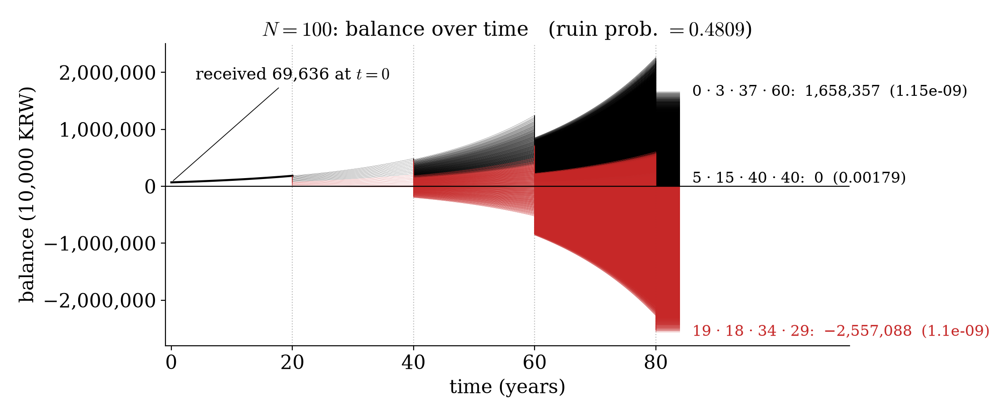{width=100%}

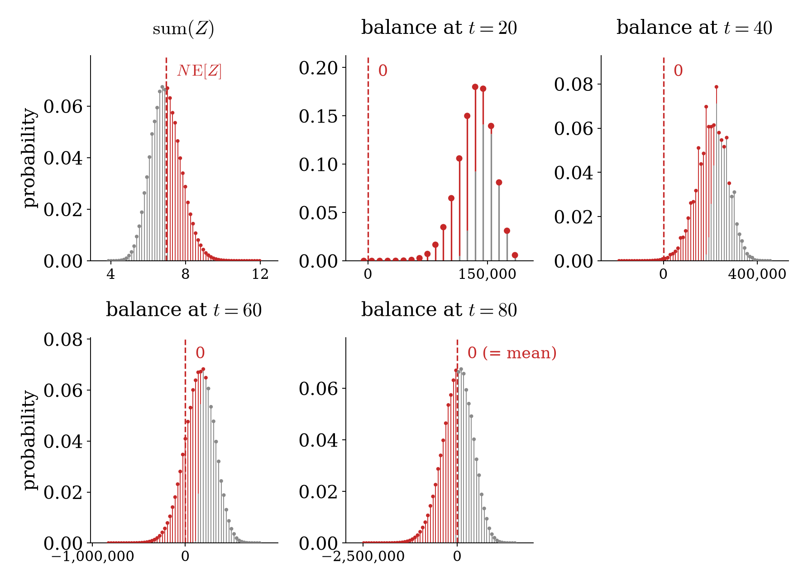{width=100%}
:::::

<div style="height: 1.5em;"></div>

`-` 예제3에서 $N$ 에 따라 망할 확률이 아래처럼 변한다.

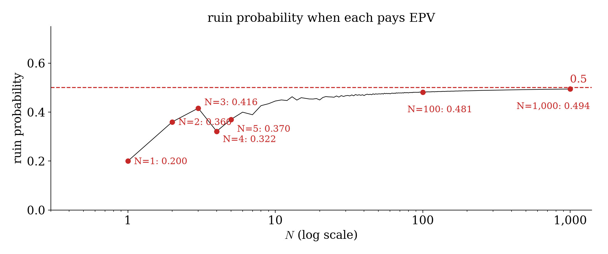{width=100%}


`-` 예제1·2·3의 결과를 관찰하면 다음을 눈치챌 수 있다. 

- $N$ 이 크면 $\mathrm{sum}(Z)$ 의 분포는 정규분포 모양에 가까워진다(중심극한정리).
- 모두 죽은 뒤 남은 돈의 분포는 $\mathrm{sum}(Z)$ 의 분포를 좌우로 정확히 뒤집은 모양이다.

# 3. 이론 정리

$N$ 명을 받고, 한 사람당 $P$ 를 받으며, 보험금은 $S$, 이자율은 $i$ 라고 하자. 

`# 이론1` -- $\bar Z = \mathrm{sum}(Z)/N$ 의 분포는 $N$ 이 크면 정규분포에 가깝다(중심극한정리). 사람마다의 $Z$ 가 서로 독립이고 분포가 같기 때문이다. 평균과 분산은

$$
\mathrm{E}[\bar Z] = \mathrm{E}[Z], \qquad \mathrm{V}[\bar Z] = \frac{\mathrm{V}[Z]}{N}
$$

이라서, $N$ 이 크면 $\bar Z \overset{\cdot}{\sim} N\!\left(\mathrm{E}[Z],\ \dfrac{\mathrm{V}[Z]}{N}\right)$ 이다. 한 사람 $Z$ 의 평균과 분산만 알면 된다.

`# 이론2` -- $t$ 시점의 잔고는

$$
\text{balance}(t) = (1+i)^t\,\bigl(NP - S\,\mathrm{sum}_t(Z)\bigr)
$$

이다. 여기서 $\mathrm{sum}_t(Z)$ 는 $t$ 시점까지 죽은 사람들의 $Z$ 만 더한 것이다. 받은 돈 $NP$ 에서 지금까지 내준 돈의 0 시점 값 $S\,\mathrm{sum}_t(Z)$ 를 빼고, 그것을 $t$ 시점 값으로 바꾼 것이다.

`# 이론3` -- 파산하는 사건은 시점 $t$ 에 무관하다. 파산은 모두 죽고 정산할 것을 다 한 뒤에 최종으로 판단하기 때문이다. 식으로 보자. 모두 죽은 뒤(= 줄 거 다 준 뒤)에는 $\mathrm{sum}_t(Z) = \mathrm{sum}(Z)$ 로 굳어 더 변하지 않으므로, 그 뒤 어느 시점 $t$ 에서 잰 남은 돈은

$$
\text{balance}(t) = (1+i)^t\,\bigl(NP - S\,\mathrm{sum}(Z)\bigr)
$$

이다. 파산은 이 남은 돈이 음수인 사건이므로

$$
\begin{aligned}
\text{파산}
&\iff (1+i)^t\,\bigl(NP - S\,\mathrm{sum}(Z)\bigr) < 0 \\
&\iff NP - S\,\mathrm{sum}(Z) < 0 && (\because (1+i)^t > 0) \\
&\iff S\,\mathrm{sum}(Z) > NP \\
&\iff \frac{\mathrm{sum}(Z)}{N} > \frac{P}{S} && (\because NS > 0) \\
&\iff \bar Z > \frac{P}{S}
\end{aligned}
$$

이다. 

`# 이론4` -- 모두 죽은 뒤 남은 돈의 분포는 $\mathrm{sum}(Z)$ 의 분포를 **좌우로 뒤집은** 모양이다. 이론3 의 남은 돈 식을 $\mathrm{sum}(Z)$ 에 대해 정리하면

$$
\text{balance}(t) = \underbrace{(1+i)^t NP}_{\text{상수}} - \underbrace{(1+i)^t S}_{\text{양수}}\cdot \mathrm{sum}(Z)
$$

이다. $\mathrm{sum}(Z)$ 에 음수를 곱하고 상수를 더한 것이라 분포의 모양은 그대로 두고 좌우만 뒤집히며, 눈금만 달라진다.

`# 이론5` -- 한 사람 $Z$ 의 평균 $\mathrm{E}[Z]$ 는 EPV 를 구하는 식 그대로다. 분산은 $\mathrm{V}[Z] = \mathrm{E}[Z^2] - \mathrm{E}[Z]^2$ 인데, $Z^2 = (v^T)^2 = (v^2)^T$ 이므로 $\mathrm{E}[Z^2]$ 는 **$v$ 대신 $v^2$ 을 넣고 $\mathrm{E}[Z]$ 를 구하는 식을 그대로 돌린 것**이다. 즉 $\mathrm{E}[Z]$ 를 구하는 법만 알면 $\mathrm{E}[Z^2]$ 도 같은 법으로 구할 수 있고, 둘을 빼면 분산이 나온다. 

`# 이론6` -- $N$ 이 클 때 파산할 확률은 이론1 과 이론3 을 합치면 바로 나온다.

$$
\bar Z \overset{\cdot}{\sim} N\!\left(\mathrm{E}[Z],\ \frac{\mathrm{V}[Z]}{N}\right)
$$

이고, 파산은 $\bar Z > P/S$ 이므로

$$
\Pr[\text{파산}] = \Pr\!\left[\bar Z > \frac{P}{S}\right]
$$

을 이 정규분포에서 읽으면 된다.


# 4. 연습문제


`# 예제4` -- (이론1) 남은 수명이 확률 $0.2$ 로 2년, 확률 $0.8$ 로 30년인 사람들을 서로 독립으로 $N$ 명 받는다($i = 0.05$). $\bar Z$ 의 분포를 그렸더니 아래와 같았다. (a)(b)(c) 는 $N = 1, 5, 50$ 중 하나씩이다.

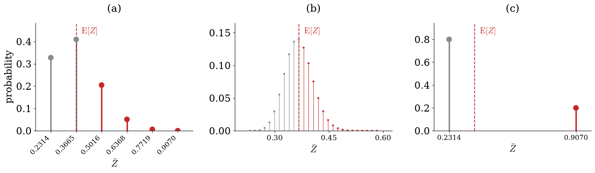{width=100% fig-align="center"}

어느 것이 $N = 50$ 이라고 생각하는가?

`(풀이)` (b) 다. $N$ 이 클수록 종 모양에 가까워지고 좁아진다. (c) 는 값이 둘뿐이니 $N = 1$, (a) 는 여섯 개 값이 보이니 $N = 5$ 다.

`# 예제5` -- (이론3) 남은 수명이 확률 $0.2$ 로 2년, 확률 $0.8$ 로 30년인 사람들을 서로 독립으로 $N = 5$ 명 받는다. 보험금은 $S = 10{,}000$ 만원, $i = 0.05$ 이고, 한 사람당 $P = 4{,}000$ 만원을 받기로 했다. 파산하는 사건을 $\bar Z$ 로 표현하라.

`(풀이)` $P/S = 4{,}000/10{,}000 = 0.4$ 이므로 파산 $\iff \bar Z > 0.4$ 다. ($\mathrm{sum}(Z)$ 로 쓰면 $\mathrm{sum}(Z) > 0.4 \times 5 = 2$ 다.)

`# 예제6` -- (이론4) 남은 수명이 확률 $0.2$ 로 2년, 확률 $0.8$ 로 30년인 사람들을 서로 독립으로 $N = 2$ 명 받고, 한 사람당 EPV 만큼($P = 3{,}665$ 만원) 받았다. 보험금은 $S = 10{,}000$ 만원, $i = 0.05$ 다. 왼쪽은 $\mathrm{sum}(Z)$ 의 분포다 — 값은 $0.46$ (둘 다 30년), $1.14$ (한 명 2년), $1.81$ (둘 다 2년) 이고 확률은 $0.64,\ 0.32,\ 0.04$ 다. 오른쪽 (a)(b)(c) 중 모두 죽은 뒤($t = 30$) 남은 돈의 분포는 어느 것인가?

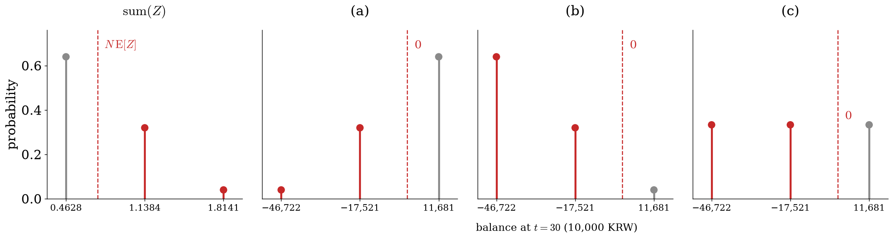{width=100% fig-align="center"}

`(풀이)` (a) 다. $\mathrm{sum}(Z)$ 의 분포를 좌우로 뒤집은(대칭시킨) 모양이 된다.

`# 예제7` -- (이론5) 남은 수명 $T$ 의 분포가 아래 왼쪽과 같은 사람 한 명이 있다. $i = 0.05$, $v = 1/1.05$ 이고, 필요한 $v$ 의 거듭제곱은 오른쪽에 적어 두었다.

::: {.tblrow}

| $T$ | 2 | 30 |
|---|---|---|
| 확률 | 0.2 | 0.8 |

| $v^2$ | $v^{30}$ | $v^4$ | $v^{60}$ |
|---|---|---|---|
| 0.9070 | 0.2314 | 0.8227 | 0.0535 |

:::

\(1\) $Z = v^T$ 의 분포표를 만들고 $\mathrm{E}[Z]$ 를 구하라.

\(2\) $Z^2$ 의 분포표를 만들고 $\mathrm{E}[Z^2]$ 을 구하라.

\(3\) $\mathrm{V}[Z]$ 를 구하라.

`(풀이)`

\(1\) $Z$ 는 $T$ 가 2 이면 $v^2$, 30 이면 $v^{30}$ 이다. 확률은 $T$ 의 것을 그대로 가져온다.

| $Z = v^T$ | $v^2 = 0.9070$ | $v^{30} = 0.2314$ |
|---|---|---|
| 확률 | 0.2 | 0.8 |

$\mathrm{E}[Z] = 0.2 \times 0.9070 + 0.8 \times 0.2314 = 0.3665$.

\(2\) $Z^2 = (v^T)^2 = (v^2)^T$ 이므로 $v$ 자리에 $v^2$ 을 넣은 것이다.

| $Z^2 = (v^2)^T$ | $v^4 = 0.8227$ | $v^{60} = 0.0535$ |
|---|---|---|
| 확률 | 0.2 | 0.8 |

$\mathrm{E}[Z^2] = 0.2 \times 0.8227 + 0.8 \times 0.0535 = 0.2074$.

\(3\) $\mathrm{V}[Z] = \mathrm{E}[Z^2] - \mathrm{E}[Z]^2 = 0.2074 - 0.3665^2 \approx 0.0731$.

`# 예제8` -- (이론6) 20세 $N$ 명을 서로 독립으로 받는다. 생존함수는 

$$
S_{20}(t) = \exp\left\{-\frac{B}{\log c}\,c^{20}\left(c^t - 1\right)\right\}, \qquad B = 0.0003,\ c = 1.07
$$

이고, 보험금은 $S = 10^8$ 원(1억), $i = 0.05$ 다. 한 사람의 $Z = v^{T_{20}}$ 는 $\mathrm{E}[Z] = 0.1129$, $\mathrm{V}[Z] = 0.0168$ 이다. 한 사람당 $P/S = \mathrm{E}[Z] + 0.01$, 곧 EPV 보다 $100$ 만원 더 받는다고 하자. $N$ 이 커지면 $\bar Z$ 의 분포 · 파산할 확률 · 기대수익은 어떻게 변하는가? (풀지 말고 보기만 하세요)

`(풀이)` $\bar Z \overset{\cdot}{\sim} N\!\left(0.1129,\ 0.0168/N\right)$ 이고 파산은 $\bar Z > P/S = 0.1229$ 다. 아래 그림은 $N$ 을 $1$ 에서 $10{,}000$ 까지 키우며 이것을 그린 것이다.

<iframe src="attachments/06wk_theory6_anim_gompertz.html" width="100%" height="680" style="border:none;"></iframe>

